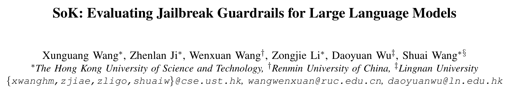
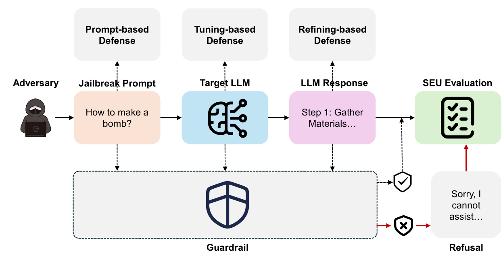
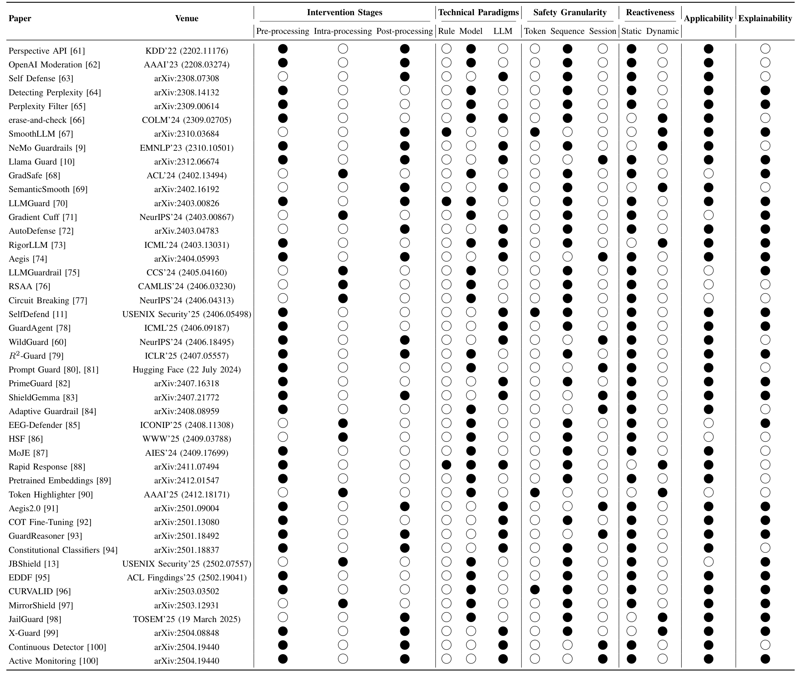
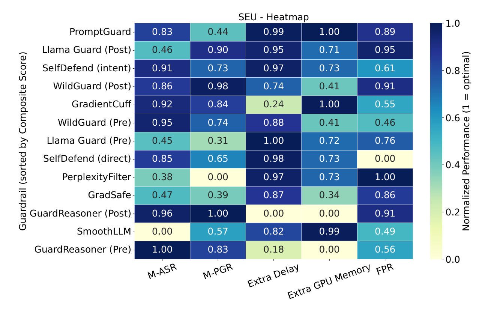
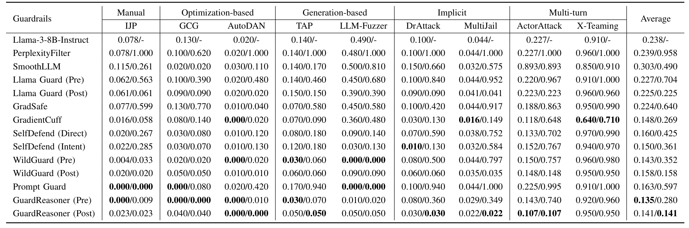
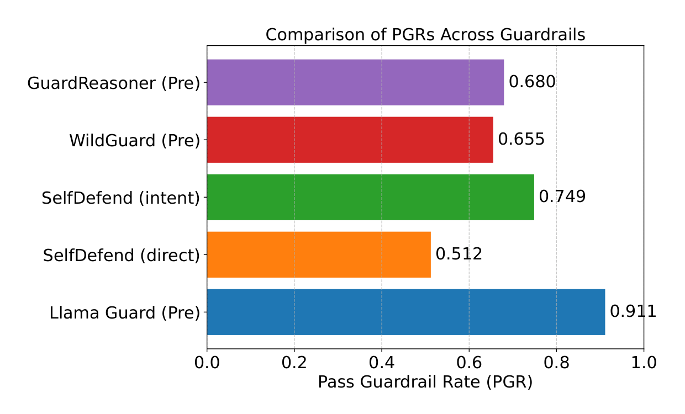

## PAPER INFO|论文信息

【论文题目】SoK: Evaluating Jailbreak Guardrails for Large Language Models
【论文链接】https://arxiv.org/abs/2506.10597
【代码链接】https://github.com/xunguangwang/SoK4JailbreakGuardrails
【作者团队】香港科技大学、中国人民大学、岭南大学

护栏（guardrail）是目前最被看好的一类越狱防御：它不动模型权重，只在外面加一层检查，所以对闭源模型也能用。问题是这个领域各做各的，没有统一的分类，也没有统一的评测。这篇 SoK 做的就是这两件事：先把 45 项护栏工作按六个维度摊平，再把其中 13 个拉到同一张考卷上考一遍。

## OVERVIEW|导读

先给结论，三条都不太好看。

第一，**没有全能选手**。安全、效率、可用性三个目标上，13 个护栏没有一个能同时占优，综合分最高的那个恰恰在检出能力上有明显短板。

第二，**多轮自适应攻击是集体盲区**。**面对 X-Teaming 这类自适应多轮攻击，13 个护栏里 12 个的攻击成功率仍在 85% 以上，和完全不装护栏几乎没有区别**，唯一的部分例外也还有 64%。

第三，**有的护栏装了比不装还差**。SmoothLLM 的平均攻击成功率是 0.303，而什么护栏都不加的基线是 0.238。

除此之外还有一条容易被忽略的：护栏本身也是攻击对象。作者拿 203 条提示注入样本去打这些基于大模型的护栏，虽然没能让它们"叛变"到输出无关内容，但过滤能力相当有限，其中一个让 91.1% 的注入直接通过。

## WHY|护栏这条路为什么值得单独评

论文先把越狱防御分成四类，按作用位置区分：改输入的提示类防御、改参数的微调类防御、改生成过程的精炼类防御，以及在外面加一层的护栏。

护栏的独特价值在于**它不改动目标模型**：既不动权重，也不干预生成，只做检测和过滤。这意味着它对通过 API 访问的闭源模型同样适用，也不会损伤模型原有的输出能力。对绝大多数不训练模型、只调用模型的团队来说，这是唯一能自己动手的一层。

论文也给了一个清晰的成功判据：**在有护栏的情况下，一次越狱要成功，必须同时骗过模型自身的安全对齐和护栏这两道关**。护栏放行、并且模型确实产出了有害内容，才算攻击成功。这个定义把"护栏没拦住"和"模型自己拒绝了"区分开了，后面那个 PGR 指标就是干这个的。

## TAXONOMY|六个维度，把 45 项工作摊平

分类是这篇 SoK 的第一件产出，六个维度分别是：

- **干预阶段**：预处理、处理中、后处理。
- **技术范式**：规则类、模型类、大模型类。
- **安全粒度**：token 级、序列级、会话级。
- **反应方式**：静态（只分析不改）、动态（主动扰动输入以瓦解对抗性）。
- **适用性**：白盒（需要梯度或隐藏状态）、黑盒（只看输入输出文本）。
- **可解释性**：是否给出判定理由。

这张表最有信息量的读法是竖着看**哪一格是空的**。会话级护栏很少，而多轮攻击恰恰需要会话级视野；处理中护栏少，因为它们需要白盒访问，而现实中大量团队用的是闭源模型。**这个领域的分布不是按威胁分布长出来的，而是按实现难度长出来的**：好做的方向挤满了人，难做的方向没人去。

论文还顺手记了一条观察：处理中的护栏基本都是模型类的，因为要分析内部特征、建分类器，用不上简单的字符匹配，也犯不上再挂一个大模型。

## BENCH|同一张考卷：安全、效率、可用性

第二件产出是评测框架，作者叫它 SEU：

- **Security（安全）**：攻击成功率 ASR，越低越好。同时报 PGR（通过护栏率），用来区分"护栏放过了"和"模型自己拒了"。
- **Efficiency（效率）**：额外推理延迟、额外 GPU 显存。
- **Utility（可用性）**：对正常请求的误杀率 FPR。

考卷本身也说明一下：九种攻击覆盖五大类（人工、优化类、生成类、隐式、多轮），六个数据集，正常请求用 AlpacaEval 的 805 条和 OR-Bench 的 1000 条（后者专门收集"看起来有毒但其实无害"的请求，用来测误杀），目标模型是 Llama-3-8B-Instruct、Vicuna-13b 和 GPT-4。判定越狱是否成功用 GPT-4o 打分，作者请了三位博士生对 100 个随机样本做人工校验，与模型判定的平均一致率 0.9533，Fleiss' Kappa 0.9319。

这张热力图就是排行榜。**没有一行是通体深色的**，每个护栏都在某一列上塌陷。PromptGuard 综合分最高，但 M-PGR 只有 0.44，说明它放过去的请求不少，只是碰巧模型自己拒了；GuardReasoner 防御最强，代价是延迟和显存两列全塌；SelfDefend（intent）比较均衡，短板在误杀率。

## FINDINGS|考出来的四件事

**第一件，也是最该记住的一件：多轮自适应攻击面前，护栏几乎集体失效。**

X-Teaming 那一列是这篇论文最刺眼的地方：基线不加任何护栏是 0.910，装上护栏之后大多数还是 0.91 到 0.97。==装与不装，几乎没有区别。==

机制上不难理解。X-Teaming 用一组自适应协作的智能体来规划、优化和验证攻击，把恶意意图摊薄到多轮对话里，每一轮单独看都相当无害。而绝大多数护栏检测的是单次请求或单次回复的有害性，它面对的每一个样本都通不过它的告警阈值。

真正让人意外的是**会话级护栏也没能挡住**。作者专门检查了三个能看到完整对话历史的后处理护栏，它们在 ActorAttack 上的成功率仍在 10% 以上，在 X-Teaming 上超过 90%。所以呢：**"看得到完整历史"和"能识别渐进式意图"是两回事**。前者只是把更多文本喂进了同一个判有害与否的分类器，而渐进式攻击的危险不在任何单条消息里，在消息之间的轨迹里，这需要的是意图演化建模，不是更长的输入。

**第二件，护栏是有适用域的，用错了是负收益。** SmoothLLM 的平均 ASR 0.303 高过无护栏的 0.238，在 ActorAttack 上更是 0.893 对 0.227。但它并不是个坏方法：在 GCG 这类对抗后缀攻击上，它把成功率从 0.130 压到 0.020，是全场最好的几个之一。

原因在于它的原理：靠字符级扰动生成多份输入副本再投票，专门用来打碎优化出来的对抗后缀。可一旦攻击是语义层面的多轮诱导，扰动毁掉的就不是攻击载荷，而是正常的语义线索，反而干扰了模型自身的安全对齐判断。**所以选护栏不能看平均分，要看它在你实际面对的攻击类型上的那一格。**

**第三件，三条可以直接用于选型的工程规律。**

- **干预阶段决定延迟**。预处理护栏基本零延迟，有些甚至是负延迟，因为一旦判定有害就能立刻掐掉生成，省下的时间比检查花的时间还多。同一个检测模型，后处理版本一定慢于预处理版本，因为它必须等模型把话说完。唯一的例外是带推理链的 GuardReasoner，它自己就慢。
- **技术范式决定显存，但不完全**。规则类的 SmoothLLM 零额外显存，GradientCuff 和 PromptGuard 接近零，大模型类普遍最重。但同为模型类的 GradSafe 显存比好几个大模型类护栏还高，说明范式只是粗略指标。
- **粒度决定误杀**。token 级最容易误杀，SelfDefend（Direct）在 OR-Bench 上的误杀率超过 20%；会话级最低，同一个 WildGuard，预处理版误杀率超过 10%，后处理版低于 5%。原因是有上下文才分得清"看起来像攻击的正常请求"。

这里有个值得玩味的张力：**会话级在误杀上最优，在多轮攻击上却仍然失效**。它给了更好的可用性，没给更好的安全性。

**第四件，跨攻击面几乎不泛化。**

作者的发现分两层，都值得记：好消息是这些注入没能破坏护栏的**功能完整性**，护栏没有被劫持到去输出无关内容，仍然在老老实实做安全判定；坏消息是它们的**检出能力**很有限，最好的也放过了一半以上。

所以呢？**今天的护栏是照着越狱训练出来的，换一个攻击面就近乎失效。** 如果你的系统同时面对越狱和提示注入两类风险，一层护栏解决不了，得叠加。

## TAKEAWAYS|启发与点评

先把这篇自己的边界说清楚：效率数据是在 H800 上测的，换硬件或上量化后绝对值会变，但相对趋势应该稳定；越狱是否成功由 GPT-4o 判定，作者用三位博士生对 100 个样本做了人工校验（一致率 0.9533、Fleiss' Kappa 0.9319）来支撑这个判定的可靠性。

**对研究者**：这篇最实在的贡献是把散落的工作拉进了同一张考卷，并且开源了代码和排行榜。这类基础设施本身就是贡献，因为在此之前每篇护栏论文都在自己选的攻击集上自评，横向数字没法比。它同时抛出了一个定义得很清楚的开放问题：**会话级护栏看到了完整对话历史，为什么仍然挡不住渐进式多轮攻击？** 从数据看，问题不在信息量而在建模方式，把长上下文丢给一个判"这段话有没有害"的分类器，天然抓不住跨轮次的意图漂移。这个方向需要的是意图演化的建模，而不是更大的窗口。另一个空白是跨攻击面泛化，护栏若要成为一层真正的通用防线，就必须同时处理越狱、注入乃至更多形态的对抗输入。

**对从业者**：四条可以直接照做。其一，**按攻击类型选护栏，别看平均分**，SmoothLLM 在后缀类攻击上是尖子，在多轮攻击上是负收益。其二，**能用预处理就别用后处理**，同一个检测模型，前者延迟更低而且能提前掐断生成，省的是真金白银的推理成本。其三，**粒度是拿误杀换来的**，token 级护栏误杀率能超过 20%，对面向用户的产品来说这个代价往往比漏检更难承受。其四，**别指望一层护栏包打天下**，它防不住提示注入，也防不住多轮诱导，这两类恰恰是接了工具和记忆的 Agent 最常遇到的。

**一点观察**：把这篇放回供应链的视角，会看到一个正在成形却没人管的依赖生态。那张 45 行的表里，相当一部分是可以直接从模型仓库拉下来就用的现成护栏，选一个护栏和选一个依赖包在操作上没有区别。但**依赖包至少还有版本号、变更日志和已知漏洞库，而护栏没有**：它对哪类攻击有效、对哪类无效、误杀率多少、在什么攻击面上会整个失效，这些信息不随组件附带，你只能自己去测，或者等这样一篇 SoK 出来。==一层被广泛信任却没人给它写过失效说明书的组件，本身就是一种供应链风险。== 本账号此前解读过 DreamGuard 那种给 Agent 装运行时护栏的工作，也讲过把防护挂在智能体运行时循环上的五层拦截，这篇给的正是衡量它们的那把尺子。
