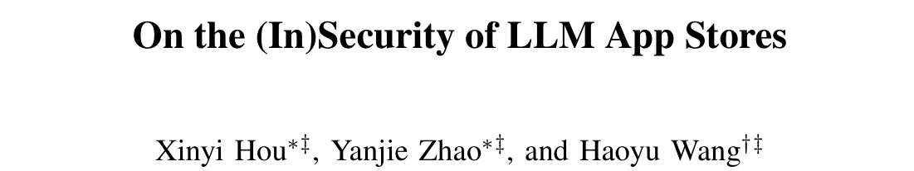
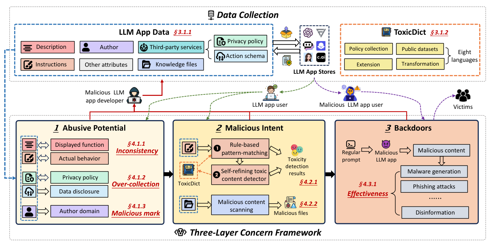
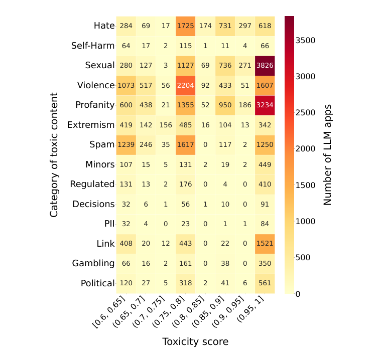
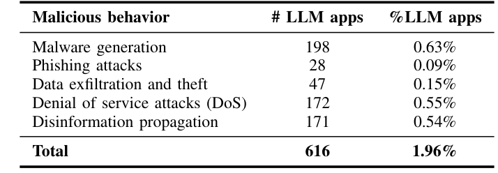
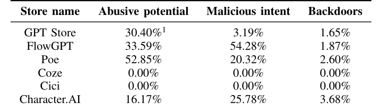

## PAPER INFO|论文信息

【论文题目】On the (In)Security of LLM App Stores
【论文数据】https://github.com/security-pride/LLM-App-Security
【作者团队】华中科技大学

这是一篇大规模实证测量论文，来自华中科技大学（Haoyu Wang 团队，长期做 LLM 与软件供应链安全）。它干了一件很基础、却一直没人认真做的事：**把六大 LLM App 商店当成一个生态系统，逐个 App 地体检一遍，看它到底有多不安全。** 因为是实证研究，本文写得更深入一些。

## OVERVIEW|导读

自定义 LLM App（就是各种 custom GPT、角色扮演机器人、专用助手）这两年爆发式增长，任何人几乎零门槛就能在 GPT Store、FlowGPT、Poe、Coze、Cici、Character.AI 上发布一个。低门槛意味着繁荣，也意味着风险：一个 App 的"指令（instructions）"就是它的源代码，只要指令里藏了越狱提示、有害内容或恶意逻辑，它就能在你毫不知情的情况下作恶。

作者用五个月爬取了这 **6 大商店、786,036 个 LLM App**，提出一套**三层风险框架**逐层筛查，坐实了一批触目惊心的数字：==1.6 万个 App 在生成仇恨、自残、暴力等有害内容，616 个是能真正跑起来执行恶意行为的后门==。这些发现已上报给 OpenAI、Quora 等平台并获正面回应，截至论文提交，GPT Store 已下架了其中 1643 个 App。

## FRAMEWORK|三层风险框架：从"可疑"到"真恶意"

作者不是简单地把 App 分成好和坏，而是按**危害确定性递进**搭了三层框架，这套结构本身就值得借鉴：

三层的逻辑是：**第一层"滥用潜能"**只看有没有可疑迹象（描述和实际行为对不上、悄悄多收数据），不一定有恶意；**第二层"恶意意图"**确认 App 的指令里确实含有害内容；**第三层"后门"**最狠，它把 App 放进沙箱真跑一遍，验证它到底能不能成功造出恶意软件、发出钓鱼邮件。层层收紧，从"可疑"一直逼到"真能作恶"。

## METHOD|方法：3 万词毒词典 + 自精炼检测器

要在 78 万个 App 里精确捞出有害内容，光靠关键词不够。作者搭了两条互补的检测线：一条是**规则匹配**，靠自建的 **ToxicDict** 毒词典（31783 个毒性词、覆盖仇恨/自残/性/暴力等 14 个类别、8 种语言）做地毯式扫描，保证召回；另一条是**自精炼的大模型毒性检测器**（基于 Llama3-8B），能理解上下文和文化语境，把"别输出暴力内容"这种正常句子过滤掉，保证精度。两者取交集提准确率、取并集保覆盖率。

这套组合在 374 个抽样上准确率 **92.51%**。更值得称道的是它的伦理设计：所有后门验证都在隔离环境里做、事后即删，且全部发现负责任地上报给了平台。

## FINDINGS|发现：三层扒下来，每层都有雷

**第一层，滥用潜能：说的和做的对不上。** 描述是给用户看的门面，指令才是真正的源代码。作者比对了 44549 个能拿到指令的 App，发现 **34.6% 的 App 描述与真实指令不一致，而这些不一致的 App 里有 56.97% 藏着有害内容**。比如一个自称"最安全 AI 助手"的 App，指令里却写着传播病毒和恶意代码的逻辑。数据层面同样不干净：29.27% 用了第三方服务的 App 存在**过度收集敏感数据**，1366 个 App 在违反自己隐私政策地收集个人信息。

这一层还有一个**反直觉的发现**：大家直觉上会觉得"作者域名可疑 = App 可疑"，但作者查了 677 个被 VirusTotal 标记为恶意/可疑的作者域名、牵出 4264 个 App，结果==只有 2.49% 真的含恶意意图，作者域名信誉几乎无法预测一个 App 是否恶意==。这提醒后来者：别拿域名黑名单当 App 安全的挡箭牌。

**第二层，恶意意图：1.6 万个 App 在教你作恶。** 两条检测线取并集，最终 15996 个 App（占受检的 27.91%）被判定含恶意意图。有害内容的分布很说明问题：

有害内容高度集中在**性、暴力、脏话**三类，且不少落在毒性分数最高的一档。此外 559 个能下载到的知识文件里，35.42%（198 个）也带有恶意内容，说明"知识文件"正在成为恶意载荷的新藏身处。

**第三层，后门：616 个 App 能真正跑起来作恶。** 这是最硬的一层，因为它不是"含有害文字"，而是沙箱验证过、确实能执行的恶意功能：

**616 个 App 通过了沙箱实测，能真正生成恶意软件、发起 DoS、批量造谣、外泄数据或钓鱼**。关键在于，作者用的是**常规提示词而非越狱**来触发它们，说明这些危害是 App 自身植入的后门，不是绕过大模型安全护栏的结果，防不胜防。

**商店之间差距悬殊。** 把风险按商店拆开看，反差惊人：

==FlowGPT 上超过一半（54.28%）的 App 带恶意意图，Poe 有 52.85% 存在滥用潜能==，都远比 GPT Store 严重。而 Character.AI 虽然占比不算最高，恶意 App 的用户交互量却最大，单个最高触达 3176 万次，危害的实际暴露面惊人。审核越松、越缺乏强制审查的平台，就越是有害 App 的温床。

## TAKEAWAYS|启发与点评

**对研究者**：这项工作的方法论价值，在于把"LLM App 安全"这个笼统的问题**做成了可测量、可分层的东西**。三层框架（滥用潜能→恶意意图→后门）是一个可迁移的思路：从"有可疑迹象"到"确含有害内容"再到"沙箱验证能真作恶"，每一层的证据强度和误报代价都不同，这比笼统地喊"LLM App 不安全"精确得多。其中"用常规提示词而非越狱来验证后门"的实验设计尤其关键，它把危害归因到了 App 自身的恶意植入，而不是大模型护栏的漏洞，这是两个完全不同的威胁模型。它开源的 ToxicDict（3 万词、14 类、8 语言）也是现成的资产。而那个"作者域名信誉预测不了 App 好坏"的反直觉结论，则为后续检测研究排除了一个看似合理其实无效的特征。

**对从业者**：给平台方和用户各一句。平台方：**关键词审核和作者信誉都不够**，恶意逻辑藏在指令和知识文件里、还能用常规提示词触发，必须像这篇一样做"描述与真实行为一致性"加"沙箱行为验证"，光扫敏感词只能抓到最笨的那批。用户：**装一个 LLM App 前，它的描述可能和它真正干的事完全是两码事**，34.6% 的 App 名不副实，来源不明、权限过大（尤其接了第三方服务、要收集数据）的应用要格外警惕，别被"最安全助手"这类描述骗了。

**一点观察**：把这篇放进我们持续追踪的 AI 供应链脉络里看，它测的是**最靠近普通用户的那一层**：应用商店。之前解读的恶意技能、Agent Skill 漏洞，讲的是开发者和 Agent 生态；而这篇说的是普通人一键就能装上的 LLM App，风险已经规模化地摆在货架上了。它和整个系列指向同一个判断：==AI 生态正在原样重演移动 App 商店当年的安全困境：低门槛带来繁荣，也带来海量未经审查的恶意应用==，而 LLM 又多了一层"用自然语言就能植入恶意"的新攻击面。应用商店的强制审查、行为验证、跨平台威胁情报共享，是这条供应链走向成熟绕不开的地基。
