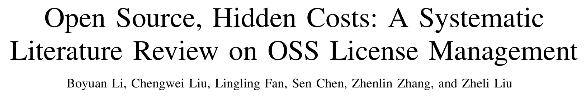
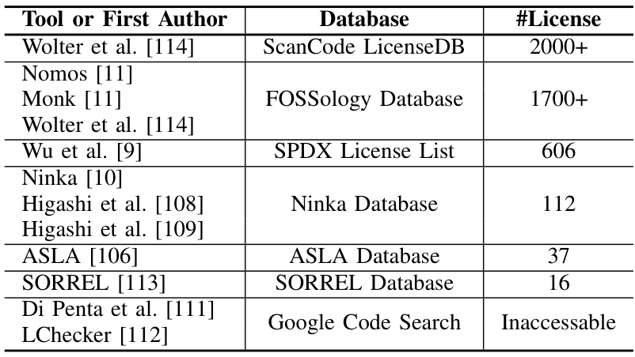
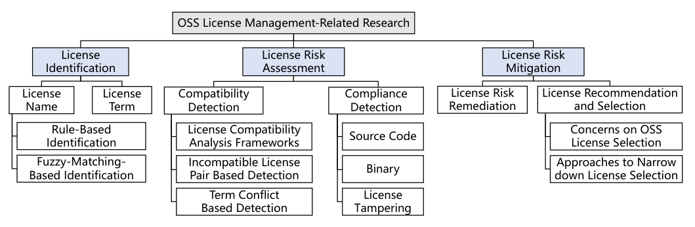
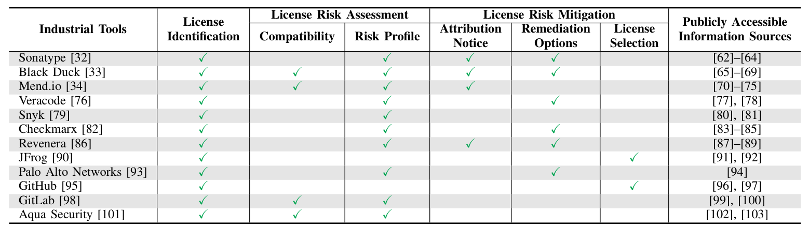

## PAPER INFO|论文信息

【论文题目】Open Source, Hidden Costs: A Systematic Literature Review on OSS License Management
【论文链接】https://arxiv.org/abs/2507.05270
【作者团队】南开大学、南洋理工大学

这是一篇系统性文献综述（SLR），来自南开大学与南洋理工大学。标题起得很妙，"Open Source, Hidden Costs"，开源不是免费，它有一笔容易被忽略的隐藏成本，就是**许可证**。因为是综述类文章，本文按它的框架逐层拆给你看。

## OVERVIEW|导读

现代软件里 **70% 到 90% 的代码来自开源**，而每一个开源组件背后，都站着一纸**许可证合同**：它规定了你能不能商用、要不要保留版权声明、改了要不要开源。用错了不是小事，==这几年 Google、TikTok、GitHub Copilot 都因为许可证问题吃过官司==：Google 被判未经许可复制了 Java SE 的 API，TikTok Live Studio 基于 OBS Studio 却没遵守 GPL，Copilot 则因为生成代码时没给出原作者署名和版权声明而遭集体诉讼。

问题是，怎么管好这些许可证，学界和业界做了大量工作，却一直没人系统地梳理过全貌。这篇综述补上了这个空白：作者用 PRISMA 方法从五大数据库的 8073 篇文献里，层层筛选出 **80 篇**聚焦开源许可证管理的核心论文，并**参照工业界 SCA 工具的实际工作流**，把这些研究归成三件事，识别、风险评估、风险缓解。

## WHY|为什么许可证是个越来越大的坑

先理解这个坑为什么在变深。核心矛盾是**许可证泛滥（license proliferation）**：为了满足各种定制需求，新许可证层出不穷。Software Heritage 上已经能识别出 **690 万种**不同的许可证声明，而现实是，识别工具的"词汇量"远远跟不上：

==现实里有 690 万种许可证声明，而最强的识别工具只认得 2000 多种，最先进的兼容性分析矩阵也只覆盖约 100 种许可证==。这个巨大的落差意味着，一旦你的项目里混进一个非主流或被人魔改过的许可证，现有工具很可能直接"失明"。更糟的是，代码大模型（如 Copilot）正在大规模生成模糊了"衍生作品"边界的代码，让本就复杂的许可证合规雪上加霜。

## FRAMEWORK|三分类框架：识别、评估、缓解

综述的骨架是这张分类图，它不是凭空拍脑袋，而是对着工业界 SCA 工具真实干的活来搭的：

三件事是一条完整的链路：**识别**回答"这是什么许可证"，**评估**回答"这些许可证放一起有没有法律冲突、合不合规"，**缓解**回答"发现问题了怎么修、以及一开始该选哪个许可证"。这套分类之所以有价值，是因为它**用工业界的工作流当标尺**，让每一篇学术论文都能被放回"它到底解决了实际流程中的哪一环"来看。

顺带一提这篇综述的严谨：作者从 8073 篇出发，去重、按七条排除标准筛掉不合格的，再做两轮滚雪球式引文追踪，最终定稿 80 篇，两位评审的一致性（Cohen's kappa）在纳入和分类上分别达到 0.95 和 0.87，是一份下了功夫的综述。

## GAP|贯穿全文的主线：学界与工业界的鸿沟

如果说这篇综述只想让你记住一件事，那就是**学术界和工业界之间那道反复出现的鸿沟**。先看工业界这边在干什么：

规律很清楚：**工业工具几乎都能做许可证识别，但越往"评估"和"缓解"的深水区走，能做的工具越少**。作者在全文埋了五处"Remark"，条条都在说同一件事：工业工具大多依赖预建的元数据库、只盯着少数已知的高危许可证、对自动化修复非常谨慎、宁可甩给你一份报告让你自己人工判断；而学术界研究得更深、更讲上下文、更系统，却常常落不了地。**一边是能落地但看得浅，一边是看得深但难落地**，这道鸿沟就是这个领域最大的现实。

## CHALLENGES|七个尚未填平的坑

综述最后梳理了七个开放挑战，挑几个最扎心的说：

- **许可证泛滥、工具滞后**：新许可证越造越多，识别和兼容性工具的知识库永远追不上。
- **缺一个细粒度的许可证元模型**：许可证条款到底怎么形式化、怎么机器可读，学界业界都还没有统一标准。
- **语义天生模糊**：很多许可证条款根本没法精确判定，比如"衍生作品（derivative works）"至今没有可量化的定义；更有像 JSON 许可证那句==著名的"本软件应被用于善，而非恶（shall be used for good, not evil）"，让合规判定无从下手==。
- **代码复用中的许可证篡改**：复制粘贴时把原始版权声明删了、改了，让基于文本的识别工具直接失效。
- **修复与推荐都还不实用**：想自动替换掉有冲突的许可证组件，常常找不到合适的替代品；想给开发者推荐一个合适的许可证，现有方法又抓不准他们真正的需求。

## TAKEAWAYS|启发与点评

**对研究者**：这篇综述的方法论价值，在于它**用工业界的工作流当分类标尺**，而不是学术界自说自话地造一套分类。这让"识别、评估、缓解"三分类天然带着"能不能落地"的评判维度，也让它反复识别出的"学界深、业界浅"的鸿沟格外有说服力。它给后来者划出了清晰的选题地图：无论是给许可证做一个细粒度、机器可读的元模型，还是攻克"衍生作品"这类语义模糊的判定，抑或是把学术界的深度分析真正做进 SCA 工具，每一个挑战都是一个明确的坑。尤其在代码大模型时代，生成代码的版权与衍生作品归属会成为新的主战场，这篇给出的框架正好是分析这些新问题的现成脚手架。

**对从业者**：两个能立刻用的判断。其一，**别把开源当成零成本**：你引入的每个组件都带着许可证义务，尤其是 GPL 这类传染性（copyleft）许可证，用不好可能逼你开源自己的商业代码，上线前务必做一遍许可证合规扫描。其二，**别迷信单一 SCA 工具的"绿灯"**：这篇明确指出主流工具只认得少数主流许可证、只盯已知高危项，你项目里那个非标或被改过的许可证，很可能它根本没看见，关键组件值得人工复核一遍。

**一点观察**：把这篇放进我们持续追踪的软件供应链安全脉络里看，它提醒了一个常被忽视的维度：==供应链的风险不只有恶意包和漏洞这类"安全"问题，还有许可证这类"法律"问题==。我们平时盯着投毒、盯着 CVE，但一个用错的 GPL 组件，带来的可能是真金白银的诉讼和被迫开源的商业损失。而且这条法律战线正在因为代码大模型变得更复杂：当 AI 把无数来源、无数许可证的代码揉进你的项目，"这段代码到底属于谁、该守哪个许可证"会越来越难回答。守住供应链，除了防坏人，也得管好这些看不见的合规账。
