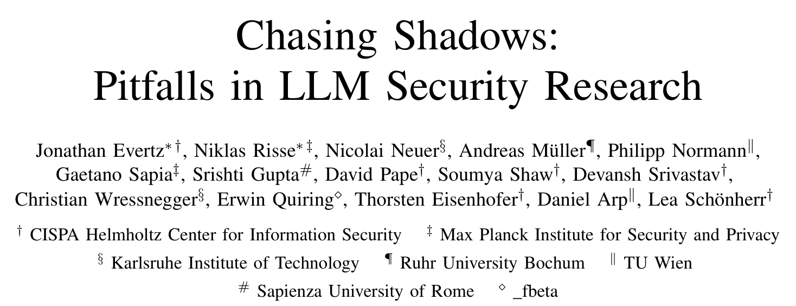
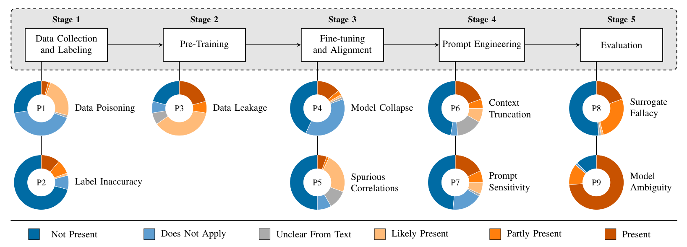
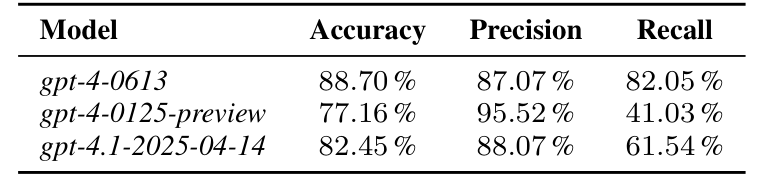
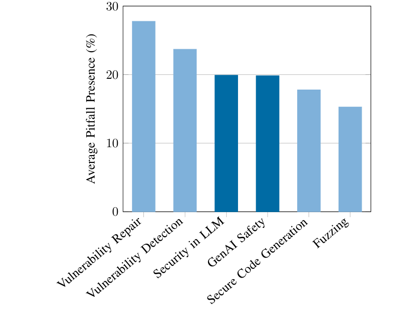

## PAPER INFO|论文信息

【论文题目】Chasing Shadows: Pitfalls in LLM Security Research
【论文链接】https://arxiv.org/abs/2512.09549
【项目主页】https://llmpitfalls.org
【作者团队】CISPA、马普所（MPI-SP）、卡尔斯鲁厄理工（KIT）等

这是一篇发表在 **NDSS 2026** 的实证研究，来自 CISPA、马普所等一众欧洲安全强校（还拿了 Artifact Evaluated 全部徽章）。它做的事很勇敢：不提新方法，而是给"用大模型做安全研究"这件事本身做了一次方法论体检。因为是实证研究，本文写得更深入一些。

## OVERVIEW|导读

这两年用 LLM 做安全研究（漏洞检测、漏洞修复、安全代码生成、越狱攻防）井喷式增长，但一个尴尬的问题被集体忽略：**这些研究的方法本身，靠谱吗？** 作者把 LLM 的研发流程拆成五个阶段，梳理出 **9 个方法论陷阱**，组织 15 位研究者逐篇盲评，核查了 2023 到 2024 年发表在八大安全与软件工程顶会（S&P、NDSS、CCS、USENIX Security、ICSE、ISSTA、FSE、ASE）上的 **72 篇** LLM 安全论文。

结论有三层，一层比一层扎心：**每一篇论文都至少踩了一个坑**；所有被踩的坑里**只有 15.7% 被作者自己意识到**；而最深的一层是，**越是 LLM 独有的新坑，越是没有一篇论文讨论过**。下面顺着这三层往下讲，重点是最后那四个"坐实危害"的实验。

## PIPELINE|九个陷阱，藏在流程的每一段

先看这张全景图，9 个陷阱按流程五阶段一一归位，每个陷阱旁的圆环是它在 72 篇里的普遍程度：

不用记全，抓住机制就行。这些坑大致分两类：**一类是老机器学习就有、只是被 LLM 放大的**，比如 P3 数据泄露（你拿来测试的公开漏洞数据集，本身就躺在 GitHub 上，很可能早被大模型"背"进了训练语料，于是你测出来的高分是背答案背出来的）、P5 伪相关（模型学到的是和标签相关但和任务无关的表面特征）。**另一类是 LLM 全新引入的**，比如 P4 模型崩溃（拿别的大模型生成的合成数据来训练，会一代代退化）、P8 替身谬误（在一个模型上的结论被想当然推广到"所有大模型"）、P9 模型歧义（论文只写"我们用了 GPT-4"，可 GPT-4 背后有几十个快照版本、还有不同量化精度，别人根本没法复现）。记住这个"老坑被放大 / 新坑全新出现"的二分，下一节的关键发现就建立在它上面。

## BLINDSPOT|最深的一层：越新的坑，越没人管

这篇最有洞察力的地方，不是"篇篇踩坑"，而是把"陷阱存在"和"陷阱被讨论"拆开对照后看到的落差。

反差是这样的：最"老牌"的坑 P2 标注不准，在相关论文里有 **60%** 都主动讨论了自己的局限，说明大家对它有意识、会防；可到了 LLM 全新引入的三个坑就彻底失声：==模型歧义（P9，73.6% 的论文都有）、数据投毒（P1）、模型崩溃（P4），在全部 72 篇里没有一篇讨论过，讨论率是零==。换句话说，整个领域的注意力还停在老一代机器学习的坑上，而对大模型带来的新坑几乎是集体盲区。一个坑没人意识到，就永远不会被修，这比"存在"本身更危险。

而 P5 伪相关这个坑，藏着全文最颠覆认知的一个例子。你以为 LLM 漏洞检测器是在"读懂代码、判断有没有漏洞"，但作者引用的证据显示：==这些检测器连"打了补丁的安全函数"和"打补丁之前那个有漏洞的原函数"都分不出来，甚至把代码结构整个抽掉、只留无关外壳，它照样能拿高分==。这说明它根本不是在理解漏洞，而是在蹭数据集里的表面统计特征（比如某类函数名、某种代码风格恰好和"漏洞"标签相关）。一个刷榜刷得很高的检测器，可能压根没在做你以为它在做的事，这是比"准确率虚高"严重得多的问题。

## PROOF|四个实验，坐实这些坑真会骗人

光说普遍还不够，作者又做了四个实验，把"坑会扭曲结论"这件事一个个证死。

**其一，模型歧义：同一个 GPT-4，结论能差一倍。** 作者用同一套仇恨言论检测流程，只换 OpenAI 的不同 GPT 快照：

==同样叫"GPT-4"、同样一套实验，只是换了个快照，召回率就从 82% 掉到 41%==。机制很具体：面对一条被标为仇恨的推文（大意是辱骂反疫苗人群的脏话），老快照 gpt-4-0613 判定它是身份仇恨、报警；而新快照认为它只是"有攻击性但没到煽动仇恨的程度"，放行。新快照的判定阈值更严，于是漏报变多（召回掉到 41%）、但报出来的更准（精度升到 95.52%）。这意味着一篇只写"我们用 GPT-4"的论文，结论完全无从复现，甚至可能因为挑中一个"碰巧表现好"的快照而虚高。作者还补了一刀：量化精度也会翻盘，2-bit、3-bit 的模型反而比 8-bit 更容易被攻击得手，所以连"我们用了 Llama-2-7B"都是没说清楚的。

**其二，数据泄露：泄多少，分数虚高多少，而且这里有个诚实的反转。** 在受控实验里，把 20% 的测试数据混进微调集，F1 就凭空涨 0.08 到 0.11，且随泄露比例近乎线性上升，泄得越多、虚高越多。但作者没有就此喊"商用大模型都被污染了"，反而做了件诚实的事：他们拿项目名 + commit 号去探测 gpt-3.5、gpt-4o、Claude、DeepSeek 等模型，让它们复现原始 commit 内容，**结果没有一个模型能复现，连在训练语料 Common Crawl 里都搜不到那个漏洞数据集的踪迹**。也就是说，泄露的危害在原理上确凿，但就这个具体数据集而言，他们没找到商用模型被污染的证据。这个"没能证明"的反例，恰恰是这篇比一般喊口号的批评更可信的地方。

**其三，上下文截断：模型在给它看不见的代码找 bug。** 在漏洞检测常用的数据集里，平均 **52.8%** 的漏洞函数超过 512 token，31.7% 超过 1024。这意味着什么？作者举了 CVE-2014-2669 的例子：那个真正引发整数溢出的关键代码行，恰好落在 512 token 窗口之外。**于是模型被要求判断一段它根本没读全的代码有没有漏洞，而那行有漏洞的代码它压根没看到**。更狠的是作者强调这还只是下界，因为很多漏洞的判断需要跨函数的上下文，光有完整函数都不够。用小上下文测出来的漏洞检测分数，有一大截是在无效评估。

**其四，模型崩溃：AI 写的代码反过来喂 AI，会越训越坏。** 作者用一个代码模型自己生成代码、再拿去训练下一代，如此循环十代，困惑度（模型的不确定度）分布一代代右移、方差越来越大，模型越来越不稳定。而且代码比自然语言更脆，因为语法和语义约束更严，错一点就崩。这个趋势在 AI 编程助手普及、越来越多代码由模型生成的当下尤其危险：如果用来做漏洞检测或代码生成的底座模型本身在退化，建立在它之上的一切安全结论都在跟着缩水。

## TOPIC|哪些研究方向最危险

把踩坑率按方向拆开，还能看出一条规律：

越是让大模型去"理解和判断"代码语义的方向（漏洞修复、漏洞检测），踩坑越多；而模糊测试这类把大模型当辅助、最终结论靠"程序真的崩没崩"来验证的方向，踩坑最少。这背后是一条可操作的经验：**给结论留一个不依赖大模型的硬验证出口**（能实际运行、能编译、能触发崩溃），就能把方法论风险压下来一大截。反过来，越是纯靠模型"说了算"的评测，越要提防上面那些坑。

## TAKEAWAYS|启发与点评

**对研究者**：这篇的价值不在算法，而在它把"存在"和"被讨论"拆开后照出的集体盲区，以及一份可操作的自查清单。最该记住的是那条落差：老坑大家会防，新坑无人问津，说明问题不是做不到，而是没意识到。它开的方子其实都不难：写清楚到底用了哪个模型快照、什么量化精度；用了合成数据或大模型打标就披露并抽样人工核验；上线前查一下测试集会不会早于模型训练截止日就公开了；别把单个模型的结论推广到所有模型；对漏洞检测这类任务，务必做伪相关检查（把代码结构扰动一下，看分数会不会不合理地稳）。这些不是高深技术，而是把方法论的严谨当成一等公民。llmpitfalls.org 那份持续更新的清单，值得任何做 LLM 安全研究的人对照一遍。

**对从业者与读者**：一个能立刻用的习惯，**读 LLM 安全论文时带上一张问题清单**。看到"某大模型漏洞检测准确率 90%+"，先别信，追问四件事：用的是哪个模型快照（模型歧义）？测试集会不会早被模型背过（数据泄露）？漏洞代码有没有超出上下文被截断（上下文截断）？它是真在理解漏洞，还是在蹭表面特征、连补丁前后都分不清（伪相关）？这四问就是一副照妖镜，能帮你快速判断一个亮眼数字背后有多少方法论的水分。

**一点观察**：我们这个号解读过大量 LLM 安全论文，这篇读下来格外扎心，因为它照的正是我们天天在读的这类研究。它戳破的其实是一个被热度掩盖的常识：==在一个爆发式增长的领域里，最稀缺的往往不是新方法，而是对方法本身的诚实和怀疑==。软件供应链安全里我们反复强调"信任要有依据"，而这篇把同样的尺子量向了研究本身：一个用来发现漏洞的工具，如果它自己的评测都站不住脚，那基于它的所有安全结论都是在流沙上盖楼。从"追逐幻影"回到扎实的证据，是这个领域走向成熟绕不开的一步。
