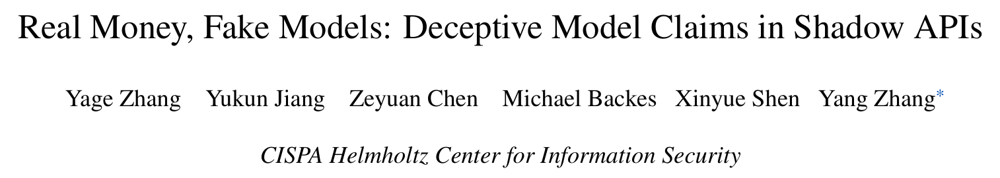
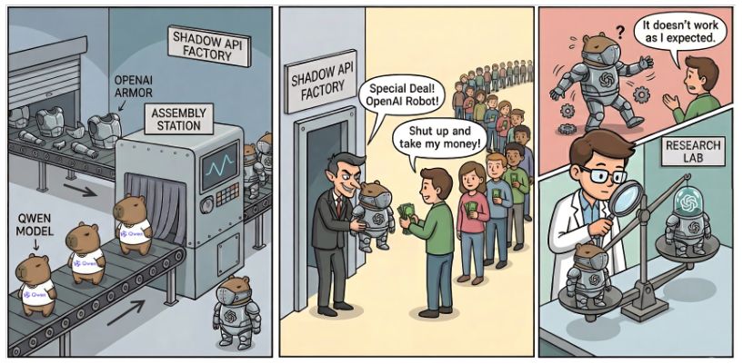
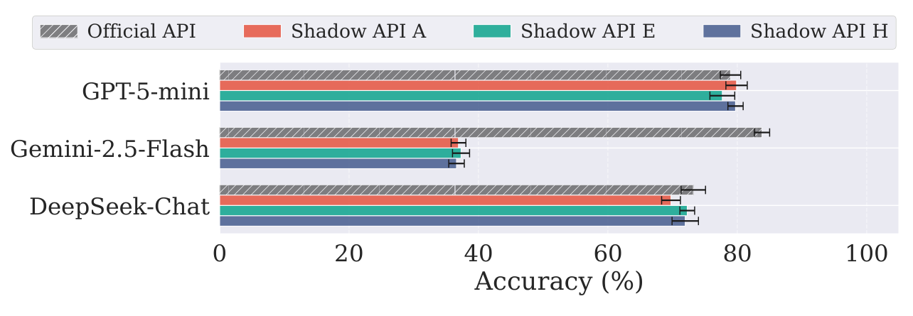
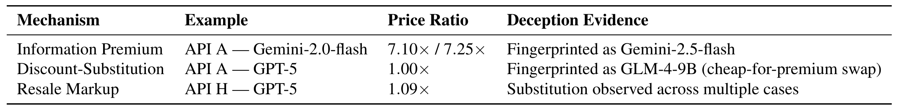

## PAPER INFO|论文信息

【论文题目】Real Money, Fake Models: Deceptive Model Claims in Shadow APIs
【论文链接】https://arxiv.org/abs/2603.01919
【作者团队】CISPA 亥姆霍兹信息安全中心

这是 CISPA 团队（通讯作者 Yang Zhang）对**影子 API（shadow API）**做的第一次系统性审计。所谓影子 API，就是那些声称"能调 GPT-5、Gemini-2.5，不限地区、价格更低"的第三方中转服务，国内一般叫中转 API 或 API 中转站。这篇论文要回答的问题非常朴素：==你按官方模型付的钱，拿到的到底是不是那个模型==。

## OVERVIEW|导读

先说结论。作者找出 17 家影子 API，它们出现在 187 篇学术论文里，其中 116 篇（62.03%）发表在 ACL、CVPR、ICLR、NeurIPS 这类顶会；用得最多的那家，关联仓库累计 58,639 个 GitHub star，关联论文累计 5,966 次引用。然后他们挑了三家有代表性的，把八个模型拉到官方 API 和影子 API 上对着跑，再用模型指纹技术直接验身份。

结果分三层，一层比一层硬：**能力上**，最难的推理任务掉得最狠，某家的 Gemini-2.5-pro 在 AIME 2025 上比官方低 40.00%；**专业领域上**，Gemini-2.5-flash 的医疗执照题正确率从官方的 83.82% 塌到平均 36.95%；**身份上**，24 个被测端点里 45.83% 没通过指纹验证，宣称是 GPT-5 的端点，指纹指向 9B 参数的开源模型。

这篇之所以值得供应链安全的读者认真看，是因为它讲的其实是一个很熟悉的故事换了个宿主：一条来源不可验证的分发链，中间商可以静默替换你要的东西，而下游没有任何手段核验。只不过这次被替换的不是软件包，是模型本身。

## BACKGROUND|影子 API 是怎么长出来的

这个市场的成因，论文讲得很克制也很清楚：官方 API 有三道门槛，价格、支付方式、地区限制。OpenAI 的 API 在包括中国在内的若干地区无法直接访问，Anthropic 明确不向未支持地区销售，而前沿模型的定价本来就是按企业客户设计的，对学生和个人研究者并不友好。与此同时，AI 顶会的投稿量恰恰大量来自这些受限地区。**供给和需求被硬生生错开，中间自然长出了一个市场。**

论文也点明了这个市场的法律位置：官方服务条款普遍禁止任何形式的 API 密钥转售和再分发，所以这些服务同时踩在服务合同和当地监管两条线上。这一点不是道德评判，而是它后面所有风险的根源：**一个无法进入正规合同关系的中间商，你出了问题也无处追责。**

从供应链的视角看，影子 API 的本质是一个黑箱代理：你的请求被路由、被处理、可能被篡改，途中经过若干个未经授权的节点，而你只能看到最后吐回来的 token。

## LANDSCAPE|它已经渗透到什么程度

作者的摸底方式很实在：先扫 ICLR 2024（2,260 篇，其中 1,108 篇带代码）和 ACL 2024（1,923 篇，1,005 篇带代码），从这 2,113 篇有代码的论文里解析出 GitHub 仓库，找到 92 个真正调用 LLM API 的项目，其中 **21 个（22.8%）至少用了一个影子 API 端点**。然后拿这些端点 URL 去 GitHub 全站反查，找出调用同一 URL 的更多仓库，再从新仓库里收割新的端点 URL，如此迭代直到不再有新发现。

地域分布这一栏需要平静地读：使用者高度集中在官方渠道受限的地区，这不是谁不守规矩，而是**没有官方通道的人，只能走非官方通道**。论文自己也把它归因于访问限制，并在建议里明确要求官方厂商放宽地域限制、提供学术定价。

比渗透率更值得警惕的是这个市场的底子。作者查了 17 家的工商与备案信息，结论是：**17 家里有 15 家由个人运营，没有可核验的身份或来源信息**，只有一家在国内持有有效的 ICP 备案；调研期间已经有两家停止运营；并且所有服务商都会频繁更换上游模型来源，不向用户做任何通知。

技术底座也很统一：17 家里有 11 家搭在 OneAPI 及其衍生的 NewAPI 上。这是一套开源的模型聚合与再分发系统，把各家商业 LLM 的接口统一成 OpenAI 兼容格式，自带密钥管理、二次分发、请求路由和自动重试。这些功能对做聚合是刚需，但**它同时也把"静默替换上游模型"变成了一个配置项**：路由指向哪个后端，对调用方完全不可见。

## METHOD|怎么审：从表现差异到身份指纹

审计分两层，这个设计是这篇论文最见功力的地方。

**第一层是间接证据，看表现对不对得上。** 科学域用 AIME 2025（竞赛数学）和 GPQA Diamond（博士级科学题），敏感域用 MedQA（美国医师执照考题）和 LegalBench 的 Scalr 子集（法条适用与结论推理），安全性用 JailbreakBench（520 条有害请求）和 AdvBench，配四种越狱手法（GCG、Base64、Combination、FlipAttack），再用 GPT-4o-mini 加 StrongREJECT 评分模板做裁判。所有实验跑三次取平均并报告标准差。

**第二层是直接证据，直接验模型身份。** 用 LLMmap 这套主动指纹框架：拿一组精心构造的探针问题去问端点，把回答与参考模型库比对，算余弦距离，判定"这个端点背后到底是哪个模型"。为了防止单一方法有盲区，作者又加了一套完全独立的 MET（Model Equality Testing），做的是双样本假设检验，判断影子 API 的输出分布与官方模型是否同源。

两套方法在 54 个案例上的结论一致率是 74.1%，Cohen's κ = 0.512。更重要的是他们还搭了一个已知真值的受控测试台，里面既有诚实端点也有故意替换的端点，**LLMmap 判对 96.0%，MET 判对 88.3%，并且在所有已确认的替换案例上两者结论完全一致**。这一步很关键：它排除了"是不是方法本身在乱报"这个替代解释，后面那些指控才站得住。

## FINDINGS|三个最该记住的发现

**发现一，指纹直接抓到了替换，而且替换是有套路的。**

24 个端点里 45.83% 没通过指纹验证，另有 12.50% 虽然身份判对，但余弦距离显著偏离官方。把红格子的规律提出来，替换分成两种：

其一是**拿便宜的开源模型冒充昂贵的闭源模型**。宣称 GPT-5，指纹却指向 glm-4-9b-chat；宣称 GPT-4o-mini，指纹指向 Qwen2.5-7B。一个 9B 参数的开源模型和 GPT-5 之间的成本差距有多大，不用算也知道。

其二是**拿不带思考的模型冒充推理模型**。你要 DeepSeek-Reasoner，它给你 deepseek-chat。这一招尤其隐蔽，因为两者同门同源、说话风格一致，只有在真正需要长链推理的题目上才会露馅。

所以呢？这两种套路解释了后面所有的性能异常，也解释了为什么用户几乎不可能靠肉眼发现问题：**你日常问的大多数问题，9B 模型也答得像模像样。**

**发现二，能力塌方集中发生在"最需要它的地方"。**

在科学域，规律很干净：非推理任务上三家影子 API 表现都还凑合，一到推理任务就崩。AIME 2025 上，A 家的 Gemini-2.5-pro 比官方低 40.00%，DeepSeek-Reasoner 低 38.89%。对照发现一就明白了，**这不是"网络不稳定"，是后端根本换成了不会推理的模型**。

敏感域更刺眼。看这张图：

法律域是同样的形状，LegalBench 上三家影子 API 全线落后官方 40.10% 到 42.73%。三家在敏感域的平均跌幅分别是 16.96%、15.71%、14.75%。

论文给了两个具体到能复现的错例。医疗题问的是产程中围产期 HIV 筛查该用哪项确证试验，官方 API 答"HIV-1/HIV-2 抗体分型免疫检测"，正确；A、E、H 三家一致答成"测定病毒的基因型"，全错。法律题问的是《联邦证据规则》606(b) 条是否允许陪审员就评议内容作证以证明其在预先审查阶段撒谎，官方答对，A 家和 H 家把"重新审判"的标准和证据可采性混为一谈，E 家干脆引了一条不相干的人身保护令规则。

所以呢？**这两个域恰恰是最不能出错的两个域。** 一个把用药和诊断问题外包给中转 API 的应用，它的错误率不是官方模型的错误率，而是某个未知后端的错误率，而这个差距可以接近 50 个百分点。

**发现三，也是最反直觉的一条：指纹对得上，不等于行为一致。**

Gemini-2.5-flash 是个绝佳的反例。三家影子 API 上它的指纹**全部判定正确**，余弦距离也贴近官方基线（15.41、17.51，官方 15.19），从身份验证的角度看这是三个"诚实端点"。但就是这个模型，在 MedQA 上从 83.82% 塌到 37%。

更进一步，独立的 MET 检验在能力类基准上判它与官方同源（AIME、GPQA 上均未拒绝原假设），却在两个安全基准 AdvBench 和 JBB 上对三家全部拒绝原假设。==也就是说，同一个端点可以在能力上像官方，在安全行为上系统性地不像。==

安全性的偏差还是双向的，这一点很要命。GPT-5-mini 在 Base64 攻击下，A 家的有害性得分 0.04，是官方 0.02 的两倍；而 Gemini-2.5-flash 在 FlipAttack 下，官方得分高达 0.90，三家影子 API 只有 0.67 到 0.68，看上去"更安全"。**同一批中转服务，在一个模型上放大风险，在另一个模型上掩盖风险。**

所以呢？对做安全评测的人来说，这条的杀伤力最大：如果你的越狱实验是在中转 API 上跑的，你既不知道自己高估了还是低估了风险，也没有办法事后校正。作者还补了一个 OLS 回归，用余弦距离、价格比、身份是否匹配、是否推理模型去预测正确率跌幅，结论是**价格没有任何预测力**：贵不代表真，便宜也不代表假。

## MONEY|这门生意怎么赚钱

作者把三家的定价和实际后端对上，归纳出三种赚钱机制：

第一种"信息溢价"很有意思：它给的模型其实比你要的更新更好，但收你七倍多的钱，赚的是你不知道自己该付多少的信息差。第二种"折价替换"是纯粹的以次充好。第三种则是在正常转售价上再叠一层替换。

真金白银的损失作者也算了。以 GPQA 上 1,273 次 GPT-5 查询为例，按官方每百万 token 输入 1.25 美元、输出 10 美元计价，官方端点交付的等价值是 14.84 美元；三家影子 API 实际交付的 token 量折算下来只值 5.70、5.35、7.77 美元，也就是官方的 0.36 到 0.52 倍。**你按官方价付钱，拿到的是三分之一到一半的东西。** 再按任务正确率归一化，影子 API 每一美元真实价值对应的错误数是官方的 2 到 4 倍。

学术层面的账更大。187 篇论文里保守假设 30%（约 56 篇）需要因身份不一致而重跑实验，按每篇 50 到 500 美元的 API 重跑费加约 40 小时研究者时间（按 50 美元每小时计约 2,000 美元）估算，直接成本在 11.5 万到 14 万美元之间。而这还不包括引用这些论文的 5,966 篇工作里，可能被静默污染的下游结论。

## TAKEAWAYS|启发与点评

必须先给这篇论文自己的 caveat 留位置，它写得很诚实：数据是 2025 年 9 月到 12 月的一个快照，这个市场极不稳定，服务商随时换上游、改路由、关门跑路；他们没有后端真值，只能靠指纹和统计检验推断；17 家也不等于全部市场。而且三家里 E 家在科学域其实相当忠实，平均只差 2.64%，Gemini-2.5-pro 在三家上都通过了 MET 检验。**所以正确的结论不是"中转 API 全是假的"，而是"你无法分辨哪一次是真的"**，而在不可分辨的情况下，风险已经实际存在了。

**对研究者**：这篇给"实验可复现性"补上了一块一直被忽略的拼图。我们习惯了核验数据集来源、公开代码和随机种子，却默认"我调用的 GPT-5 就是 GPT-5"。这篇证明这个默认假设有将近一半的概率不成立，而且**无论你的实验设计多严谨，都补救不了算力来源本身就是假的**。论文给的建议很具体：把端点 URL、宣称的模型版本、访问日期、价格档位写进实验设置；正式跑数据前用至少 24 条 LLMmap 探针验一次身份，余弦距离超过官方基线 1.2 倍或首选模型对不上就弃用；再用至少 500 个样本跑 MET，拒绝原假设就弃用；同一基准跑至少三轮，正确率标准差超过 5 个百分点或延迟变异系数超过 0.15 就弃用。本账号此前解读过《72 篇 LLM 安全顶会论文，篇篇都踩坑》，那篇讲的是方法论层面的陷阱，这篇补的是基础设施层面的陷阱，后者更隐蔽，因为它连一个可疑的实验现象都不会留下。

**对从业者**：三条能直接用。其一，**如果你的产品后面挂的是聚合或中转端点，你等于把用户的医疗、法律类回答托付给了一个无法追责的中间商**，而这类问题恰恰是掉分最狠的。其二，**价格不是信号**，回归结果显示定价对是否被换模型毫无预测力，按官方价收费的端点照样在用 9B 模型交付。其三，有两个便宜的自查手段：定期拿固定探针做一次指纹比对，以及盯住延迟和 token 数的波动，论文观察到影子 API 的这两项波动能超过官方的 2.0 倍，这是后端在动态路由或换模型的直接迹象。

**一点观察**：把这篇放回供应链安全的脉络里，它几乎是恶意包问题的一次精准平移。包生态里我们花了十年建来源验证：签名、SBOM、构建溯源，就是为了回答"我装的这个东西是不是发布者发布的那个"。而模型推理这一层，==目前根本不存在一个机制，让终端用户验证"我付费拿到的这串 token，是不是我付费的那个模型生成的"==。指纹和分布检验是研究者的事后取证手段，成本高、需要探针、需要参考模型库，不可能让每个调用方跑一遍。论文最后那条建议其实点到了要害：官方厂商应该提供轻量的验证端点，让任何人都能独立确认模型身份。翻译过来就是，**模型推理也需要它自己的签名与溯源机制**。在这套机制建起来之前，这条链上的每一次调用，都是一次基于信任的赌博。
