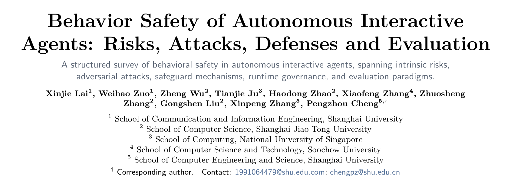
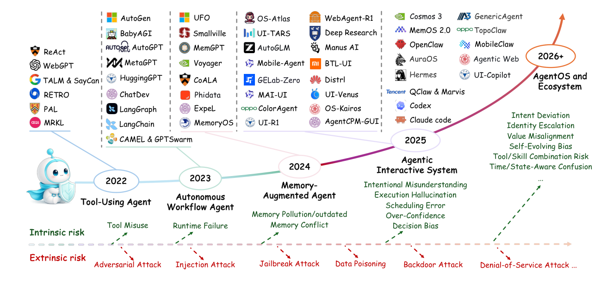
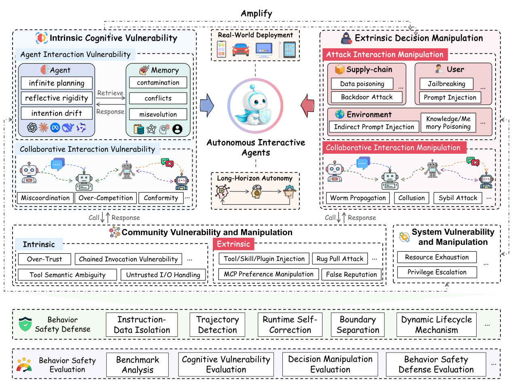
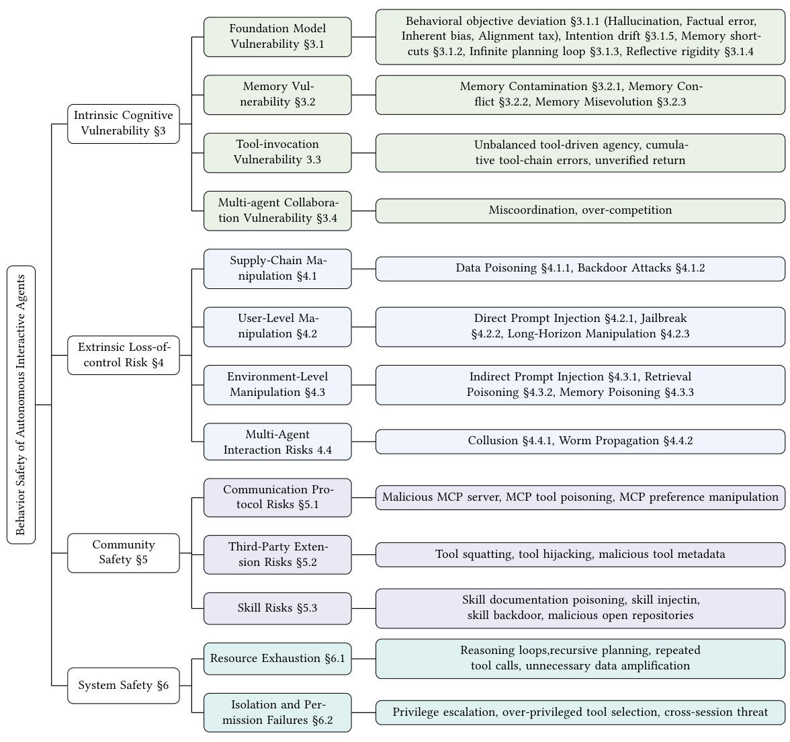
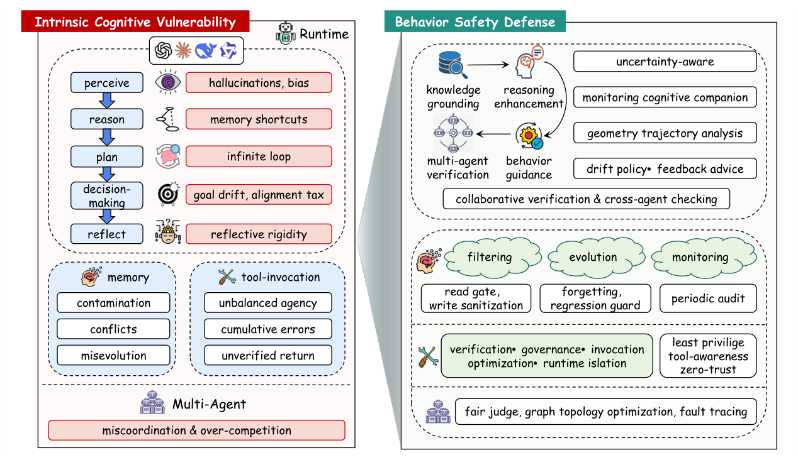
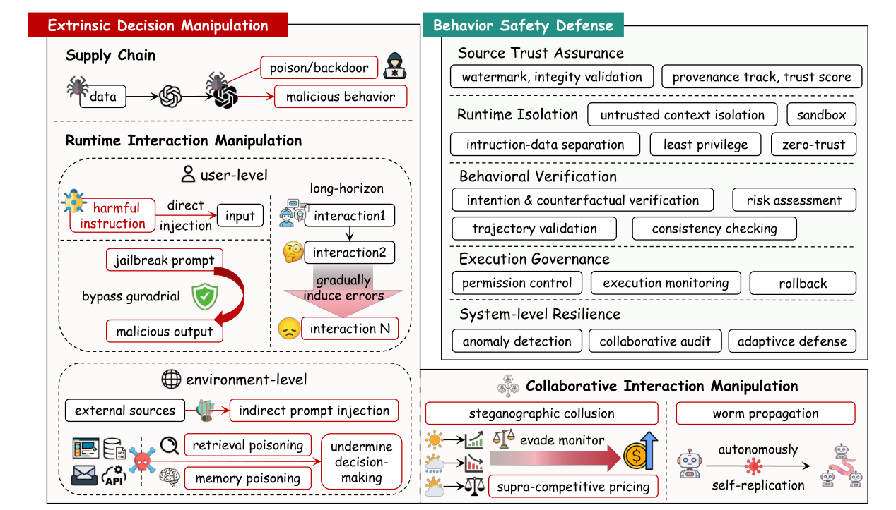

## PAPER INFO|论文信息

【论文题目】Behavior Safety of Autonomous Interactive Agents: Risks, Attacks, Defenses and Evaluation
【论文链接】https://doi.org/10.1145/nnnnnnn.nnnnnnn
【项目仓库】https://github.com/zuo-dot/Behavior-Safety-of-Autonomous-Interactive-Agents

本文由**上海大学、上海交通大学、新加坡国立大学、苏州大学**联合完成。这是一篇体量很大的综述(74 页、系统梳理 412 篇技术文献),也是我们连续解读的 Agent 安全系列里的"总纲"。前面几篇(Skill 三部曲、Dawn Song 攻防综述、权限实测)都是这张大图里的某一块拼图,这篇则试图把整块拼图拼起来。因为是综述,本文写得更深入一些。

## OVERVIEW|导读

过去我们谈 LLM 安全,谈的是"内容安全":模型会不会说出有害的话、生成有毒的文本。但当模型变成能自主规划、长期运行、调用工具、和其他 Agent 协作的**自主交互 Agent**,风险的性质变了。危险不再是某一次输出说错话,而是**在几十上百轮的长程交互里,行为一点点偏离用户的本意**,最终酿成不可控的后果。作者把这个新问题命名为"**行为安全**"(behavior safety),并给出了迄今最系统的一张地图:从 Agent 内部的认知缺陷,到外部攻击者的操纵,再到社区生态和底层系统,四个层次层层递进。它还提出了一个衡量"能力与风险如何权衡"的理论指标 Agentic COB,贯穿全篇。一句话概括全文的洞察:**Agent 的能力(自主性、交互性)和它的行为风险是同源的,你把能力推得越高,行为攻击面就同步放大**,可靠性不会随能力自动到来,而必须被单独设计进去。

## BACKGROUND|为什么需要"行为安全"这个新视角

Agent 的演化路径本身就在放大风险。下图是论文画的一条时间线:从 2022 年的工具调用 Agent(ReAct),到 2023 年的自主工作流(AutoGPT),到 2024 年的记忆增强(MemGPT),再到 2025 年的智能交互系统和 2026 年展望的 AgentOS 生态。能力每上一个台阶,底部那条风险带就宽一分:内生风险从"工具误用"长到"意图偏移、自演化偏差",外生风险从"对抗攻击"长到"数据投毒、拒绝服务"。

作者指出,已有综述有个共同的局限:它们大多沿用"模型中心"的老框架来分类,要么按系统组件分(记忆、工具、协议),要么按生命周期阶段分,彼此割裂,始终缺一个**以"行为链"为主线的统一框架**。而行为安全的特殊性恰恰在于:风险不发生在孤立的某一步推理,而是**沿着整条长程轨迹累积**。这就要求换一套以行为为中心的视角来重新组织整个领域。

## FRAMEWORK|四层行为安全框架

这篇综述的核心贡献,是把 Agent 的行为风险组织成一个"认知→执行→环境→协作"贯通的统一框架,共四个层次。下图是全篇的总览:

四个层次对应的风险目录如下图这张分类树,每一类都标了对应章节,信息密度很高,值得对照阅读:

在展开四层之前,先说这篇综述一个有意思的理论工具:**Agentic COB 指标**。它把行为安全量化成一个权衡式:

> Agentic COB = (自主性 × 交互性) / 行为风险 = (轨迹长度 × 交互轮数) / 风险分

直白说,分子是 Agent 能干多少活(轨迹越长、交互越丰富,能力越强),分母是它累积的行为风险。**几乎所有增强能力的设计都会同时抬高分子和分母**:给它更长的自主轨迹、更多工具、更强记忆、更多协作,它能干的事变多了,但可被攻击、可跑偏的面也变大了。这个指标是全篇的暗线,作者在每一层结束时都用它点一句"能力与安全的权衡",反复强调一件事:**行为可靠性是高能力的前提,而不是高能力的副产品**。

## LAYER 1|内生认知脆弱性：Agent 自己会跑偏

第一层是 Agent 内部的认知缺陷,不需要任何攻击者,它自己就会出问题。下图左半部是这一层的风险全景(右半部是对应防御):

这一层细分为四块。**基座模型脆弱性**是根子:幻觉(Agent 会编造不存在的工具返回值、规划出无法执行的步骤)、事实错误、固有偏见、以及"对齐税"(安全对齐往往以推理能力下降、过度拒绝为代价)。还有几个 Agent 特有的认知病:**意图漂移**(多轮交互中一点点偏离最初的目标,还会自我强化)、**记忆捷径**(像懒惰学习者一样直接复用表面相似的历史经验,不再重新推理,论文举的例子是助手一看到"星巴克"就自动"买一杯冰美式",不再核实当前意图)、**无限规划循环**(反复重规划却不推进,烧掉大量 token)、**反思固化**(自我检查时死守错误结论,越反思越错)。

**记忆脆弱性**是第二块:记忆污染(良性但无关的信息悄悄误导后续任务)、记忆冲突(新旧记忆矛盾未解决)、记忆自演化(从历史成功里学到一个错误的启发式,比如"给所有不满意的客户退款")。**工具调用脆弱性**是第三块:工具代理权失衡(给了过多或过少的工具)、工具链累积误差、返回值未经核实就写进上下文。**多智能体协作脆弱性**是第四块:失调(盲目信任队友的消息导致误差放大)和过度竞争(竞争机制诱发超竞争定价、攻击性言辞)。

## LAYER 2|外生失控：攻击者如何放大内生缺陷

第二层是外部攻击者主动利用上述内生缺陷。下图是这一层的全景:

按攻击来源分四类。**供应链操纵**(训练期):数据投毒、奖励投毒、偏好投毒、轨迹投毒、后门攻击,把恶意行为在训练阶段就埋进模型。**用户级操纵**(运行期):直接提示注入、越狱、以及"长程操纵"(把有害意图拆散到多轮里慢慢诱导)。**环境级操纵**:间接提示注入、检索投毒、记忆投毒,这三个尤其隐蔽,因为 Agent 会把外部读到的内容当成可信上下文。论文把记忆投毒又细分为注入式、触发式、渐进侵蚀式,其中"睡眠者"记忆投毒最阴险:恶意记忆植入后长期休眠,原始恶意文档删掉了也没用,会在未来某次会话里被唤醒。**跨 Agent 操纵**:合谋(多个 Agent 通过隐写信号暗中串通抬价)和蠕虫传播(自我复制的恶意提示像病毒一样在 Agent 网络里扩散,论文提到 ClawWorm 一条消息就能把载荷写进配置、每次重启自动执行并传染邻居)。

## LAYER 3 & 4|社区与系统：生态和地基的风险

第三层**社区安全**,直接对应我们前几篇解读过的内容。三块:**通信协议(MCP)风险**,即恶意 MCP 服务器、工具投毒、偏好操纵,论文点名了 Anthropic 官方 MCP Inspector 的 CVE-2025-49596 远程代码执行漏洞;**第三方扩展(工具)风险**,即工具抢注、工具劫持、恶意元数据;**技能(Skill)风险**,即技能文档投毒、技能注入、技能后门,论文引用的数据很扎心:84.2% 的技能漏洞藏在自然语言文档(SKILL.md)里,带可执行脚本的技能出漏洞的概率是别的 2.12 倍。读过我们 Skill 三部曲的朋友会发现,那三篇(MalSkillBench、HarmfulSkillBench、SkillSafetyBench)正好落在这一层。

第四层**系统安全**,是最底层的执行地基。两块:**资源耗尽**,不同于传统 DoS 打基础设施,这里攻击者用技能描述或工具响应诱导 Agent 陷入推理循环、重复调用,造成持续的 token 消耗和 API 预算流失,论文提到一个反常现象:技能一旦出故障,Agent 会自主进入长时间的错误恢复循环,烧掉比攻击本身更多的资源;**隔离与权限失效**,即越权提权、过度授权的工具选择、跨会话威胁。这一层的核心观点是:权限不再是"每次调用检查一下"的静态配置,而是必须在整条长程轨迹上都守住的**持续行为属性**。

四层看下来,防御侧的思路高度一致:从"过滤输入内容"转向"守护整条行为轨迹":来源可信校验、指令与数据隔离、轨迹级检测、运行时自我纠偏、边界隔离、全生命周期的动态治理。评估侧,作者把现有基准按内生行为安全和外生行为攻击两类归纳,并指出一个空白:多数基准还不足以评估新型 Agent 的行为级、轨迹级安全。

## TAKEAWAYS|启发与点评

**对研究者**:这篇综述最大的价值是提供了一套**以行为为中心的统一坐标系**。在此之前,Agent 安全的论文各说各话:有人从记忆角度、有人从工具角度、有人从协议角度切入,彼此难以对话。这篇把它们统一到"认知→执行→环境→协作"的行为链上,四层框架加一棵分类树,几乎可以把任何一篇 Agent 安全新工作对号入座。Agentic COB 这个指标虽然还比较理论化(轨迹长度、交互轮数、风险分如何精确测量仍是开放问题),但它传达的思想很重要:**能力和风险是同源的,不能只优化能力榜单而不管行为风险**。对于想进入这个方向的研究者,这篇是一份极好的地图和选题清单,每一个"能力-安全权衡"的注记框,都是一个待解的问题。

**对从业者**:三个层面的提醒。其一,**要盯的是行为轨迹,不是单次输出**。给 Agent 做安全,只在输入端加护栏、只审单步输出都不够,论文反复证明风险是沿长程轨迹累积的,监控、纠偏、回滚这些运行时机制必须贯穿整个生命周期。其二,**记忆和上下文是被低估的攻击面**。意图漂移、记忆投毒、睡眠者攻击这些都发生在"Agent 信任了它本不该信任的历史/环境内容"这个环节,给记忆和检索内容做来源校验与隔离,和审查工具/技能同等重要。其三,**能力扩展要配套安全预算**。每给 Agent 加一项能力(新工具、更长自主、更多协作),就等于抬高了 Agentic COB 的分母,安全投入需要同步跟上,否则就是在放大攻击面。

**一点观察**:把这篇综述放在我们整个 Agent 安全系列的最后来读,恰好有一种"收束"的感觉。前面每一篇:恶意 Skill 检测、有害技能、技能周边环境投毒、包幻觉、技能名幻觉、Agent 权限、Dawn Song 攻防地图,都是这张四层大图里的一个具体切片。而这篇的独特贡献是提出了"行为安全"这个统摄性的视角:**Agent 安全的本质,是在一个能自主行动、长期运行、不断和开放世界交互的系统里,如何保证它的行为始终不偏离人的意图**。这既是一个技术问题,也正在成为软件供应链安全向 AI 时代延伸的主战场。当 Agent 越来越像一个"会自己干活的软件",我们守护它的方式,也必须从"检查它说了什么"升级到"看住它做了什么"。
