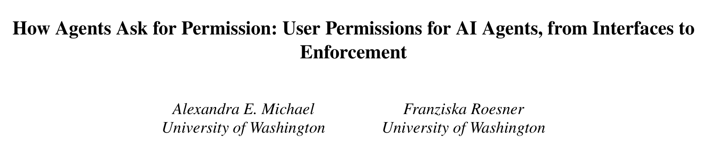
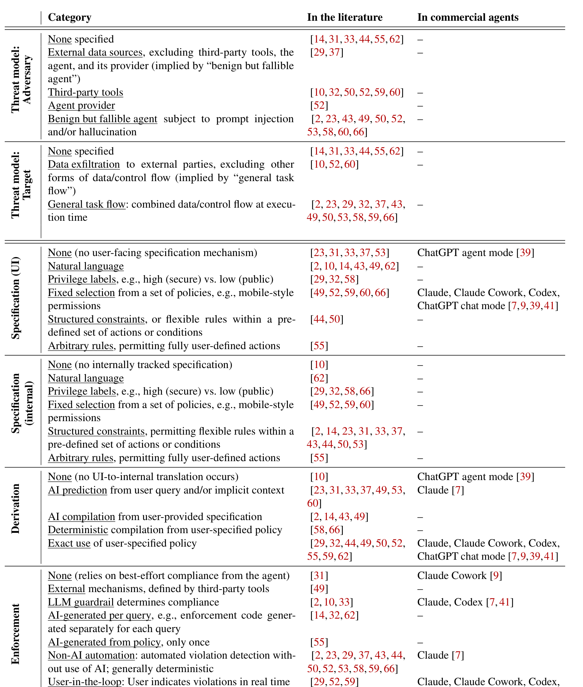
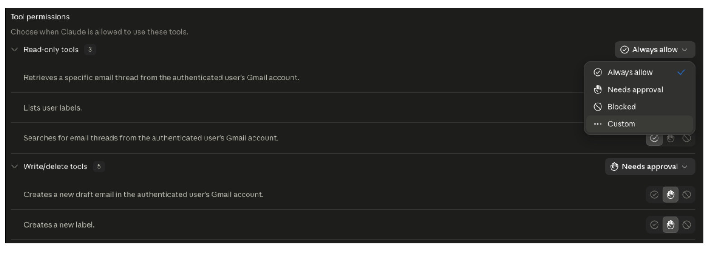
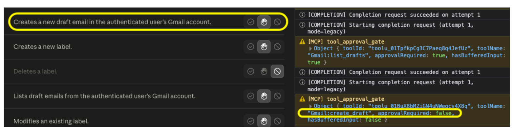
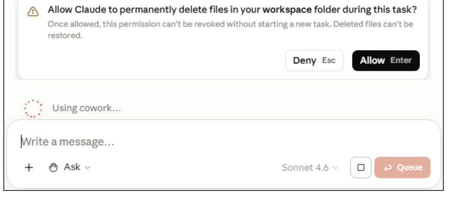

## PAPER INFO|论文信息

【论文题目】How Agents Ask for Permission: User Permissions for AI Agents, from Interfaces to Enforcement
【论文链接】https://arxiv.org/abs/2607.13718

本文来自**华盛顿大学**，通讯作者 Franziska Roesner 是可用安全与隐私方向的代表性学者（Security & Privacy Research Lab 联合负责人），长期研究权限系统与用户交互安全，从 Android 权限时代一路研究到今天的 AI Agent。

## OVERVIEW|导读

Agent 安全的文献大多在做"产品级"策略：开发者定一套全局规则，所有用户共用。但权限本质上是**用户级**的：有人愿意让 Agent 把护照号发给特定订票网站，有人则希望永远禁止。这篇论文第一次系统回答了"用户级权限在 Agent 系统里被处理得怎么样"：作者综述了 2024 至 2026 年的 **21 个权限系统提案**，构建了一套覆盖"界面规约、内部规约、策略推导、运行时执行"的完整分类学，再用逐步走查法**实测五个商业 Agent**（Claude 网页版、Claude Cowork、ChatGPT 聊天模式、ChatGPT Agent 模式、Codex）。结论相当扎心：学界追求的三大目标没有一个系统全部做到，而商业产品**连其中任何一个都基本没做到**，还存在"设置界面承诺"与"实际执行"不一致的透明度问题。

## BACKGROUND|问题与挑战

用户级权限不是新问题：从 Unix ACL、OAuth 到手机应用权限，传统系统积累了最小权限、默认拒绝这些成熟原则，也积累了教训，比如弹窗过多导致的"隐私疲劳"会让用户闭眼点同意。Agent 把这个老问题变得更难：指令与数据在 LLM 里混为一体，提示注入和幻觉让系统行为不再确定，同一条指令可能走出任意多条执行路径，权限系统却必须对每条路径都守住策略。已有的 Agent 安全工作（护栏、多 LLM 特权分离、信息流控制）大多假设策略是固定的、产品级的，用户改不了。

## METHOD|方法与分类学

作者从代表性论文出发滚雪球式检索，筛得 21 个符合"用户级权限"标准的系统（3 篇正式发表、18 篇预印本或开源系统），经多轮迭代提炼出五段式分类学：**威胁模型**（对手是谁、打什么）、**用户界面规约**（用户怎么表达策略：自然语言、固定选项、结构化约束、任意规则）、**内部规约**（系统内部怎么表示策略）、**推导**（从用户输入到内部策略怎么转换：AI 预测、AI 编译、确定性编译、原样使用）、**执行**（运行时怎么落实：LLM 护栏、按查询生成代码、非 AI 自动化、用户实时把关）。

对五个商业 Agent，作者用应用分析领域的"走查法"：干净环境安装、授予少量权限（如实验专用 Gmail）、要求 Agent 完成"应该能做"和"不应该能做"的任务、尝试撤销权限再测试。Claude 的场景还借助浏览器控制台记录的 MCP 调用日志拿到了内部证据。

## RESULTS|发现：文献侧与商业侧的双重落差

**文献侧有三大目标，但没人全做到。** 21 个系统反复追求三件事：近零用户负担（12 个避免让用户直接写策略，5 个干脆从上下文预测）、形式化根基（11 个用信息流标签、类型化 DSL、线性时序逻辑等），以及确定性执行（12 个不依赖 LLM 判断合规）。但**没有任何一个系统同时做到三件**，最接近的组合也各缺一角；持续的用户控制（事后修改、撤销策略）更是只有 6 个系统支持。

**商业侧连单项都难达标。** 五个商业 Agent 的走查结果分成三个故事：

第一，**高负担**。商业 Agent 普遍依赖"每次都问你"的用户实时把关，ChatGPT 对所有带权限策略的动作强制逐一确认且无法关闭；讽刺的是它的 Agent 模式找到了"解法"：远程浏览器干脆不设任何权限策略，于是也就无所谓批准了。

第二，**不透明**。这是全文最实锤的发现：作者把 Claude 的"创建邮件草稿"设为"需要批准"，Claude 却直接创建了草稿，浏览器记录的 MCP 请求里赫然写着 `approvalRequired: false`。Claude 内部有一个**用户不可见、不可关闭的 LLM 自动审查器**，它判断"你的指令已经算授权了"就替你放行，用户界面上却没有任何提示。作者已于 2026 年 7 月 2 日向 Anthropic 负责任披露。

第三，**收不回的授权**。Claude Cowork 弹窗警告"允许后本次任务内不可撤销"，看似只限本次，实测却发现旧会话重新进入后权限依然在，用户没有任何界面可以永久撤销文件夹权限，除非动用操作系统手段或卸载应用。

**净效果**：用户要么手动批准每一个动作，要么把控制权整体让渡给一个自己看不见也管不了的 LLM 审查器。作者特别点名：Claude Code 的 auto 模式起码是用户自己开的，而 `bypassPermissions`（俗称 YOLO 模式）连自动审查这层保护都没有。

## GAPS|四大缺口

综合两侧，论文给出四个明确的研究缺口：一是**三属性无人兼得**，低负担、形式化规约、确定性执行的统一是完全可行但没人做到的目标；二是**执行层没有形式化验证**，11 个系统形式化了策略本身，却没有一个证明过"执行代码正确落实了策略"；三是**持续用户控制被文献忽视**，一次性决策被默认外推到所有未来场景；四是**威胁模型单一**，几乎所有系统只考虑"善意但会犯错的 Agent"，多用户场景的对抗性用户、以及 Agent 提供商本身作为对手，分别只有一个系统涉及。

## TAKEAWAYS|启发与点评

**对研究者**：这篇论文和我们上期解读的 Dawn Song 团队攻防综述（正是本文引用的 SoK）拼在一起，正好补全了拼图：那篇画的是开发者视角的防御地图，这篇证明"用户控制"这一格在学界和工业界都是洼地。四大缺口每一条都是可直接开题的方向，其中"形式化验证执行层"尤其值得关注：执行代码在整个 Agent 里占比很小，验证投入的杠杆效应大。方法论上，"走查法 + 客户端日志"用很低的成本从闭源系统里挖出了实锤，这套打法对任何想研究商业 AI 产品安全的团队都可复用。

**对从业者**：核心教训一句话：**权限设置界面展示的，未必是系统实际执行的**。如果你的团队在用 Agent 处理敏感数据，值得做一次本文式的自查：把关键操作设为"需要批准"，然后观察它是否真的每次都问你。用 Claude Code 的读者请记住论文的这个区分：auto 模式是你主动选择的风险，YOLO 模式是没有任何兜底的风险，二者不该混用。企业选型时，把"权限行为的透明度与可撤销性"写进评估清单，而不是只看有没有权限设置页面。

**一点观察**：手机权限系统用了十几年才从"装前全同意"进化到运行时细粒度授权加隐私仪表盘，Agent 权限现在正处在它的"装前全同意"阶段，而 Agent 的能力半径远大于当年的手机应用。更值得玩味的是，本文发现的"界面承诺与实际执行的落差"本身就是一个新攻击面：攻击者不需要绕过权限系统，只需要利用那个用户看不见的自动审查器的判断偏差。谁先把"权限的言行一致"做成可审计的产品能力，谁就在下一轮 Agent 信任竞争里握住了筹码。
