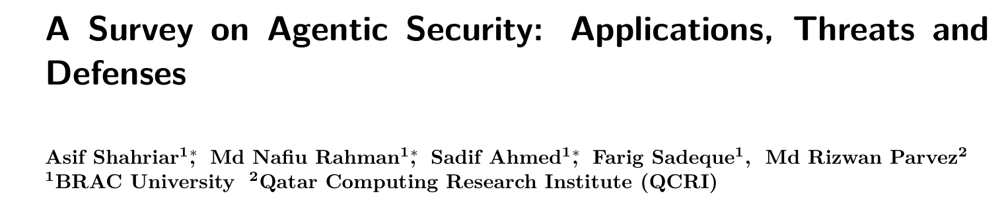
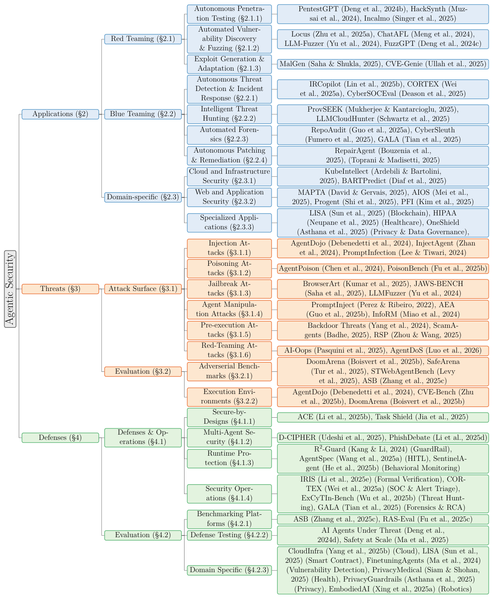
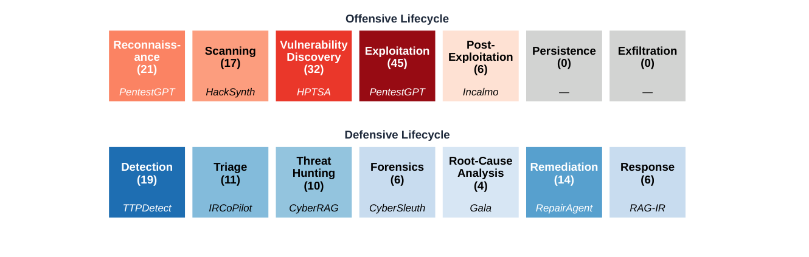
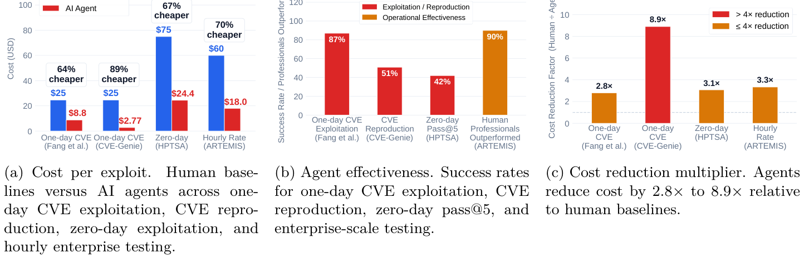
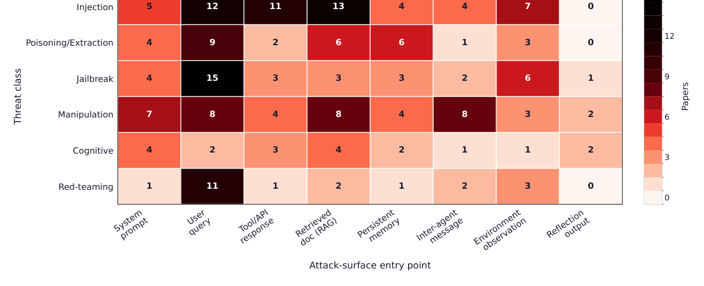
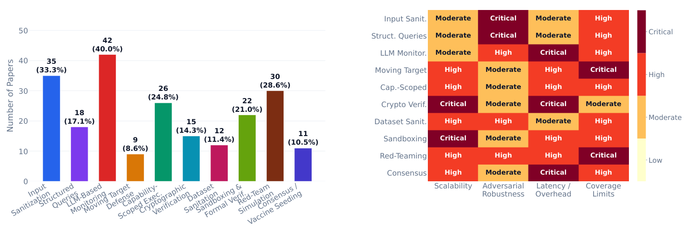

## PAPER INFO|论文信息

【论文题目】A Survey on Agentic Security: Applications, Threats and Defenses
【论文链接】https://arxiv.org/abs/2510.06445
【项目仓库】https://github.com/kagnlp/Awesome-Agentic-Security

本文由**孟加拉 BRAC 大学与卡塔尔计算研究所（QCRI）**完成。这是我给读者推荐清单里的一篇，也是我们 Agent 安全综述系列的第三张"地图"。前两张（Dawn Song 团队的攻防地图、上海大学的行为安全综述）都聚焦"Agent 被怎么攻、怎么防"，而这篇最大的不同是**多了一整个支柱：Agent 被用来做安全**（攻防应用）。因为是综述，本文写得更深入一些。

## OVERVIEW|导读

以往的 Agent 安全综述几乎都在回答一个问题：Agent 会被怎么攻击、怎么防御。但这篇指出，要真正看懂这个领域，必须把三个问题一起问：**Agent 能为我的安全做什么（应用）？它会被怎么攻击（威胁）？我怎么防（防御）？** 作者据此梳理了 2024 至 2026 年的 **260 多篇文献**，搭起"应用—威胁—防御"三位一体的分类体系。之所以要合起来看，是因为三者深度纠缠：一个被造出来找漏洞的红队 Agent，本身就可能被用作攻击武器；不把攻击和防御对照，你根本不知道哪些威胁已被覆盖、哪些还在裸奔。全文的总结论很冷峻：**Agent 系统在默认状态下就是结构性脆弱的，守住它需要覆盖整个 Agent 生命周期的多层防御，而不是任何单点补丁。**

## FRAMEWORK|三支柱全景

论文的骨架是下面这张大分类树，蓝色是应用、橙色是威胁、绿色是防御，每一支再层层展开到具体系统。信息密度极高，可以当作全领域的目录来对照：

下面按三支柱各挑最有洞察的发现来讲。

## PILLAR 1|应用：Agent 做安全，攻防严重不对称

Agent 被大量用于网络安全：红队（自主渗透、漏洞挖掘、漏洞利用生成）、蓝队（威胁检测、威胁狩猎、取证、自动修复）、以及云/Web/专用领域。但作者把所有系统映射到"攻击杀伤链"和"防御生命周期"上后，发现了强烈的不均衡：

**攻击研究扎堆在"有即时反馈"的环节**：漏洞利用（45 篇，全场最多）、漏洞挖掘（32 篇），因为这些任务能立刻验证成没成。而持久化、数据外泄这两个阶段**是 0 篇**，这既反映了自主恶意软件的伦理顾虑，也说明当前模型在"长期潜伏、维持隐蔽"上还做不到。防御侧同理，扎堆在检测和修复，根因分析（4 篇）这种需要长链条推理的环节最冷清。

更值得警惕的是**攻防的自主性鸿沟**。作者用四级自主度给所有系统打分：攻击型系统 **88.1% 达到最高的 Level 3（全自主规划+执行）**，只有 11.9% 需要人类批准；而防御型系统**没有一个到 Level 3**，100% 都保留人在环控制，只有 41.2% 有执行能力。一句话：**进攻的 Agent 在狂奔向全自动，防守的 Agent 还被安全、问责、合规死死拴着。** 这个鸿沟本身就是未来最危险的地方。

**双用途问题**同样触目：55.3% 的应用型系统暴露了可直接用于攻击的能力。而攻击型 Agent 带来的三个真实转变，用数据说话最有冲击力：

一是**成本崩塌**：一个 Agent 能以每个 8.80 美元的成本利用 87% 的一日 CVE，而人类专家基线是 75 美元；CVE-Genie 以每个 2.77 美元复现了 841 个 CVE 中的 428 个。二是**规模化**：HPTSA 用多智能体并行，在零日 Web 漏洞上拿到 42% 的 pass@5；ARTEMIS 一次调度 8 个 Agent 覆盖约 8000 台主机。三是**技能门槛降低**：以前需要专家才能做的攻击，现在门外汉借 Agent 脚手架就能完成，而且这份进攻力大多来自**智能体框架本身**，而非底座模型：HPTSA 去掉分层协调机制后性能掉 13 倍。**攻击正在变得更快、更便宜、更并行、更不依赖专家**，这正是所有防御工具需要重新假设的新威胁模型。

## PILLAR 2|威胁：三分之二的攻击是从底座大模型"继承"来的

威胁支柱覆盖注入、投毒、越狱、Agent 操纵、预执行认知攻击、红队攻击六类。作者做了几个很有价值的量化交叉分析。

**第一，攻击从哪进来。** 下面这张热图把六类威胁和八个"入口"交叉统计：

会话输入（用户查询 + 系统提示）占了 55% 的攻击，但这其实是"前 Agent 时代"就有的入口。真正 Agent 特有的攻击面是三个驱动自主行动的接口：**检索文档（RAG，15 篇，最热的自主攻击面）、环境观测（14 篇）、工具/API 响应（11 篇，主要是 MCP）**。而最"Agent 独有"的入口是**跨 Agent 通信**（8 篇），攻击者利用 Agent 之间彼此信任来传播恶意消息，AiTM 攻击拦改 Agent 间消息能达到 70%+ 的成功率。

**第二，也是最重要的判断：67% 的攻击是继承或放大自底座大模型的，只有 25% 是 Agent 原生的。** 这个数字实锤了一个共识：**底座模型的安全对齐，在被套进 Agent 框架后基本失效。** 论文举的例子触目惊心：GPT-4o 在聊天里有害行为率 12%，做成浏览器 Agent 后飙到 74%；把一个恶意目标拆解成多个良性子步骤，模型的拒绝率能从 84%–100% 掉到 17%，**不需要任何越狱，光靠"多步规划"这个 Agent 的基本能力就能瓦解安全对齐。**

**第三，失败发生在哪一步。** 作者把 Agent 循环拆成八个阶段，统计每类攻击在哪个阶段"暴雷"：**动作选择是最受攻击的阶段（52 篇），其次是感知（41 篇），而反思阶段几乎无人问津（3 篇）。** 换句话说，攻击都落在"Agent 读取输入"和"Agent 决定动手"这两个节点上；而针对中间推理、规划这些内部环节的攻击虽然更危险（它们篡改逻辑却让最终输出看起来正常），却被严重低估。

威胁侧还有个方法论痛点：**基准极度碎片化**，108 个被点名的基准里有 92 个只被一篇论文用过，导致跨论文根本没法比较：你无法在不重跑的情况下，排出两个注入防御谁更强。

## PILLAR 3|防御：没有银弹，只有帕累托前沿

防御支柱归纳出十种主流策略。作者沿"可扩展性、对抗鲁棒性、延迟/开销、覆盖面"四个维度给每种策略打了严重度分：

最关键的结论一目了然：**没有任何一种防御能同时做到可扩展、鲁棒、低开销、广覆盖。** LLM 监控（用第二个模型异步审查，占 40%）延迟和成本都高，本身还可能被攻击；输入过滤（33.3%）便宜但挡不住语义混淆的间接注入；形式化验证严谨但没法扩展到大模型的自然语言状态空间；沙箱隔离在底层 API 本身被攻破时就失效。每种策略都在某个维度上是"高"或"临界"风险，这就把整个领域推向了**混合、多层架构**。

论文还画出了清晰的**成本-安全帕累托前沿**：轻量过滤器 PPA 只要 0.06 毫秒但能力有限；MCP-GUARD 花 455 毫秒换来 23.4% 的 F1 提升；IPIGUARD 把攻击成功率压到 1% 以下，代价是每个任务 14605 个 token；PROVSEEK 拿到 0.92 的 F1，但要烧 44 万 token、跑 30 分钟。**更强的防护，几乎总是要用更多的延迟和算力去换。** 另一个趋势是防御正在转向"假设已被攻破"的姿态：75.2% 的防御是后置的（在计算之后监控），说明社区已经不再指望在入口就把攻击全挡住，而是转向全生命周期的持续监控。

## TAKEAWAYS|启发与点评

**对研究者**：这篇综述最大的价值是"三支柱合一"的视角，尤其是把"应用"这一支柱纳进来。它让几个别处看不到的洞察浮出水面：攻防自主性鸿沟（88% vs 0% 到 Level 3）、红队 Agent 的双用途风险、以及"进攻更快更便宜"如何反过来定义了防御必须应对的新威胁模型。它暴露的空白也都是明确的选题：持久化/数据外泄阶段无人研究、中间推理和反思阶段的攻击被严重低估、跨 Agent 通信和 RAG 记忆这些 Agent 原生攻击面缺乏评估基准、以及基准碎片化导致的不可比。"67% 攻击继承自底座""动作选择是最受攻击阶段"这些量化结论，也可以直接作为设计防御的靶心。

**对从业者**：三个可落地的判断。其一，**别把底座模型的安全对齐当护栏**。数据反复证明，一个在聊天里会拒绝的模型，套进 Agent 后光靠多步分解就会照做，安全必须在 Agent 层重新设计。其二，**Agent 特有入口是新战线**。你的防御如果只盯用户输入，就漏掉了 RAG 检索、工具响应、跨 Agent 消息这些真正驱动自主行动的接口，而它们正是攻击增长最快的地方。其三，**防御选型要认帕累托前沿**，别指望一个工具通吃，要按你的延迟预算和安全需求做多层组合，并接受"假设已被攻破、持续监控"的姿态。

**一点观察**：把这篇放进我们整个 Agent 安全系列来看，它补上了一块别人都没画的拼图：**Agent 不只是被攻击的对象，它同时是攻击和防御的执行者**。当红队 Agent 把漏洞利用成本压到人类的九分之一、还能 8 个并发扫上千台主机，防御的时间窗口正在被压缩。而防御型 Agent 因为安全和问责的顾虑迟迟不敢全自动，这道"进攻全速、防守踩刹车"的鸿沟，可能是 AI 安全下一个十年最核心的矛盾。对做软件供应链安全的人来说，这也意味着攻击者手里的自动化武器正在升级，我们熟悉的"人肉对人肉"攻防节奏，正在被"Agent 对 Agent"改写。
