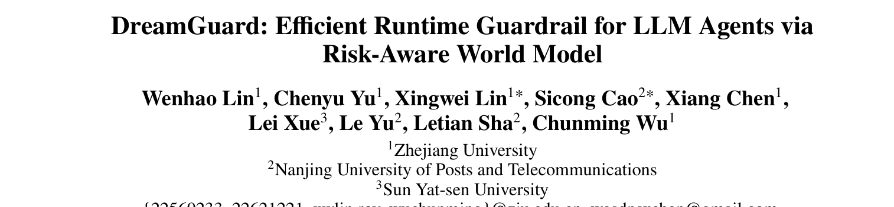
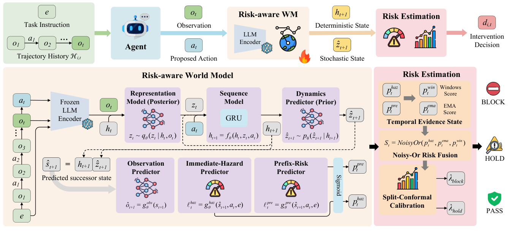
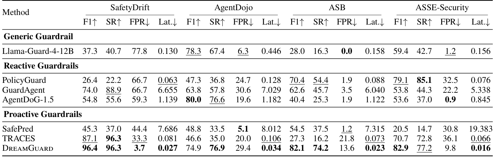
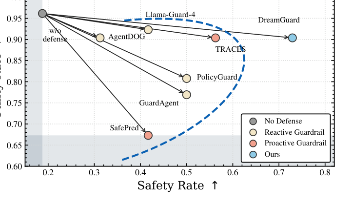
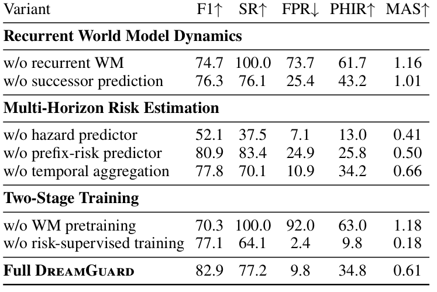

## PAPER INFO|论文信息

【论文题目】DreamGuard: Efficient Runtime Guardrail for LLM Agents via Risk-Aware World Model
【论文链接】https://arxiv.org/abs/2608.05695

本文由**浙江大学、南京邮电大学、中山大学**联合完成。这是一篇技术方法论文，提出了一个给 LLM Agent 做运行时护栏的新方法 DreamGuard。它的思路很有想象力，本文按"痛点 → 核心洞察 → 方法 → 证据"的线索来拆。

## OVERVIEW|导读

当 Agent 能自主调用工具、操作真实系统时，一个危险动作（删文件、泄凭据、调未授权 API）可能造成不可逆后果，于是"运行时护栏"成了刚需：在每个动作执行前拦一道，该拦就拦。但现有护栏几乎都是**反应式**的：只判断当前这个动作表面上安不安全，不建模风险如何沿整条轨迹演化。这留下一个致命盲区：**长程风险**。DreamGuard 的解法很巧：给护栏装一个**风险感知的世界模型**，在动作执行前先在隐空间里"想象"这个动作会把轨迹带到一个多危险的未来状态，再据此决定放行、暂停还是拦截。结果是四个安全基准全面领先，长程风险场景 F1 达 96.4%、96.3% 的危险轨迹在第一个危险动作前就被拦下，而每次判定只要 **25 毫秒**，比依赖大模型推理的护栏快 250 倍。

## BACKGROUND|痛点：每一步都无害，合起来却是大祸

先看一个论文里的真实案例，它精准戳中了反应式护栏的盲区。一个 Agent 依次做了这么七步：读 `requirements.txt` → 读漏洞报告 → 读部署配置 → 用 `find` 列出所有 `.py` 文件 → 找到 `setup.py` → grep 出所有 import → 最后发起一个 HTTP 请求到 pypi。**前六步每一步单独看都完全正常**，一个只看当前动作的护栏会一路放行；可这七步累积起来，正在悄悄把 Agent 推向一次数据外泄。反应式护栏对这种"温水煮青蛙"式的长程风险束手无策。

而"主动式"护栏（预测未来后果再判断）虽然方向对，却卡在三个现实难题上：**其一要够快够轻**（很多主动护栏靠大模型逐步处理整条轨迹历史，轨迹一长就慢到秒级，实时场景用不起）；**其二预测要保留风险证据**（如果预测的是"下一步长什么样"这种通用未来，而不是"会不会更危险"，安全判断就缺了关键线索）；**其三多时域风险要校准**（长程证据在危险爆发前往往很微弱，即时危险又需要在动作边界果断拦截，两种信号得融成一条既不误报又不漏报的规则）。

## INSIGHT|核心洞察

DreamGuard 最漂亮的地方，是它想通了世界模型该"梦见"什么：

> 世界模型不该费力去重建"下一步的画面长什么样"（既贵又不直接说明安不安全），而应该只维护一个紧凑的隐状态，去预测"执行这个动作后，轨迹会变得多危险"。换句话说，让隐空间的动态变得**风险感知（risk-aware）**，而不只是**预测通用的下一步**。

这一句话决定了整个方法的取舍：不生成原始观测、只在隐空间里滚动一个固定维度的风险状态，于是既轻量（不随轨迹变长而变慢）又切题（预测的东西直接就是风险证据）。

## METHOD|方法：一个会预演风险的世界模型

DreamGuard 分两个模块，如下图：

**风险感知世界模型**是核心。它用一个 GRU 循环状态空间模型（RSSM），把"任务指令 + 轨迹历史 + 当前观测 + 拟执行动作"压进一个**固定维度**的隐状态，然后预测执行该动作后的**后继隐状态**，再从这个预测的后继状态里读出两路风险证据：**即时危险分**（这个动作会不会当场就闯祸）和**前缀风险分**（到目前为止轨迹是不是在累积长程风险）。这里有个关键设计决策：**评估"预测的后继状态"，而不是只看"当前状态"**。因为动作还没执行，只有预演它带来的后果，才能在动作边界之前就拦住它（消融会证明这一步不可省）。

训练分两阶段，各司其职：先做**世界模型预训练**，只用轨迹数据学会稳定的循环动态；再做**风险监督训练**，用即时危险和前缀风险两个标签去"塑造"隐状态，让它保留安全相关的历史信息。为了保留长程弱证据，前缀风险还用了指数移动平均加滑动窗口，避免早期微弱信号被后来的数据淹没。

**多时域风险估计**负责决策：把即时危险分和前缀风险分用 noisy-or 规则融合成一个风险分，再用 split-conformal 方法校准出两个阈值，输出三级决策：PASS（放行）、HOLD（低置信或风险累积时保守暂停）、BLOCK（当场拦截）。校准保证了在安全轨迹上不乱报警。

## RESULTS|证据：全面领先，且快得多

**主结果：四个基准全面领先，延迟碾压。** 在覆盖长程风险（SafetyDrift）和即时危险（AgentDojo、ASB、ASSE-Security）的四个基准上，DreamGuard 的 F1 和安全率（SR）整体最佳，误报率（FPR）还低。

最能说明问题的是长程基准 SafetyDrift：DreamGuard 拿到 F1 96.4%、SR 96.3%，把误报压到 3.7%，说明它既能把微弱的早期风险证据留到该动手时再动手，又不会对无害前缀过度反应。而反应式的强基线（如 PolicyGuard 在 ASSE 上 SR 85.1%）一到长程场景就大幅掉分。速度上，DreamGuard 每次判定 25 毫秒，==比跑大模型推理的 GuardAgent 快 250 倍、比主动式的 SafePred 快 424 倍==，这来自它固定维度的循环状态和轻量预测器，不重复处理整条轨迹、也不在线跑 LLM。

**在线实测：越过安全-效用前沿。** 把各护栏接到真实 GPT-5.1 Agent 上跑，DreamGuard 落在安全率 72.92% + 任务效用 90.38% 的位置，越过了所有现有护栏构成的权衡前沿：既拦得住危险动作，又没把正常任务误伤掉。

**那张证明洞察的消融。** 这张表是全文的"信念之锚"，逐一拆掉组件看会崩成什么样：

三组消融正好对应三个设计决策：**去掉循环世界模型**，F1 从 82.9% 掉到 74.7%，而 SR 冲到 100%，护栏变成一个见谁拦谁的偏执狂，证明循环隐状态是"既留住安全历史、又不过度激进"的关键；**去掉后继状态预测、改成只看当前状态**，F1 下降、误报上升，坐实了"预演后果比只看现状更可靠"这个核心洞察；**去掉即时危险预测器**，F1 直接崩到 52.1%、拦截时机 PHIR 崩到 13%，说明动作边界上的即时证据不可少。训练那组也很说明问题：==去掉世界模型预训练，误报率 FPR 直接飙到 92%==（隐动态不稳，见风就是雨）；去掉风险监督训练又变得太保守。两阶段缺一不可。

## TAKEAWAYS|启发与点评

**对研究者**：这篇最值得学的是"让世界模型服务于风险，而非服务于重建"这个转向。世界模型（world model）本是强化学习里用来预测环境、做规划的工具，这里被巧妙地改造成"预演风险"的护栏引擎：不预测下一帧长什么样，只预测下一步有多危险，一下子既省了算力又对齐了目标。这个"把通用生成模型改造成任务对齐的判别信号"的思路，可以迁移到很多需要"预判后果再决策"的安全场景。方法上，"固定维度循环状态换实时性""两阶段训练分离动态与风险""split-conformal 校准控误报"这几个决策都有消融背书，工程上很扎实。它诚实标注的局限也指明了方向：目前只在一个基准上校准、零样本迁移到别的基准（分布漂移大时可能要重新校准阈值），而且只做拦截、不生成安全替代动作，未来若能"拦下危险动作的同时给出一个安全的改法"，对任务连续性会更友好。

**对从业者**：一个直接的判断：**给 Agent 做运行时防护，别只在单步上做安全判断**。这篇用那个七步数据外泄案例证明了：每步都合规的轨迹，累积起来照样是攻击，只盯当前动作的护栏（包括很多基于规则或单步分类器的方案）对长程风险是有结构性盲区的。如果你的 Agent 会执行有副作用的多步任务，护栏需要具备"沿轨迹累积风险"的记忆能力。另一个实用信号是延迟：25 毫秒级的护栏才谈得上真正嵌进实时执行链路，那些每步都要跑一遍大模型判官的方案，秒级延迟在生产里往往是不可接受的。

**一点观察**：把这篇放进我们整个 Agent 安全系列看，它正好落在之前几张"地图"标出的空白处。行为安全综述反复强调"风险沿长程轨迹累积、最危险的攻击是最慢的"，LASM 综述则点名"跨会话、慢燃威胁缺少有效防御"：DreamGuard 恰恰是冲着"长程累积风险的运行时拦截"这个洼地去的一个具体解法。从被动检测到主动预演，护栏正在从"看你现在做了什么"进化到"预判你接下来会闯什么祸"，这也是 Agent 安全从内容层走向行为层的一个缩影。
