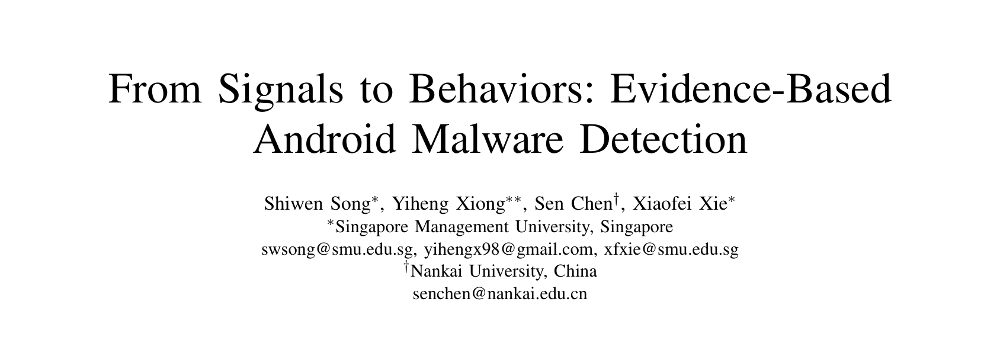
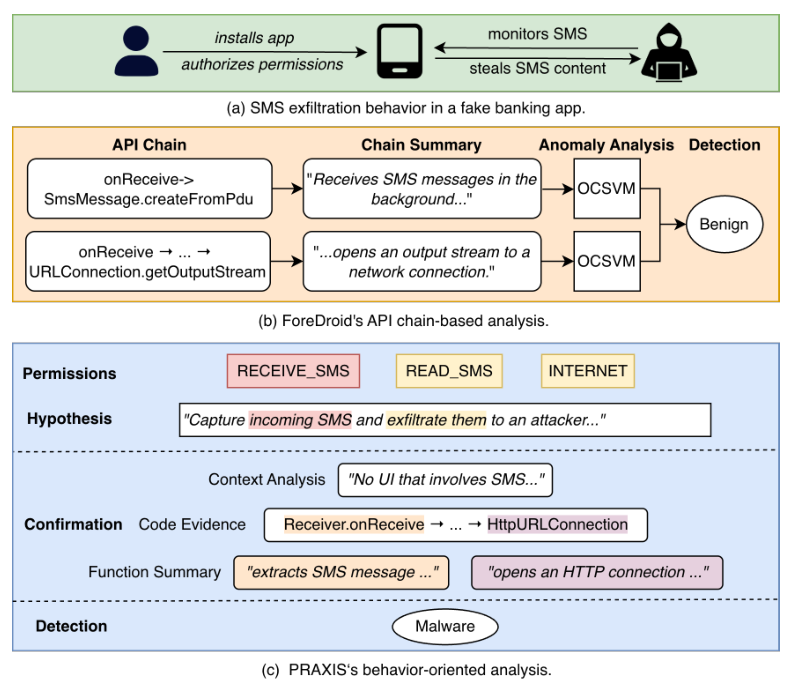
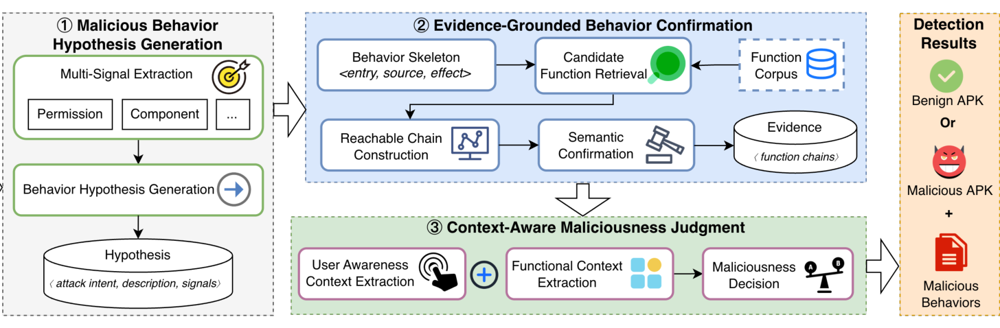
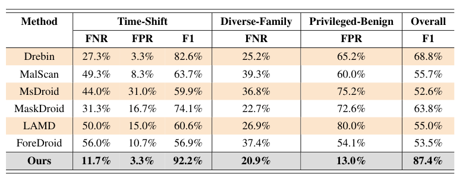
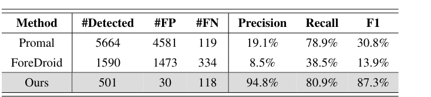
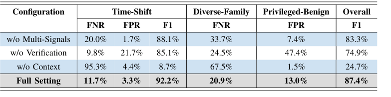

## PAPER INFO|论文信息

【论文题目】From Signals to Behaviors: Evidence-Based Android Malware Detection
【论文链接】https://arxiv.org/abs/2607.23272

本文由来自**新加坡管理大学与南开大学**的研究团队完成。团队在 Android 安全与恶意软件分析方向有长期积累，此前的 GPMalware、行为标注等工作为本文的行为级评测打下了数据基础。

## OVERVIEW|导读

一个应用是不是恶意的，取决于**它实际做了什么、在什么情境下做的**，而不是它表面上带了哪些特征。但现有检测器恰恰在用后者做判断：权限组合、敏感 API、调用图特征，这些都只是行为的代理变量。代理与本体之间的缝隙，正是误报和漏报的来源。本文提出 PRAXIS，把检测重构成"**假设、确认、裁决**"三段流水线：LLM 从静态信号出发假设应用可能干的坏事，程序分析在代码里查证每条假设是否有完整证据链，最后结合用户感知与功能上下文裁决。三个高难度测试集上总体 F1 达 **87.4%**，超过最强基线 18.6 个百分点，还能给出每个判定背后的行为记录和代码证据。

## BACKGROUND|问题与挑战

作者用一个真实样本把问题讲透：一个伪装成手机银行的恶意应用，界面是假登录页，装好后在后台静默监听短信并通过 HTTP 转发给远程服务器。注意，**读短信这个操作本身不恶意**（短信应用天天读），恶意在于它避开用户感知运行、又和应用宣称的银行功能毫无关系，读取与外传组合成了一次完整的短信窃取攻击。

这个样本把两类主流检测器都骗过了。学习型检测器（Drebin、MalScan 等）学的是历史恶意样本的特征分布，而这个样本的短信、网络特征在良性应用里都很常见，组合模式又在训练数据里罕见，于是安然过关。LLM 型检测器（LAMD、ForeDroid）虽然开始推理行为，但要么逐个 API 汇总后把攻击"平均"没了，要么把短信接收链和网络传输链各自判为良性，从没把两条链拼成一次攻击看。

难点有三个：恶意行为在庞大行为空间里是稀疏的，逐一枚举不现实；语义层面的行为描述与代码证据之间有鸿沟，一个行为往往散落在多个函数和执行路径里；即便行为确认了，它的上下文（用户是否知情、是否符合应用功能定位）以及多个行为如何组合成攻击，应用自己是不会说的。

## METHOD|方法

PRAXIS 的三段流水线如下图，每一段对应一个难点：

**第一段：假设生成。** 从 manifest、字节码（Soot 中间表示）和原生库（Ghidra 提取函数名）中抽出五类信号：权限、组件、隐式 intent、敏感 API、native 函数名。LLM 以攻击者视角阅读这些信号，凭它对 Android 和恶意软件战术的知识提出攻击意图假设（比如"拦截短信窃取 2FA 验证码"），每条假设都必须列出支撑信号。信号只是引子，假设空间不受固定规则目录限制，这是它比目录式检测器覆盖面广的原因。

**第二段：证据确认。** 假设只是自然语言猜测，这一段负责"在代码里找到干这事的那条链"。每个行为被建模成 entry→source→effect 骨架（谁触发、动了什么数据、造成什么效果），用语义检索（SBERT 嵌入函数摘要）加词法检索（BM25 匹配 API 名）双路找候选函数，再沿调用、组件间通信、共享状态三种可达性关系把三个角色连成可达链，最后让 LLM 对照反编译代码逐段确认这条链确实实现了该行为。**连不成链的假设直接丢弃**，这一步是对 LLM 幻觉的硬约束。

**第三段：上下文裁决。** 对每个确认的行为恢复两层上下文：用户感知（从证据回溯到触发入口，后台广播、定时任务触发的标记为"用户不知情"；UI 触发的再看界面语义有没有向用户披露该行为）和功能上下文（行为是否符合应用公开宣称的功能）。最后把所有行为连同证据和上下文交给 LLM 联合裁决，看它们能否组成一个连贯的攻击模式，能则判恶意并输出关键行为清单。

## RESULTS|实验结果

评测数据集刻意贴近真实部署压力：时间漂移集（2024 至 2026 年最新样本 600 个）、家族多样集（163 个不同家族各取一个样本）、特权良性集（270 个每个都声明至少 9 项危险权限的良性应用）。

**检测性能全面领先。** 总体 F1 87.4%，超过最强基线 Drebin（68.8%）18.6 个百分点；时间漂移集 F1 92.2%（学习型基线在此跌到 59.9% 至 82.6%）；最能说明问题的是特权良性集：基线误报率 54.1% 至 80.0%，PRAXIS 只有 **13.0%**，因为它看的是"权限有没有被用来干坏事"，而不是"权限多不多"。

**行为识别是代差级优势。** 在行为级 ground truth 上，PRAXIS 识别细粒度恶意行为 F1 87.3%，对比 ProMal 的 30.8% 和 ForeDroid 的 13.9%；精度 94.8% 对 19.1% 和 8.5%。基线生成了上千条候选但绝大多数是噪声，说明只靠 API 链或知识图谱拼不出完整的恶意行为。

**消融实验揭示了各段的分工。** 去掉多信号假设，召回下降；去掉证据确认，误报暴涨（特权良性集误报率从 13.0% 飙到 47.4%），因为没人逼 LLM 的假设拿代码说话；去掉上下文裁决最致命，时间漂移集漏报率飙到 95.3%，总体 F1 崩到 24.7%，裁判只看代码证据无法区分"合法功能"与"恶意行为"。三段各挡一类失败，缺一不可。

**跨模型稳定，成本可控。** 换用 GPT-5.2、DeepSeek-V4-Pro、GPT-5.4-mini 三档模型，总体 F1 都在 84.4% 以上；默认配置每个应用约 0.6 美元（其中函数摘要 0.56 美元由轻量模型承担）。局限也很清楚：30 个误报大多来自第三方 SDK 的敏感操作无法判断归属，118 个漏报几乎都是运行时才加载的内容（WebView 远程页面、动态解密载荷），静态分析天然看不见。

## TAKEAWAYS|启发与点评

**对研究者**：这篇论文最有价值的是范式主张：**恶意性定义在"行为于上下文中"这一层，检测就应该在这一层进行**。消融数据给了这个主张定量支撑（去掉上下文 F1 从 87.4% 崩到 24.7%）。方法论上，"LLM 提假设、程序分析验证、证据链落地"的组合值得关注：它把 LLM 的知识广度和程序分析的严谨性各用在刀刃上，幻觉被"连不成可达链就丢弃"这条硬规则拦住。读过我们前一篇 MalSkillBench 解读的朋友会发现两篇的核心洞察高度一致：恶意性存在于代码、声明与上下文的**关系**里，单看任何一面都会失守。这个视角正在成为恶意软件与供应链安全研究的共同底层逻辑。

**对从业者**：两个值得留意的点。其一，PRAXIS 输出的不是一个分数而是**带代码证据的行为清单**，安全分析师可以审计每条判定，这对需要人工复核的恶意应用审查流程是实打实的效率提升；每应用约 0.6 美元的成本用在应用市场审核或企业 MDM 场景是可接受的。其二，它的漏报模式提醒我们：**运行时加载的载荷仍是静态方案的盲区**，动态分析和运行时监控在检测体系里不可省。

**一点观察**：从供应链恶意包到 Android 恶意应用，"言行一致性"（声明的功能 vs 实际的行为）正在成为跨领域通用的检测判据。恶意包检测里对比 README 与代码，Skill 检测里对比指令与脚本，本文对比应用宣称功能与实际行为，殊途同归。谁能把"言行对齐"做成通用基础设施，谁就握住了下一代检测器的钥匙。
