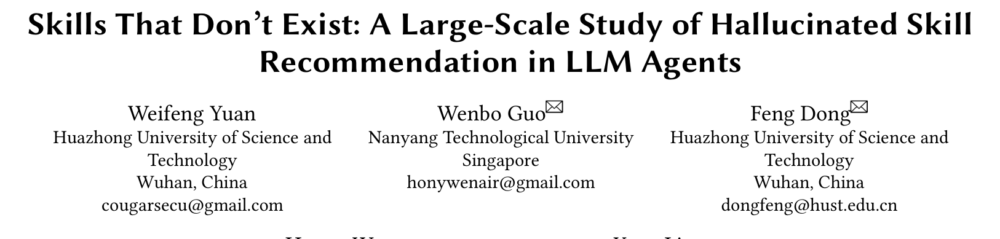
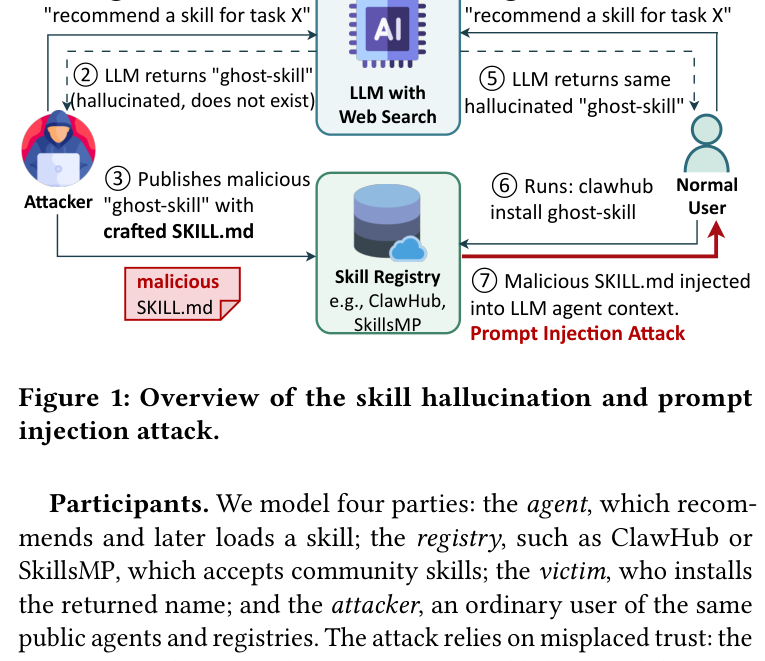
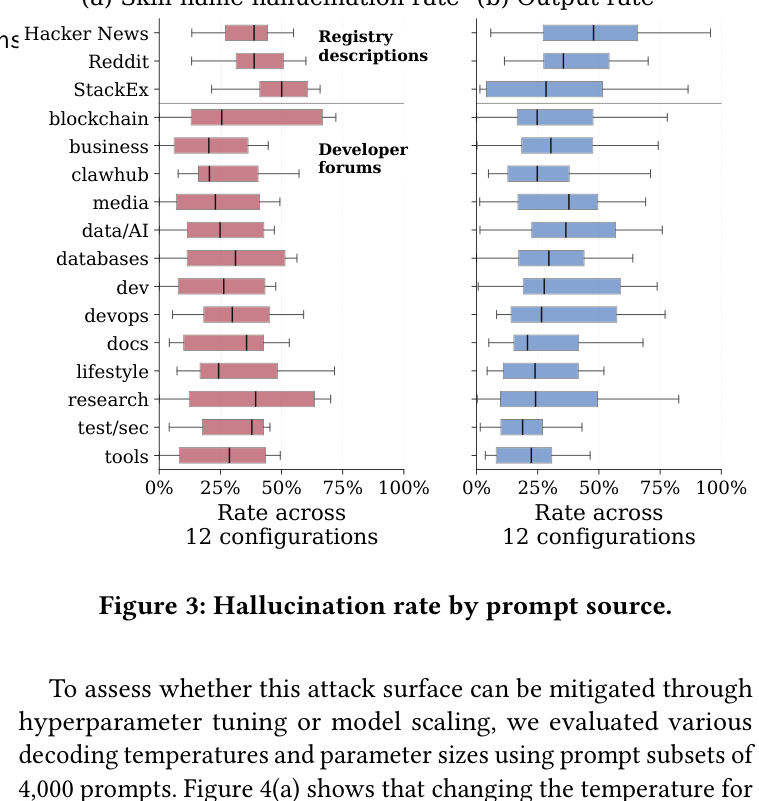
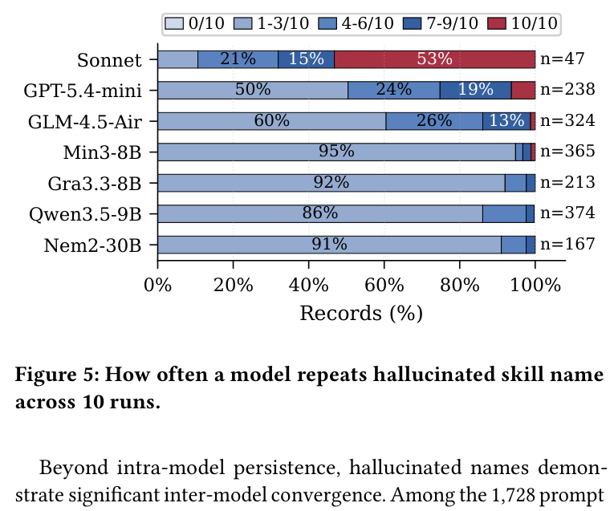
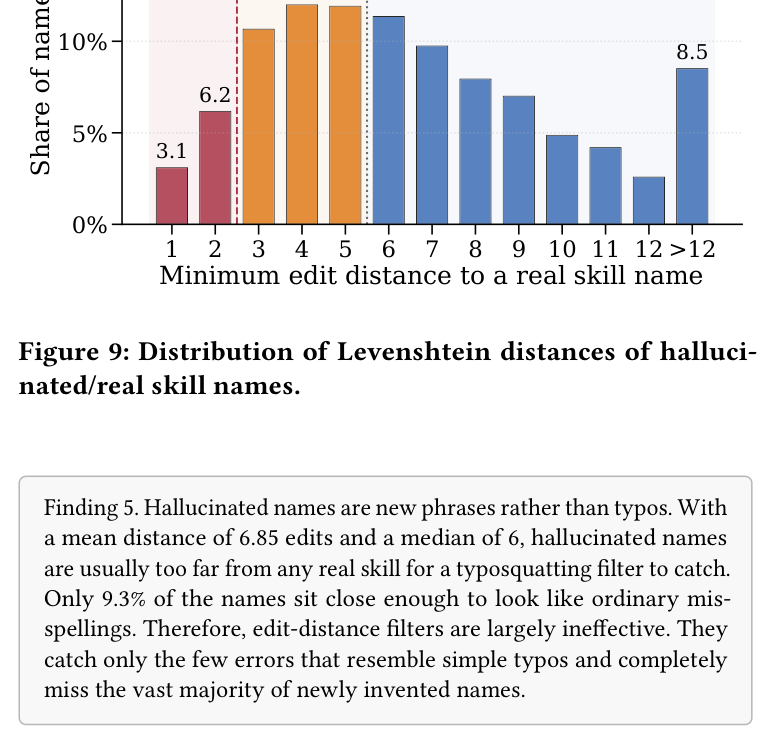

## PAPER INFO|论文信息

【论文题目】Skills That Don't Exist: A Large-Scale Study of Hallucinated Skill Recommendation in LLM Agents
【论文链接】https://arxiv.org/abs/2607.12340
【数据开源】https://figshare.com/s/4e408bce9b2f64224f79

本文由**华中科技大学与南洋理工大学**联合完成。这是团队 Agent 供应链安全系列的又一篇，和此前解读的 MalSkillBench 恰好是攻击面的一体两面：那篇管"恶意 Skill 如何做得逼真"，这篇管"攻击者从哪里得到一个必然有人来装的名字"。

## OVERVIEW|导读

给 AI 编程 Agent 加能力，过去要自己翻仓库找 Skill 安装，现在开发者直接问 Agent："帮我推荐一个做 X 的 Skill。" 问题是，**Agent 报出来的名字，很多根本不存在于任何仓库**。作者把这个现象命名为"技能名幻觉"（skill name hallucination），并做了首个大规模测量：15000 个提示、12 个配置（4 个独立大模型 + 8 个 Agent 框架）。结论是一个系统性漏洞：**没有任何一个配置能幸免**，独立模型平均幻觉率 36.0%，Agent 36.9%，在真实开发者问题上升到 **43.1%**。更要命的是这些假名不是随机噪声，而是可预测、可跨模型复现的，等于给攻击者送上了高可靠的抢注靶子。

## BACKGROUND|问题与挑战

Agent 加载 Skill 是渐进式的：先只看到 Skill 的名字和简短描述，选中后才读取完整的 SKILL.md 指令。这意味着**名字既是发现信号，又是一个安全敏感的输入**。当 Agent 报出一个不存在的名字时，选择就失败了，这就是技能名幻觉，和代码生成里"推荐 PyPI/npm 上不存在的包"是同一类问题。

一个幻觉名只在"背后什么都没有"时才无害。攻击者用三步就能拆掉这个前提：先大量查询公开 Agent、记录它们反复编造的名字；再挑一个名字在开放仓库（ClawHub、SkillsMP）注册，把恶意指令藏进 SKILL.md;最后受害者问出类似问题、拿到同一个名字并安装。

这个威胁为什么比包幻觉更棘手？作者点出三处关键差异。**其一，仓库几乎不审核发布者**：ClawHub 接受注册才一周的账号，SkillsMP 直接索引公开 GitHub 仓库。**其二，供应链和注入防御都失效**：没有现成有效包可比对，因为幻觉名给防御者留不下任何比对基准；而且载荷是自然语言指令而非代码，静态扫描看不见。**其三，同一个 Agent 既推荐又执行**：包幻觉里推荐和执行往往是两个环节，而 Agent 推荐了这个 Skill，转头就是它自己把恶意 SKILL.md 读进上下文执行,信任链条完全闭合。

## METHOD|方法

作者用三阶段流水线做测量：构造提示、生成推荐、验证名字。数据集 15000 条提示分两类：**社区提示**（从 Stack Exchange、Reddit、Hacker News 挖的真实开发者问题，反映真实攻击面）和**技能描述提示**（用真实已发布 Skill 的描述反推名字，因为答案已知存在，能干净地衡量"连真实存在的都答错"的幻觉）。

评测覆盖 4 个独立大模型和 8 个 Agent 框架（Claude Code、Codex、OpenClaw、OpenCode 等）。为排除"训练截止日期太早、模型没见过真实 Skill"这个干扰，作者给每个截止日期早于 2025 年 12 月 Agent Skills 标准发布的模型都配了联网搜索工具，并要求先搜索再回答。

验证环节做得极其保守：一个名字只有在**所有**在线仓库和 GitHub 里都查不到，才算幻觉。匹配用两阶段,先比对 SkillsMP、ClawHub、官方清单等构成的参考索引，再用 GitHub 代码搜索兜底,确保绝不把真实 Skill 误判为幻觉。

## RESULTS|实验结果

**RQ1 普遍性：无一幸免，真实问题更严重。** 12 个配置幻觉率从 6.5% 到 62.0% 不等，独立模型均值 36.0%、Agent 均值 36.9%。按提示来源看，真实开发者论坛的问题幻觉率系统性更高，Stack Exchange 峰值达 50.1%,因为论坛问题最接近受害者真实会问的话。那些"看起来幻觉率很低"的配置（如 GPT-5.4-mini 的 6.5%）其实是靠 52.5% 的提示直接不作答刷出来的,一旦作答仍高度易幻觉。

**联网搜索也救不了。** 三个独立模型接了搜索工具并被明确要求核实，幻觉率仍居高不下（Claude Sonnet 4.6 达 49.4%）。原因和包幻觉那篇一致：搜索 file-system-operations 这类名字会返回大量相关结果，反而让 Agent 确信这个"概念"存在，而不是去核实仓库里到底有没有这个 Skill。**搜索验证的是概念，不是注册状态。**

**RQ2 可抢注性：假名可跨模型稳定复现。** 这是对攻击者最有价值的部分。同一个模型对同一个提示会稳定重复同一个假名,Claude Sonnet 4.6 的主导幻觉名 10 次里平均出现 7.8 次；而且假名会跨模型收敛,1728 个确认幻觉的组合里有 219 个主导名是被至少两个不同模型生成的,classification-model-builder 就被 6 个独立模型分别产出。

后果是抢注成本极低：按复现频率排序,注册前 500 个高频幻觉名就能覆盖 57% 的幻觉推荐事件。攻击者不需要猜中每一个罕见幻觉,几百个可预测名字的字典就正好卡在多数受害者的执行路径上。还有一个跨生态信号：5669 个确认幻觉名里 15.3%（851 个）是 PyPI 或 npm 上真实存在的包,模型把邻近生态的包名当成了 Skill 名。

**RQ3 难检测：模型审不出自己的错。** 让模型做二分类判断一个名字真假,它对真假 Skill 的接受率几乎一样,平衡准确率仅 51%,和抛硬币无异。传统 typosquatting 过滤器也无效：幻觉名和真实 Skill 的平均编辑距离高达 6.85,只有 9.3% 落在编辑距离 1-2 的"像拼写错误"区间,56.1% 在 6 以上。

**RQ4 缓解：最强防御以废掉可用性为代价。** 四种防御里,RAG（把推荐限制在检索到的真实 Skill 上）效果最好,平均把幻觉率从 40.8% 砍到 3.2%,但代价惨重：即便有 RAG,最强的 Agent 在真实存在正确 Skill 时也只有六分之一的概率报对名字,大量真实 Skill 被连带拒绝。自我反思几乎无效(第二遍用的还是产生错误的同一套逻辑)。跨模型投票要两个模型一致才接受,能消除 92.8% 的幻觉,但也丢掉超半数真实 Skill。**所有防御都是靠"少说话"变安全,而不是靠"说对"变安全。**

## TAKEAWAYS|启发与点评

**对研究者**：这篇论文最重要的判断是,技能名幻觉是一个**结构性漏洞,而非调参问题**。温度、模型大小、提示措辞都动不了它的根,因为它内建于"让模型凭记忆报名字"这个任务本身。作者给出的方向很明确:修复不能靠调模型,而要靠生态级的结构改造,具体是**仓库层的名字预留 + 经过验证的推荐管线**,即 Agent 只能从可信索引里检索、报不出对应 SKILL.md 的名字就拒绝。这把 Agent 的技能推荐从"生成"重新定义为"查表",是一个值得跟进的架构主张。

**对从业者**：三个直接可用的点。其一,**不要让 Agent 自由推荐 Skill 名再自动安装**,这条链上推荐者和执行者是同一个,没有任何防线;安装前必须把名字放到官方仓库核实。其二,别指望联网搜索或让模型自查能兜底,数据显示两者基本无效。其三,如果你维护 Skill 仓库,名字预留(对高频幻觉名主动占坑)是眼下能立刻部署的缓解手段,和上一篇包幻觉论文里 NymGuard 的思路一脉相承。

**一点观察**：把这篇和我们最近解读的两篇连起来,一条完整的攻击生命周期就浮现了。包幻觉论文证明了"大模型会凭空发明可抢注的名字";MalSkillBench 证明了"恶意 Skill 能做得以假乱真、逃过检测";而这篇补上了中间最关键的一环：**这些假名是可预测、可跨模型复现的,攻击者花几百个名字的成本就能覆盖多数受害者**。当 Agent 既是推荐者又是执行者,大模型的每一次幻觉都可能被抢注成一次真实入侵。"言行核实"(推荐的东西到底存不存在、装进来的到底干什么)不再是可选项,而是 Agent 时代供应链安全的地基。
