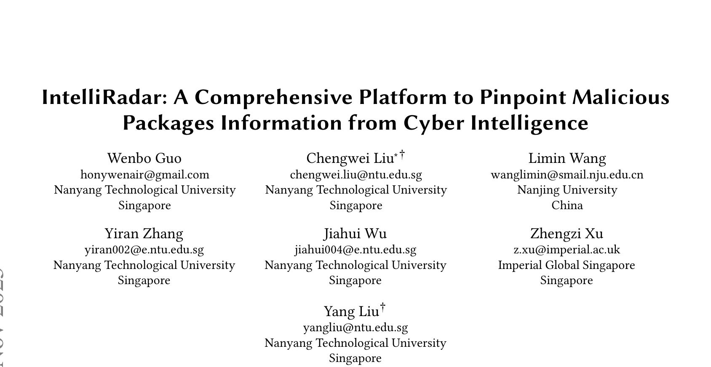
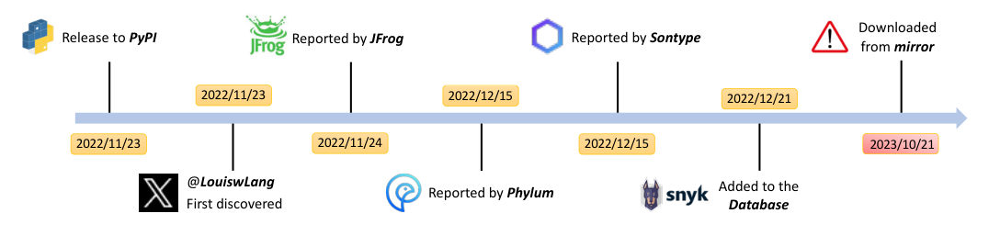
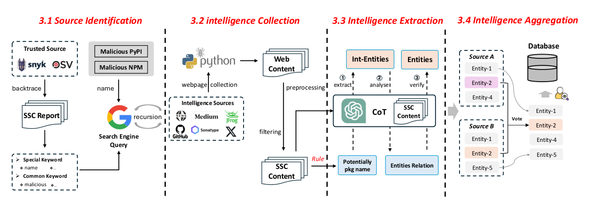
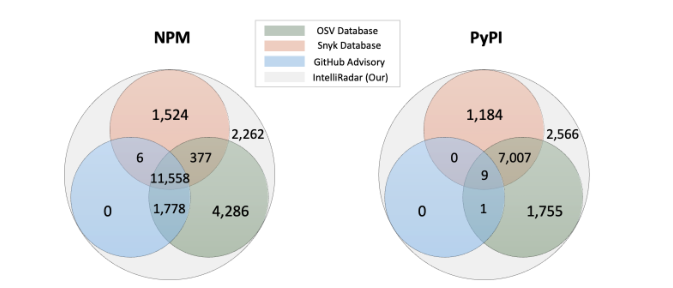
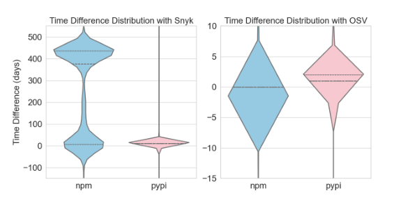
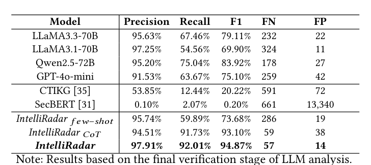

## PAPER INFO|论文信息

【论文题目】IntelliRadar: A Comprehensive Platform to Pinpoint Malicious Packages Information from Cyber Intelligence
【论文链接】https://arxiv.org/abs/2409.15049
【平台主页】https://sites.google.com/view/intelliradar/home

本文由来自**南洋理工大学、南京大学、Imperial Global Singapore** 的研究团队完成，已被软件工程顶会 **ICSE 2026** 录用。团队专注软件供应链安全与开源情报方向，IntelliRadar 是其恶意包情报体系的核心工作。

## OVERVIEW|导读

PyPI、NPM 上的恶意包被安全研究者发现后，情报往往先出现在博客、推特、安全厂商报告这些**非结构化角落**，要过很久才进入 OSV、Snyk 等权威数据库——而下游用户依赖的正是这些数据库。IntelliRadar 做的事情很直接：**让机器持续盯着全网情报源，用 LLM 把散落的恶意包情报自动抽取、聚合成数据库**。结果是一个包含 34313 个恶意包（12522 个 PyPI + 21791 个 NPM）的最大公开恶意包情报库：精度 97.4%，比 OSV 多收录 7542 个、比 Snyk 多 12684 个，且大部分情报**比商业数据库更早**——最多提前一年以上。

## BACKGROUND|问题与挑战

作者用一个真实案例点破问题。恶意 PyPI 包 colorwed 上传当天（2022/11/23）就有人在推特上曝光，随后 JFrog、Phylum、Sonatype 相继报告，但直到 12 月 21 日才进入 Snyk 数据库——**整整一个月的空窗期**，期间它照常被下载。更普遍的数据是：72.4% 的恶意 PyPI 包在被曝光后仍留在镜像服务器上，colorwed 被确认恶意后又被下载了 1000 多次。

要填上这个空窗期，有三道坎：**情报源在哪**（第一手情报散落在博客、社交媒体、厂商报告里，没有清单）；**关键信息怎么抽**（同一篇报告里恶意包名和正常包名混在一起，通用 NER 模型分不清）；**情报可不可信**（网上的信息本身可能是错的）。

## METHOD|方法

IntelliRadar 的流水线分四步，如下图：

**第一步，找齐情报源。** 从已知恶意包报告出发，用 LDA 聚类提取通用关键词、TF-IDF 提取专用关键词，通过搜索引擎大规模检索后滚雪球式递归扩展，最终从 2412 个候选域名中锁定 **24 个持续发布恶意包情报的源头**（安全公司、安全媒体、开发者社区、代码平台、社交媒体五类）。递归验证显示新发现外链 97% 都指回这 24 个源，说明清单已收敛。

**第二步，定向采集。** 对 24 个源做针对性爬取，用"生态关键词必选 + 安全关键词可选"的两级过滤把 5 万余页原始网页筛到 2.8 万页，token 消耗直接砍掉 58.4%，过滤召回率仍有 96.4%——这是它成本低的第一个原因。

**第三步，LLM 三段式抽取。** 先用正则和词典过滤出候选包名，再让 LLM 按**实体抽取 → 关系分析 → 交叉验证**三段 CoT 流程处理：抽出包名、版本、攻击手法、IOC 等 9 类实体，围绕包组织关系，最后让模型对照原文自检纠错。CoT 把召回率从 few-shot 的 59.89% 拉到 91.73%，两者结合后 F1 达到 **94.87%**（精度 97.91%）——对比之下，通用威胁情报方法 CTIKG 只有 20.22%，SecBERT 几乎完全失效（0.20%）。在训练截止日期之后的全新网页上，F1 仍有 93.70%，基本排除了数据泄漏的解释。

**第四步，投票聚合 + 双重验证。** 多源冲突用"按时间戳投票"解决（后发的报道通常引用并修正先前信息），再经官方 registry 元数据核验包名真实存在（排除 LLM 幻觉）、与权威数据库和多源交叉印证恶意性，最终 97.4% 精度的数据库由此而来。

## RESULTS|实验结果

**覆盖面：不是"追平"数据库，而是补上它们的盲区。** 与 OSV、Snyk、GitHub Advisory 的四方对比显示：四库共有的 PyPI 恶意包只有 9 个，而 IntelliRadar 独有 2566 个 PyPI + 2262 个 NPM 恶意包——**任何现有结构化数据库都没收录**。这些独有 PyPI 包在被发现前已被累计下载 **326740 次**。

**时效性：快出的不是几小时，是几个月。** 76.6% 的 NPM 情报和 70.3% 的 PyPI 情报早于 Snyk 收录，其中 6598 个 NPM 包平均早 **100.3 天**、近半数提前一年以上；对 OSV 同样领先（4711 个 PyPI 包更早）。4533 个 NPM 和 549 个 PyPI 恶意包在**发布当天**就被捕获。

**抽取引擎的硬指标。** 不同 LLM 与方法的对比中，完整版 IntelliRadar 以 F1 94.87% 领先所有开源模型和已有方法，误报仅 14 个：

**成本与真实影响。** 关键词过滤把 1700 万 token 压到 707 万，全库构建成本 93.8 美元，**平均每条情报 0.003 美元，持续监控每月只要 7 美元**。用这个库扫描国内主流 PyPI 镜像，发现 **1981 个恶意包仍在镜像上存活**（清华镜像 781、腾讯 548、豆瓣 395……），累计被下载超 86240 次——最极端的 ethereum2 比 Snyk 早识别 436 天，期间被下载 436 次。团队向镜像维护方通报后，腾讯、豆瓣、清华已确认清除。

## TAKEAWAYS|启发与点评

**对研究者**：这篇论文展示了"LLM + 领域知识"做威胁情报抽取的正确打开方式——不是把网页直接塞给大模型，而是用正则预过滤对抗幻觉、用三段 CoT 分解任务、用 registry 元数据和多源投票兜底验证。94.87% 对 20.22% 的差距说明：**领域化的流水线设计比模型本身更值钱**。它也把"情报时效性"从一个模糊的痛点变成了可量化的研究对象（时间差分布、镜像存活分析），这套度量方法值得后续工作沿用。

**对从业者**：两个可以直接行动的点。其一，如果你的依赖安全策略只盯 OSV/Snyk，你看到的恶意包情报平均**晚了几十到上百天**，且有数千个恶意包根本不在里面——把非结构化情报源纳入监控是有真实收益的。其二，**镜像站是被严重低估的风险面**：上游删了包，镜像可能还留着，1981 个存活恶意包就是证据。企业内部镜像同样适用这个教训，值得对照该数据库做一次自查。

**一点观察**：从这篇工作到恶意 Skill 检测，可以看到同一条主线——供应链威胁的"发现"早已不是瓶颈，**"情报到达下游的速度"才是**。用 LLM 把人类世界的非结构化安全知识实时结构化，可能是未来几年供应链防御体系里性价比最高的一环。
