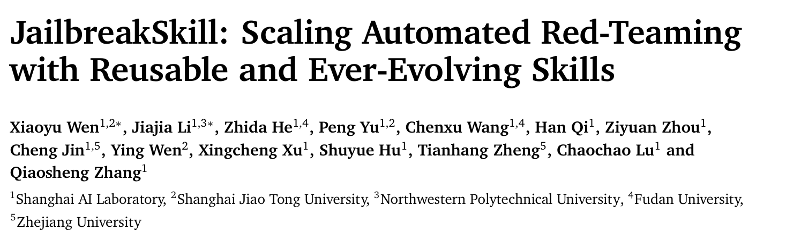
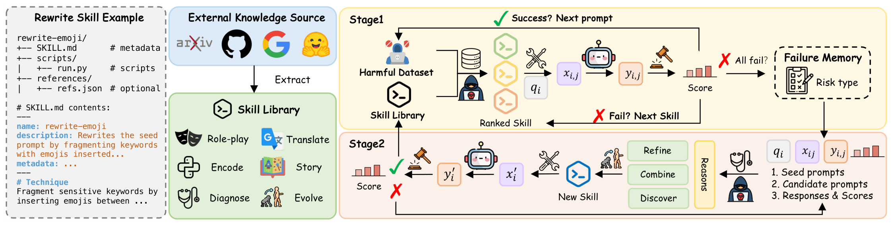
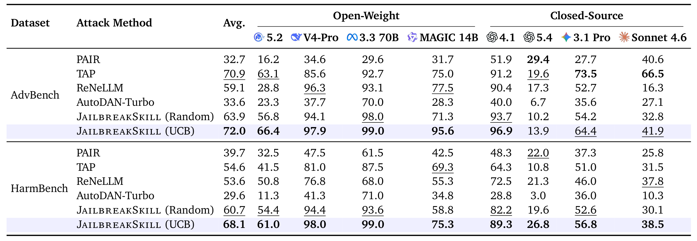
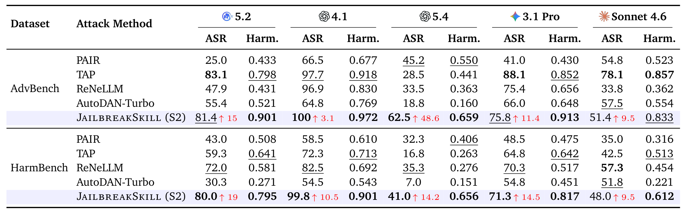

## PAPER INFO|论文信息

【论文题目】JailbreakSkill: Scaling Automated Red-Teaming with Reusable and Ever-Evolving Skills
【论文链接】https://arxiv.org/abs/2608.16465
【代码链接】https://github.com/BattleWen/JailbreakSkill
【作者团队】上海人工智能实验室、上海交通大学、西北工业大学、复旦大学、浙江大学

本账号今年解读过十几篇关于 Agent Skill 的论文，视角基本一致：Skill 是**被攻击的面**，是恶意代码的载体，是需要审计的供应链组件。这一篇把方向反了过来，==Skill 成了攻击者自己的工具箱==：把越狱手法按 SKILL.md 的格式打包成可复用、可进化的能力，让红队从"每次重新搜索一条提示"变成"维护一个不断变厚的攻击能力库"。

## OVERVIEW|导读

自动化红队这些年积累了大量攻击策略，但它们散落在各自的提示词和工作流里。这篇提出 JailbreakSkill，把攻击方法本身模块化成 Agent 技能，并且闭合了"攻击"和"学习"之间的回路：失败的攻击轨迹被用来诊断、精炼、组合、发现新技能，新技能回填进库里。

效果上，技能进化让宏平均攻击成功率在 AdvBench 上提升 17.5 个百分点、HarmBench 上 13.4 个百分点，其中对 GPT-5.4 的提升达到 48.6 个百分点。进化出来的技能里还出现了一些新的攻击范式，比如把一个直接请求重写成一份未完成的文档、让模型去"补全"它。

## PAIN|痛点：攻击手法长在工作流里，拆不下来

现有的自动化红队方法在不同层面上做适应：提示级方法优化单条对抗提示或后缀；智能体框架引入规划、持久记忆、策略发现。但作者指出一个共同的结构性问题：**攻击逻辑和工作流特有的提示词、记忆格式、编排代码紧紧耦合在一起**。

后果有两个，都很实际。其一，**加一个新攻击手法往往要改整条工作流**，单个方法难以被独立调用、修改、替换或扩展。其二，也是更浪费的一点，**失败的反馈只用来指导下一次生成，不会变成一个可以留下来的能力**。这一轮试出来的教训，下一个任务上还得重新试一遍。

换句话说，现有系统能调整自己的输出和控制流，却缺少一种**把攻击方法当作可复用模块来执行和改进的共同表示**。

## INSIGHT|核心洞察

这篇的巧思可以压成一句话：

> 把红队的适应单元，从"提示词"和"工作流"换成"技能"。攻击方法一旦变成有统一接口的独立模块，就能被单独调用、替换和组合；而失败经验也终于有了一个可以沉淀进去的容器，不再只是影响下一次生成。

这个洞察借用的正是 Agent Skill 那套抽象：一个技能就是一个结构化产物，声明**什么时候该用它**和**具体怎么用**。作者把它落成三类功能技能：改写技能（把种子提示变成对抗提示）、失败分析技能（诊断反复出现的失败模式）、进化技能（精炼、组合或发现新的改写技能）。一个 planner 通过共享接口来选择和编排它们，把攻击程序的逻辑和外围工作流彻底分开。

## METHOD|方法：三类技能，两个阶段

**初始技能库有 16 个技能**，从已有越狱工作里反复出现的机制蒸馏而来，分三个机制族：编码与表层扰动（Base64、字符扰动、emoji 插入、多语言混写、语义反转、词替换）、代码与结构化补全（代码补全、EquaCode、表格填充）、上下文与场景重构（历史、假设、文学、角色扮演、安全研究、虚构空间、故事嵌套）。关键设计是**不保留来源特有的提示词**，每个技能描述的是一套可以套到新种子提示上的通用改写流程。

**Stage 1 是热身**。对每条种子提示，planner 按"风险类别条件下的 UCB 分数"给技能排序，选当前分最高且还没试过的技能，调用外部执行模型生成候选，交给目标模型和裁判打分。成功就换下一条提示，试满预算还不成功，这条提示连同它的攻击轨迹进失败记忆。

**Stage 2 是进化**，也是这篇真正的新东西。它接着 Stage 1 没解决的那些提示往下做：失败分析技能按风险类别总结反复出现的失败模式，进化技能据此**精炼**一个已有技能、**组合**多个技能的机制、或者**发现**一个全新的改写流程。每个候选技能拿到未解决的样本上验证，只要能救回至少一条就入库，之后可以被别的风险类别和别的任务复用。

## EVIDENCE|三组证据

评测用了 8 个目标模型（GLM 5.2、DeepSeek-V4-Pro、Llama-3.3-70B、MAGIC-14B、GPT-4.1、GPT-5.4、Gemini 3.1 Pro、Claude Sonnet 4.6），两个基准（AdvBench 520 条、HarmBench 400 条），基线是 PAIR、TAP、ReNeLLM、AutoDAN-Turbo。裁判用 GPT-4o 按有害顺从程度打 1 到 5 分，**只有拿到满分 5 才算成功**，标准比"检测到没拒绝就算成功"严格得多。

**证据一，也是最能坐实核心洞察的一条：单个技能没有普适最优，价值在互补。**

热力图横着看很说明问题：EquaCode 的宏平均 ASR@1 最高（42.1%），但它对 Claude Sonnet 4.6 在 AdvBench 上是 **0.0%**；文学框架对 Gemini 3.1 Pro 最好；虚构空间框架对 Claude Sonnet 4.6 最好，同时对 Llama-3.3-70B 打到 79.0%。**技能的有效性强烈依赖具体目标模型，不存在一个通用最强。**

于是那几行汇总才是重点：==事后挑出的最强单技能池化覆盖 54.0%，而 16 个技能的并集是 72.6%，差 18.6 个百分点==。平均每个目标模型上，有 10.8 个（HarmBench）或 7.1 个（AdvBench）技能各自独占解决了至少一条别人都没解出的提示。

所以呢？这条直接支撑了洞察：**技能化的价值不是找到那个最强的攻击，而是把互补的机制都保留下来**，然后在有限预算里去调度它们。如果按传统做法把攻击逻辑焊死在一条工作流里，弱技能会被平均分淘汰掉，而它们各自独占的那部分覆盖也就跟着丢了。

**证据二，排序策略本身值 8 个百分点，这是那张消融。**

Stage 1 的宏平均 ASR@10 是 AdvBench 72.0%、HarmBench 68.1%，最强基线 TAP 是 70.9% 和 54.6%。平均查询次数也最低，4.14 和 4.63 次。

真正有意思的是那行消融：**技能库完全不变，只把 UCB 排序换成均匀随机**，成功率就掉到 63.9% 和 60.7%，平均查询次数从 4.14/4.63 涨到 5.98/6.24。这说明"保留互补机制"只是前提，**在有限预算里按风险类别把它们排对顺序，才把互补性真正兑现**。两件事缺一不可。

**证据三，失败真的能长出新能力。**

五个目标模型上，宏平均 ASR 从 56.7% 涨到 74.2%（AdvBench）、从 54.5% 涨到 67.9%（HarmBench），提升 17.5 和 13.4 个百分点。**最大的一跳出现在 GPT-5.4：13.9% 到 62.5%，涨了 48.6 个百分点。**

注意这个数字的含义：GPT-5.4 恰恰是 Stage 1 里最难打的那个目标，16 个已知技能几乎全线失效。而正是这种"集中失败"给了 Stage 2 最干净的诊断素材，按风险类别一归纳，就暴露出初始库根本没覆盖的攻击方向。**失败越集中的地方，进化的收益越大**，这个机制和"随便再试一百条提示"有本质区别。

有害度上也一致：JailbreakSkill 的平均有害度 0.856 和 0.756，最强基线是 0.773 和 0.554。也就是说进化出来的技能不只是更容易骗过判定，拿到的回答本身也更具体。

进化产物里出现了一类新范式值得单说：把一个直接请求**重写成一份未完成的文档，让模型去补全它**。归档条目、结构化模式里的待填字段、案卷关系梳理都属于这一类。它们的共性是把"回答一个有害问题"偷换成"完成一项文档工作"，请求的表面意图从索取变成了整理。

## LIMITS|边界：迁移是"有条件的成立"

作者挑了 7 个高覆盖的进化技能，不做任何调整迁到别的模型和另一个基准上，结论他们自己称为"有保留的正面"。

宏平均看是成立的：在源目标上 36.2%，迁到 DeepSeek-V4-Pro 反而更高（40.6%），迁到 GLM 5.2 降到 25.6%；换到完全不同的 JailbreakBench 提示上是 29.1%、35.3%、20.3%。**迁到没见过的模型上比在源模型上还高**，说明这些技能捕捉的确实是机制而不是对某个模型的过拟合。

但拆开看就不一样了：有两个技能在两个 held-out 目标上都还提升，另外两个在 GLM 5.2 上急剧退化。**迁移强烈依赖具体的技能与目标配对**，不能笼统地说"进化出来的技能可以通用"。

还有一条 nuance 对做防御评测的人特别值得留意：**ASR 和有害度量的是两件事**。在 GLM 5.2 上，某个技能的 ASR 只有 3.0%，有害度却有 0.744；它的 67 个回答里有 57 个拿了裁判的 3 分或 4 分，而只有 5 分才计入成功。**模型学会了一种中间状态：不完全满足那个有害目标，但仍然给出了具体信息。** 按二元成功率看它守住了，按信息泄露看它没有。

## TAKEAWAYS|启发与点评

**对研究者**：这篇最值得学的是它把"复用"和"进化"分成了两件事，并且分别给了证据。互补性那张热力图证明的是"为什么要模块化"，UCB 消融证明的是"模块化之后还得会调度"，Stage 2 证明的是"失败可以被资本化"。三条论证各管一段，没有混在一个总的 ASR 数字里，这种拆法比堆一个更高的成功率有说服力得多。它也给防御方留了一个很硬的问题：如果攻击方的能力库是**单调增长**的，失败会变成新技能沉淀下来，那么静态的防御规则在时间轴上必然是被追着打的一方。本账号前几天刚解读过一篇越狱护栏的 SoK，结论是 13 个主流护栏面对自适应多轮攻击成功率仍在九成以上；把两篇放在一起看，攻防两侧的迭代速度完全不对称。

**对从业者**：三条能直接用。其一，**评测口径要看清楚**，这篇只有裁判打满分才算成功，所以它报的数字比很多"没拒绝即成功"的口径更保守，横向对比别的工作时要先对齐这一点。其二，**单点防御的评估要按机制分组做**，热力图显示同一个模型对不同机制族的抵抗力差异极大，你的模型可能对编码类扰动免疫，却在文档补全类框架下全线失守，只看一个总成功率会掩盖这种结构性缺口。其三，**关注"半成功"的回答**，那个 3.0% ASR 配 0.744 有害度的例子说明，只统计完全越狱的比例会系统性低估实际的信息泄露。

**一点观察**：把这篇放回本账号的 Skill 系列里，它完成了一次视角的翻转。此前十几篇讲的都是恶意 Skill 如何被塞进生态、如何绕过扫描器、如何窃取凭据，Skill 是**被污染的供应品**；而这一篇里，Skill 是攻击者自己的**生产资料**。这两件事其实共用同一个前提：==Skill 这套格式把"一段可复用的程序性知识"变成了可以打包、分发、组合和迭代的标准件，而标准件对攻防两方是同样好用的。== 供应链安全里我们熟悉这个规律，包管理器让开源协作变得高效，也让恶意包的分发变得高效。现在轮到攻击方法本身被包管理了：一个越狱技能可以被写成 SKILL.md、放进仓库、被别人拉下来复用、再根据自己的失败经验改进后推回去。这条链一旦跑起来，红队能力的积累方式就和软件生态是同构的，而防守方还在按"一次一个漏洞"的节奏打补丁。
