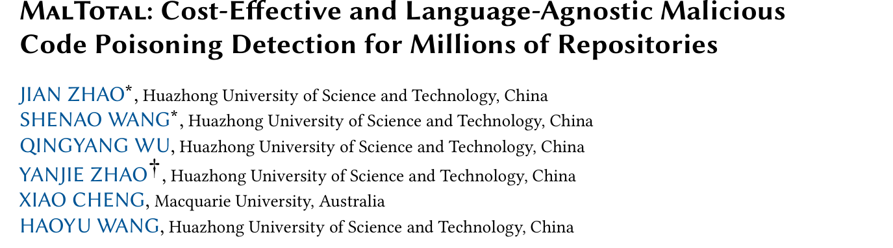
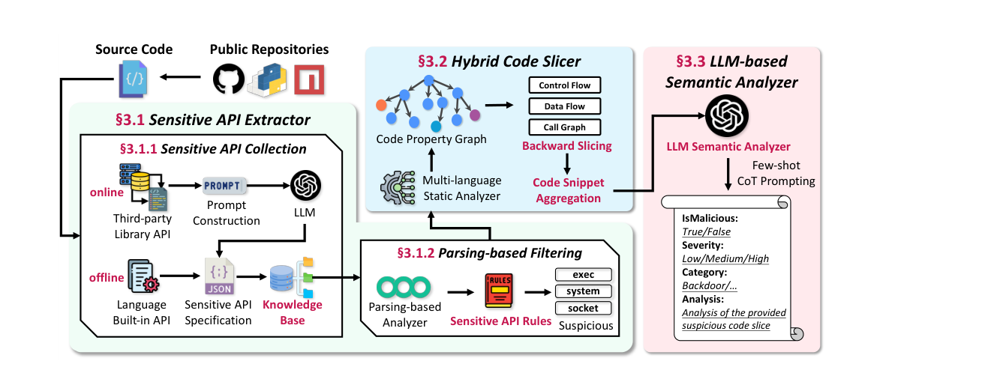
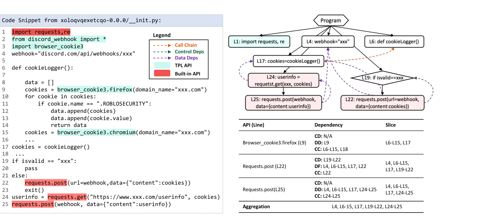
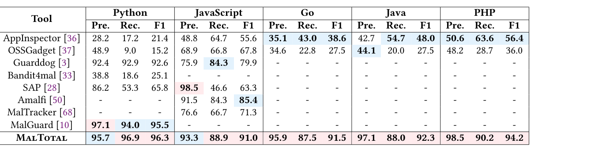
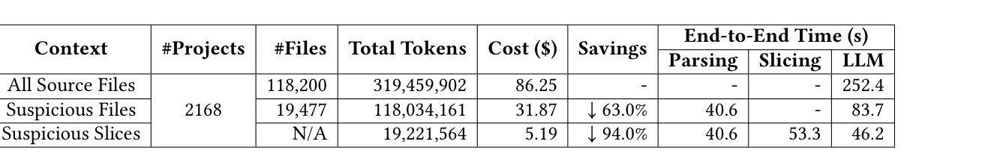

## PAPER INFO|论文信息

【论文题目】MalTotal: Cost-Effective and Language-Agnostic Malicious Code Poisoning Detection for Millions of Repositories
【论文链接】https://doi.org/10.1145/3832228
【代码链接】https://github.com/security-pride/MalTotal

本文由**华中科技大学联合麦考瑞大学**完成，已被软件测试顶会 **ISSTA 2026** 录用。通讯团队（Haoyu Wang 组）是国内软件供应链安全方向最活跃的力量之一，此前在恶意模型仓库测量、NPM 恶意包检测等方向有一系列工作，这篇是他们把检测能力推向"百万仓库规模"的集成之作。

## OVERVIEW|导读

用 LLM 判断代码是否恶意，效果已经被反复验证，但有一个致命障碍：**贵**。把仓库整个塞给模型，2168 个项目就要烧 3.2 亿 token，摊到百万仓库要 2.6 万美元起步，而且大仓库根本塞不进上下文窗口。MalTotal 的解法是给 LLM 配一个"减负前端"：先用覆盖五种语言的敏感 API 知识库定位代码里值得看的位置，再用程序切片把每个位置的完整行为上下文抠出来，最后才让 LLM 做语义裁决。结果是 token 消耗降 94%，**五种语言平均 F1 93.1%**，超过 8 个 SOTA 基线，并在 12 万个真实 GitHub 仓库上只花 338 美元就挖出 **564 个此前未知的恶意仓库**。

## BACKGROUND|问题与挑战

投毒攻击的规模已经不是新闻：仅 2025 年一季度就新增 17954 个开源恶意包，2019 年以来累计超过 82.8 万。战场也早已不限于 PyPI 和 NPM，GitHub 仓库本身成了大宗攻击面：一场 repo confusion 攻击波及超过 10 万个仓库，一项研究发现 3.52 万个"教学用途"仓库里 9294 个含恶意内容。而 GitHub 托管着超过 5 亿个仓库。

现有检测器面对这个规模有三道坎。**语言绑定**：绝大多数工具只针对 Python 或 JavaScript 设计，规则和特征都是生态专属的，扩展一门语言等于重做一遍，攻击者还能借第三方库里的敏感 API 绕开预定义清单。**语义泛化差**：规则和机器学习方法把代码语义压缩成模式和统计特征，遇到 0-day 攻击模式或恶意逻辑变体就失灵，而且只输出二分类结果，安全团队复核时毫无线索。**成本失控**：直接把 LLM 当裁判，会被上下文窗口和 token 费用双重卡死。作者用 250 个跨语言恶意样本做了一个先导实验：整仓库输入时 PHP 有 46% 的样本直接超出上下文无法分析；而人工提炼的最小代码切片输入时，所有语言漏报率合计只有 0.5%，成本从 10.72 美元降到 0.25 美元。**结论很清晰：LLM 不缺判断力，缺的是有人替它把上下文剪对**。

## METHOD|方法

MalTotal 的三段流水线正是围绕"把上下文剪对"设计的：

**第一段：敏感 API 提取器。** 离线部分整合 MalOSS、MalTracker 与官方文档人工梳理，构建了覆盖 Python、JavaScript、Java、Go、PHP 的 **2147 个内置敏感 API 知识库**，按载荷执行、网络访问、文件操作、敏感数据访问、密码学五类组织。在线部分解决第三方库盲区：解析项目依赖清单后下载库源码，让 LLM 阅读函数签名和实现摘要判断是否敏感，结果按（库、版本、函数）三元组缓存复用。评估期间共分析 27746 个第三方 API、识别出 694 个敏感 API，人工抽查一半仅 4 个误报。定位阶段用 Semgrep 做轻量匹配，83.5% 的文件在这一步被直接排除。

**第二段：混合代码切片。** 用 Joern 把源码统一转成语言无关的代码属性图，然后从每个敏感 API 调用点（sink）**反向**切片：沿调用链（深度上限 3）、数据依赖、控制依赖三路回溯，抠出以整个函数为粒度的完整行为上下文，再用 Jaccard 相似度迭代聚合去冗。选反向而非正向是刻意的：从数据源正向追踪会路径爆炸，而恶意行为最终都要落到敏感操作上，从 sink 回看只保留真正相关的路径。

**第三段：LLM 语义裁决。** 精炼后的切片交给 DeepSeek-V3，用安全专家角色设定加四步思维链（找敏感操作、追数据流向、评估意图、综合定论）加少样本示例，输出结构化 JSON：是否恶意、类别、严重度和分析理由。理由字段让安全团队复核时有据可依，这是对"二分类黑盒"的直接回应。

## RESULTS|实验结果

**检测性能：五种语言全面领先。** 在 1.6 万个包的多语言基准上，MalTotal 平均 F1 93.1%：Python 96.3%（最强基线 MalGuard 95.5%）、JavaScript 91.0%、Go 91.5%、Java 92.3%、PHP 94.2%。真正拉开差距的是跨语言能力：能覆盖全部五种语言的基线只有 ApplicationInspector（F1 47.8%）和 OSSGadget（32.4%），MalTotal 是它们的两到三倍。

**消融给出两个反直觉发现。** 一是切片不只是省钱手段：去掉切片改喂完整文件，召回率全线下跌，因为无关代码稀释了 LLM 的注意力，噪声比窗口更早杀死准确率。二是粒度不能太抠：只保留严格执行行（不含函数结构上下文）时 F1 从 94.2% 跌到 86.5%，变量初始化、循环条件甚至开发者注释这些"冗余"恰恰是 LLM 推理需要的语义完整性。调用链深度也有甜点：k=3 最优，更深只涨 token 不涨分。

**成本：94% 的削减是实测出来的。** 2168 个项目、11.8 万个文件的端到端分析：朴素全量输入需 3.19 亿 token（86.25 美元），敏感 API 过滤后降到 1.18 亿，切片后只剩 1920 万 token，**5.19 美元**。解析加切片每个项目约 94 秒，换来 LLM 阶段成本降一个数量级。

**大规模实战：564 个未知恶意仓库。** 团队把 MalTotal 部署到 12 万个有异常人气信号的 GitHub 仓库（730 万个文件）上，总花费 338 美元。初筛 1553 个候选，经两名 5 年以上经验的安全研究员独立复核（分歧由 7 年经验的资深专家仲裁），确认 **564 个此前未被任何数据库收录的恶意仓库**：C/C++ 200 个、Python 174 个、JavaScript 56 个，主要模式是凭据窃取（73 例 token 抓取器）与直接载荷执行（71 例），还有隐蔽挖矿和伪装恶意 fork。全部仓库已按负责任披露流程报告给 GitHub 安全团队。

## TAKEAWAYS|启发与点评

**对研究者**：这篇论文和我们此前解读的 PRAXIS 形成了一个值得注意的共识：**LLM 负责语义判断，程序分析负责把证据浓缩到刀刃上**，这个分工正在成为 LLM 时代安全检测的标准架构。MalTotal 的独特贡献是把"成本"当成一等公民来做研究：先导实验量化上下文粒度与成本的关系，消融量化每个组件的边际价值，大规模部署验证经济可行性，这套"成本敏感评估"的方法论本身就值得借鉴。它的局限也标注得很诚实：跨语言边界（Python 调 C 库）是盲区，LLM 裁决器自身可能被代码里嵌入的欺骗性注释提示注入，这两点都是现成的后续选题。

**对从业者**：两个信号值得注意。一是**GitHub 仓库层面的投毒已经规模化**，而现有防线几乎都架在包管理器上；如果你的团队会从 GitHub 直接引用代码（克隆、子模块、CI 拉取），这块空白需要正视。二是成本数字打破了"LLM 扫描用不起"的印象：每百万仓库数千美元的量级，已经低于一次人工安全审计。论文工件已开源，五类敏感 API 知识库（2147 个内置加 694 个第三方）本身就是可以直接复用的资产。

**一点观察**：论文结尾透露了两个动向：团队正与 VirusTotal 洽谈集成（名字都起好了，MalTotal 对 VirusTotal），未来目标生态点名了 VSCode 扩展、MCP 服务器和 Agent Skill。结合我们前几期的解读，这条线索很清晰：恶意代码检测的下一站就是 Agent 生态，而"程序分析缩上下文 + LLM 判语义"这套架构会是先头部队。供应链检测工具与平台级基础设施（VirusTotal、GitHub）的融合，也预示着学术工具落地的一条现实路径。
