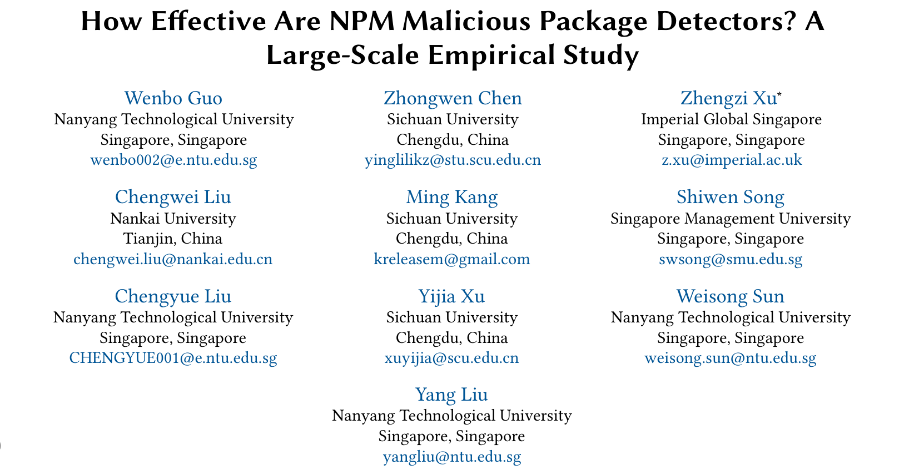
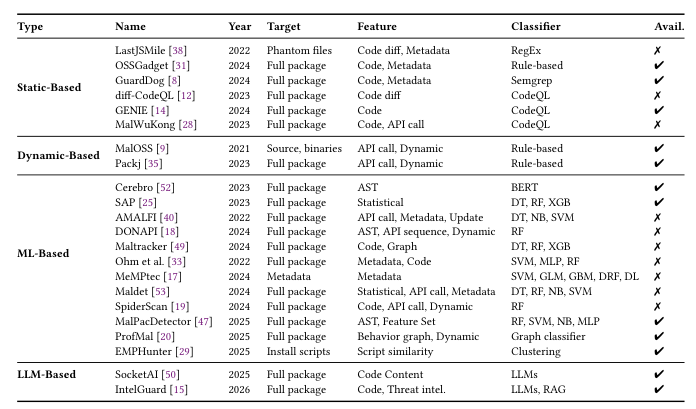
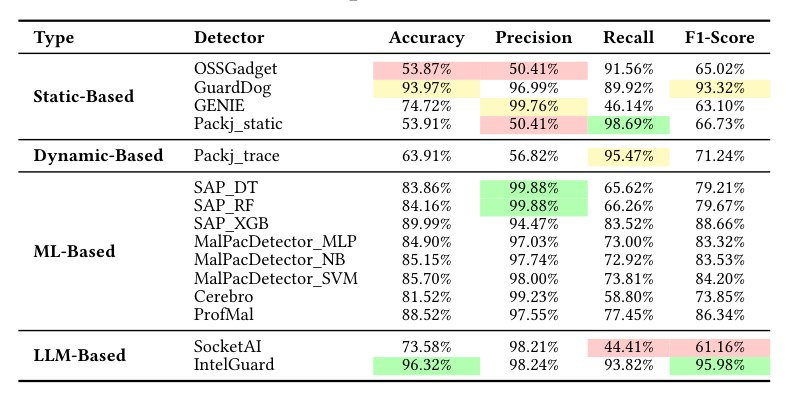
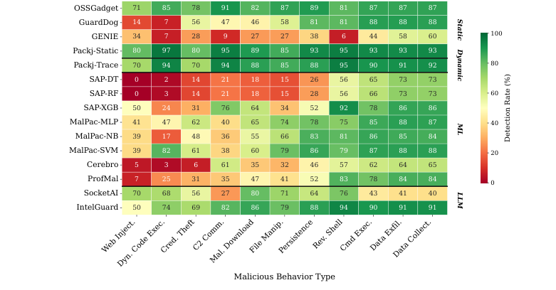
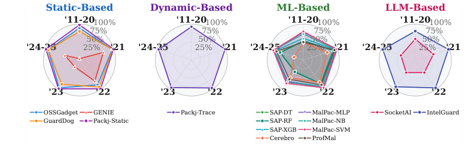
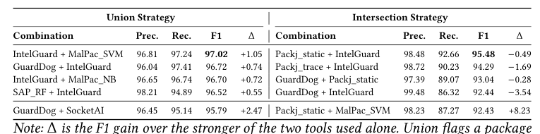

## PAPER INFO|论文信息

【论文题目】How Effective Are NPM Malicious Package Detectors? A Large-Scale Empirical Study
【论文链接】https://arxiv.org/abs/2603.27549
【数据开源】https://doi.org/10.6084/m9.figshare.31869370

这篇已被软件工程顶会 **ASE 2026** 录用，作者团队来自**南洋理工大学、四川大学、南开大学、帝国理工新加坡**等，长期做软件供应链安全（此前的 IntelliRadar、MalTotal 等恶意包情报与检测工作也出自这条线）。它对准了一个基础但一直没答案的问题：**市面上这么多 NPM 恶意包检测器，到底哪个行、哪个不行、为什么？** 因为是一项扎实的实证研究，本文写得更深入一些。

## OVERVIEW|导读

NPM 生态的恶意包威胁越来越严重，学界业界造了一大堆检测器：静态分析、动态沙箱、机器学习、大模型，四种范式都有。但有个尴尬的现实：**每个工具都在自己的数据集上、用自己的设置自测，报出来的数字没法横向比**，从业者想选一个部署都无从下手。这项研究做了第一个大规模横向评测：建一个统一基准（6420 个恶意包 + 7288 个良性包，标注了 11 种恶意行为和 8 种规避技术），把 **11 个工具的 16 个变体**拉到同一张考卷上考。而且关键是，它**不把工具当黑盒**，而是逐个读它们的源码，解释性能差异的结构性原因。五个发现每个都能改变你对"恶意包检测"的认知，其中最反直觉的是：==ML 工具这几年性能大幅衰退，不是因为攻击变复杂了，而是因为攻击变简单到和正常包在特征空间里统计上无法区分==。

## SETUP|评估对象：四范式 11 个工具

先看这项研究把哪些工具拉上了考场：

## FINDINGS|五个发现：检测器为什么行、为什么不行

**发现一：精度和召回的取舍，根子在"能力-意图鸿沟"。** 恶意包和良性包调用的是**同一批操作系统 API**（`child_process.exec`、`https.request`），一个 API 能干什么（能力）不等于它想干什么（意图），比如 `child_process.exec` 既能跑正常构建、也能跑反弹 shell。每个检测器本质上都在解决这个"能力-意图鸿沟"，解决得越好，精度和召回越平衡。主结果一目了然：

赢家的共同点是**用证据判断意图**，而不是只看代码能干什么：IntelGuard 从 8000 多份威胁情报里检索相似的已知恶意样本来给判断"接地"，GuardDog 用端到端污点分析追踪敏感数据流到网络汇聚点。而那些"见到敏感 API 就报警"的工具（如 Packj_static 召回 98.69% 但误报海量），或"只看代码本身不追证据"的工具，都栽在了这个鸿沟上。

**发现二：行为一旦"扎堆"，就容易被抓。** 恶意行为很少单独出现，当"收集数据"和"外传数据"共现时，检测率从单独的 40-72% 跳到 85.4%。最戏剧性的是 SAP_DT，==单看某个行为检测率只有 3.2%，行为耦合后飙到 79.3%，涨了整整 76 个百分点==。因为孤立的 `os.hostname()` 意图不明，但"取主机名 → 打包成 JSON → 发到外部"这条链就是铁证。

这也暴露了一个所有工具都过不去的坎：**攻击面错配**。Web 注入攻击的是浏览器端 DOM，但所有工具分析的是服务端 Node.js 代码，没有任何规则能桥接：连最强的 IntelGuard，数据外泄检测率 98.5%，一到 Web 注入就掉到 62.5%。有 21% 的恶意包因为这种错配，在代码分析工具眼里是结构性不可见的。

**发现三：80% 的攻击者根本不做规避，因为不需要。** 反直觉但合理：==80.3% 的恶意包不用任何规避技术==，因为 NPM 生态根本没有强制的发布前扫描，简单攻击照样能上架、照样能得手。而 72.21% 的恶意包把攻击藏在**安装脚本（install script）**里，因为 npm 的 `preinstall`/`postinstall` 生命周期钩子保证了代码在 `npm install` 时以完整用户权限自动执行、且抢在任何安全工具介入之前。更极端的是，21.2% 的恶意包纯靠 `package.json` 里的 install 钩子作恶，连一行恶意 JavaScript 都没有：这不是漏洞，是 npm"默认信任发布者"这个设计假设被利用了。

**发现四（最反直觉）：ML 工具衰退，是因为攻击变简单了，不是变复杂了。** 大家都知道 ML 检测器会随时间性能下降，通常归因于"概念漂移"（攻击手法变了）。但论文追踪发现，SAP_DT 从 2021 年的 87.15% 掉到 2023 年的 39.49%，真正的原因是作者称之为"**概念收敛**"的现象：

机理是这样的：攻击者转向了**最小足迹代码**（能少写就少写，一行命令注入就搞定），于是恶意包在特征空间里变得和良性包统计上无法区分。ML 模型的每一个决策边界都是拟合到它训练时那个语料时代的，一旦攻击"返璞归真"到没有明显特征，边界就失效了。**只有 GuardDog 靠持续维护规则实现了真正的恢复，而所有 ML 模型都做不到这一点**，因为规则可以人工更新，学到的特征分布不能。这解释了为什么"重训模型"治标不治本。

**发现五：工具组合的有效性 = 互补性 减去 误报引入。** 从业者常被建议"多个工具一起上"，但研究发现组合不是越多越好。战略性组合能到 97.21% 准确率、97.02% F1，但有个反直觉的不对称：**最强的工具被组合拖累，最弱的工具从组合受益最多**。

原因很干净：并集（union）会累加两个工具的真阳性，也会累加它们的假阳性。当你把一个高召回低精度的工具配给一个已经很强的工具，它带来的假阳性可能比真阳性还多，反而拖低整体精度。所以组合的价值取决于**互补性**（两个工具的盲区不重叠），而不是**范式多样性**（不是"静态+动态+ML"堆起来就好）。判断一个伙伴值不值得加，要看它填补的盲区，减去它引入的误报。

## TAKEAWAYS|启发与点评

**对研究者**：这项工作的方法论价值在于"不把工具当黑盒"：通过读 11 个工具的源码，它把"哪个工具好"这种榜单式结论，升级成了"为什么好、为什么坏"的结构性解释。五个原理（能力-意图鸿沟、行为耦合放大、攻击面错配、概念收敛、组合互补性）都是可迁移的：任何做恶意检测的人都该问自己，我的工具是在判断能力还是意图？我的特征会不会随攻击简化而失效？其中"概念收敛"这个发现对整个 ML 安全方向都有警示意义：它说明在对抗性环境里，攻击者可以通过"变简单"而非"变复杂"来逃避学习型检测，这是传统概念漂移框架完全没覆盖的失效模式。IntelGuard 靠检索情报证据保持稳定，也再次印证了一点：把判断"接地"到可信证据上，比学习易过时的表面特征更耐久。

**对从业者**：三个能立刻用的判断。其一，**选检测器要认清它解决"能力-意图鸿沟"的方式**：只看代码能干什么的工具误报会淹没你，能追证据、追数据流的工具（GuardDog 这类污点分析、IntelGuard 这类检索接地）才实用。其二，**别忽视 install script**：72% 的攻击藏在安装脚本里，对不信任的包用 `npm install --ignore-scripts` 是立刻能做的防护。其三，**组合工具别盲目堆范式**：加一个工具前先想清楚它填的是不是你现有工具的盲区，否则只会给你增加误报；一个高召回低精度的工具配错了搭档，会把强工具一起拖下水。

**一点观察**：这篇把话题拉回到软件供应链安全的地基。它和我们之前解读的 Agent Skill 安全系列形成了一个有意思的呼应：Agent 生态正在重演 NPM 走过的路（恶意组件、install 脚本式攻击、检测器的能力-意图困境），而这篇给的是 NPM 这个"过来人"十几年沉淀下来的检测器成败经验。最值得记住的一句是那个"概念收敛"：==在安全对抗里，最难防的往往不是越来越复杂的攻击，而是简单到你的检测器认不出它是攻击==。这对所有想用 AI/ML 做安全检测的人，都是一句冷静的提醒。
