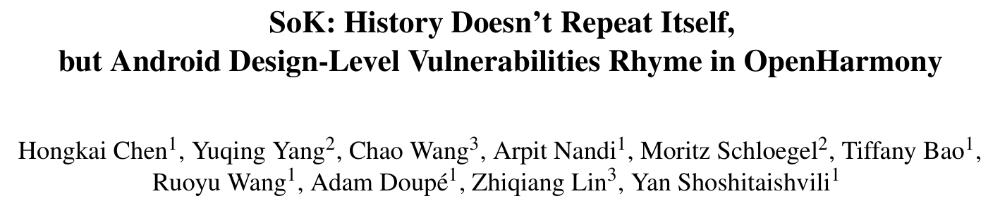
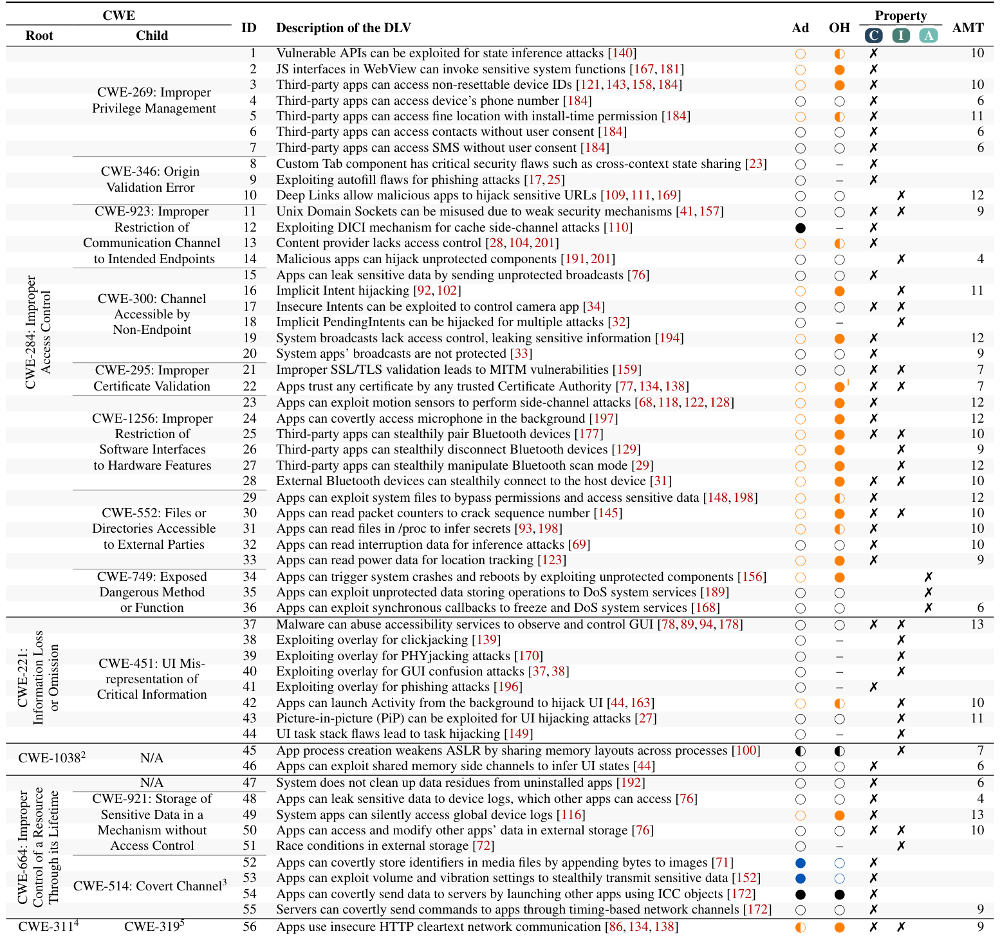
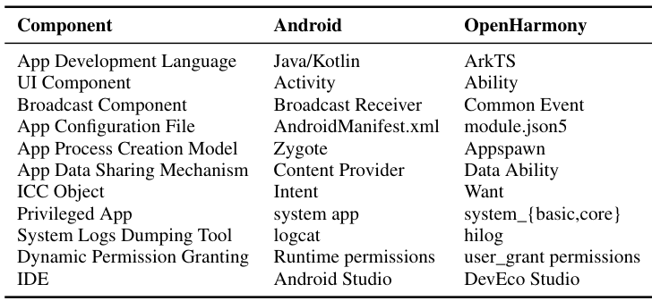
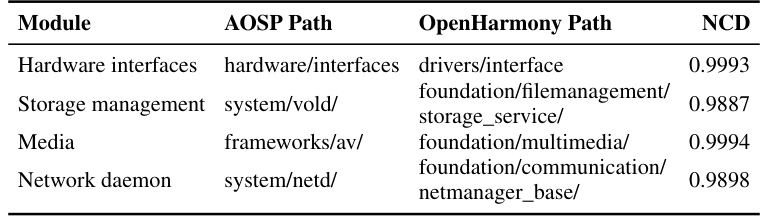
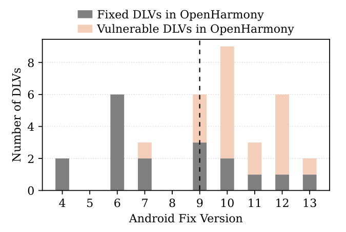

## PAPER INFO|论文信息

【论文题目】SoK: History Doesn't Repeat Itself, but Android Design-Level Vulnerabilities Rhyme in OpenHarmony
【论文数据】https://doi.org/10.5281/zenodo.20655878
【作者团队】Arizona State University、CISPA、Ohio State University

这是一篇 **USENIX Security 2026** 的 SoK（系统化知识）论文，标题化用了马克·吐温那句"历史不会重演，但常常押韵"。它问了一个我们一直好奇、却少有人系统回答的问题：**安卓这些年被安全研究者挖出又修好的设计缺陷，会不会在那些"另起炉灶"的新手机系统里，一模一样地重新长出来？** 作者拿华为鸿蒙 OpenHarmony 做了实证，答案是会，而且触目惊心。

## OVERVIEW|导读

先厘清一个关键概念：**设计级漏洞（Design-Level Vulnerability, DLV）**。它不是代码写错了（实现 bug），而是**设计逻辑本身就不安全**。作者举的例子是安卓的隐式 Intent：Intent 让 App 之间松耦合通信，但任何 App 只要注册了匹配的 Intent filter，就能拦截或伪造这条通信，敏感数据可能被误送到恶意组件。这不是哪一行代码的锅，是 Intent 解析机制的设计使然。

设计级漏洞有个要命的性质：==它和具体代码无关，所以任何共享同一套设计的系统，哪怕代码从零重写，也会原样继承这个漏洞==。安卓被研究烂了，但那些"复刻"安卓设计、自己重写一套的新系统（如鸿蒙）却几乎没人从安全角度审视过。这篇 SoK 就是来补这一课的。

它做了三件事：**梳理**（系统化 116 篇安卓论文，提炼 56 个设计级漏洞）、**建模**（做一套与安卓代码无关、可复用的审计方法）、**验证**（拿这套方法去审鸿蒙 OpenHarmony，10 亿+设备）。结果：56 个漏洞里 46 个适用于鸿蒙，鸿蒙对其中 **24 个真的中招**。

## LANDSCAPE|56 个设计漏洞的全景图

作者从四大顶会（S&P、USENIX Security、CCS、NDSS）2010 到 2024 年的论文里，加上 14 篇 Black Hat 报告，从 450 篇候选中筛出 116 篇聚焦安卓设计漏洞的工作，逐篇提取、去重，最终得到 56 个设计级漏洞，用 CWE（通用弱点枚举）组织成 **5 个根类、12 个子类**。这张表是全文的地基：

这张表本身就藏着几个值得记住的结论。其一，**56 个漏洞里有 36 个都属于"访问控制不当"（CWE-284）**，说明即便对久经考验的安卓，访问控制依然是设计层面最大的老大难。其二，56 个里只有 3 个破坏"可用性"，绝大多数破坏的是机密性和完整性，意味着这类漏洞的危害更多是**隐蔽的窃取和篡改**，而不是显眼的崩溃闪退，更难被用户察觉。其三，到 2025 年，56 个漏洞里安卓已经修掉 52 个，只剩 4 个没修，其中 3 个是隐蔽信道（covert channel），因为它们干脆被划在了安卓的威胁模型之外。

顺带一提，那一栏栏**橙色的圈**，就是这篇论文最想让你看见的东西：橙色越多，说明鸿蒙在这一项上比安卓更暴露。往下看，橙色相当密集。

## METHOD|方法：先证明鸿蒙"不是安卓套壳"，再逐条审

要说服人"鸿蒙继承了安卓的设计漏洞"，得先堵住一个反驳：那会不会只是因为鸿蒙就是安卓改的、代码都一样？作者用两组硬证据证明**恰恰相反**。

先看概念上的对应关系，安卓和鸿蒙几乎是"换了名字的同一套架构"：

但概念对应不等于代码抄袭。作者做了两项代码相似度分析：核心框架外的原生模块用归一化压缩距离（NCD）比对，结果全都逼近 1（1 代表完全不同）；核心框架内的函数名、变量名、接口名用 Jaccard 和余弦相似度比对，也都低得可怜。

结论很硬：==鸿蒙不是安卓的分支，也不是逐函数照抄，而是一套从零独立重写的系统==。安卓核心框架主要用 Java/Kotlin，鸿蒙用 C/C++；两边共享 0 个文件路径。这恰恰让论证成立，代码完全不同、漏洞却照样存在，那问题就只能出在两者**共享的设计**上。

在此基础上，作者把 56 个漏洞的审计方法做成了一套与安卓代码无关的"系统化审计模型"，对鸿蒙逐条走三步：判断该漏洞是否适用（对应功能在不在）、在鸿蒙文档和源码里定位相关组件、写 PoC 应用在真机上验证。

## FINDINGS|结果：24 个中招，而且大多是安卓"后来才修"的

56 个漏洞里，46 个适用于鸿蒙，鸿蒙对其中 24 个存在漏洞（17 个完全中招 + 7 个部分中招）。作者还在**商用的 HarmonyOS NEXT** 真机上复验了这 24 个，确认 20 个能打通。几个具体的例子能感受到危害：

- **随手就能拿到设备 MAC 地址**：普通 App 无需任何权限，读 `/proc/net/arp` 拿路由器 MAC、读 `/sys/class/net/wlan0/address` 拿本机 MAC，可用于定位和 TCP 注入。
- **一个文件读操作就能让系统重启**：一个声明"零权限"的普通 App，读 `/sys/kernel/debug` 下的 USB 调试文件就能触发内核 panic，把设备强制重启（DoS）。
- **蓝牙可以静默配对、静默断开、静默改扫描模式**：全程不需要用户同意，可劫持音频、也可持续把设备设成不可发现来搞 DoS。
- **默认允许明文 HTTP**：鸿蒙默认不强制 HTTPS，App 发明文请求畅通无阻，天然暴露在中间人攻击下（安卓早已默认禁止）。

而最发人深省的，是漏洞的**时间线**。作者把 19 个有明确修复版本的漏洞，按安卓"在哪个大版本修好"画了出来：

看这张图：虚线右边（安卓 10 及以后）粉色一片。==15 个漏洞里，安卓是在鸿蒙动手重写之后才修好的，鸿蒙自然没跟上==。这不是巧合：安卓 10 发布于 2019 年 9 月，正好是华为推出鸿蒙前后。也就是说，鸿蒙"复刻"的是**那个时间点的安卓**，而安卓后来十几个版本里陆续修掉的设计缺陷，鸿蒙一个都没同步过来。这就是"押韵"的机制：重写者复制了设计，却没有复制这套设计**踩过的坑和长出的教训**。

作者已按 90 天规则把 24 个漏洞全部负责任地披露给 OpenHarmony，其中 6 个已被确认，获得了 25000 元漏洞赏金。

## TAKEAWAYS|启发与点评

**对研究者**：这篇 SoK 的方法论价值，在于把"设计级漏洞"这个模糊的概念**做实、做成可迁移的资产**。它证明了一件反直觉的事：安全知识可以脱离具体代码存在，一个漏洞可以在完全不同的代码里"转世"。因此它提炼的 56 个漏洞 + 12 条设计原则，本质上是一份**与实现无关的移动 OS 安全审计清单**，任何做新系统（HyperOS、BlueOS，乃至更远的新平台）的人都能拿去对照自查。更妙的是那套"用代码相似度证明系统独立、从而反证漏洞源于设计"的论证结构，为"跨系统的设计漏洞研究"提供了一个可复制的范式。它也留下了顺理成章的后续选题：把这套审计模型自动化，而不是像现在这样每条都要人工映射概念、写 PoC。

**对从业者**：给做系统和做安全的两类人各一句。做系统的：**别把"我们是全新代码、和安卓无关"当成安全的挡箭牌**，代码全新恰恰可能意味着你把安卓早年的设计坑又踩了一遍；真正该做的是盯住安卓（以及其它成熟系统）**近十几个版本的安全变更日志**，因为你复刻的很可能是某个旧版本的设计。做安全的：审一个"新"系统时，与其从零 fuzzing，不如先把它对标的成熟系统的**历史设计漏洞列一遍**，逐条验证是否复现，投入产出比高得多，这篇 24/46 的命中率就是明证。

**一点观察**：这篇和我们此前解读的供应链安全工作是同一条神经，只是把"复用"从代码层抬到了**设计层**。软件供应链安全一直在讲"你复用了别人的组件，就继承了它的漏洞"；而这篇说的是更隐蔽的一种复用：==你复用了一套设计理念，就算一行代码都没抄，也照样继承了它的漏洞==。安卓的设计经由无数论文和补丁"公开教学"了十几年，新系统抄走了架构、却没抄走这些血泪教训，于是历史押着韵重演。对整个行业，这是一句冷静的提醒：真正的安全资产不只是代码和补丁，更是那份"某个设计为什么危险"的集体记忆，而这份记忆，目前还没有一个好机制能随设计一起传下去。
