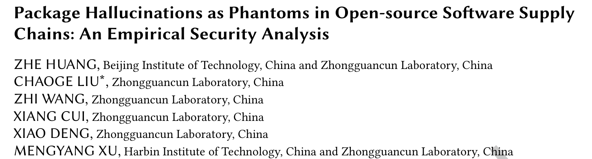
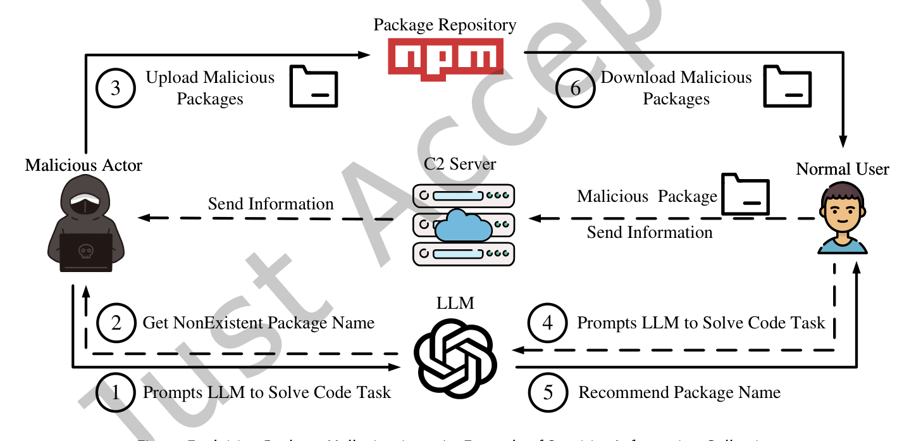
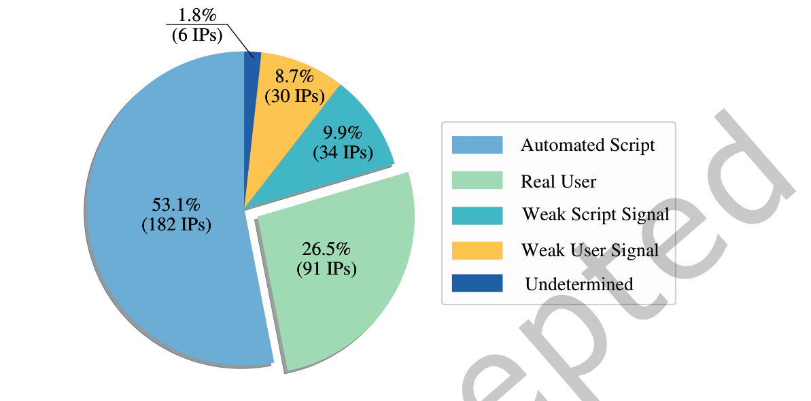
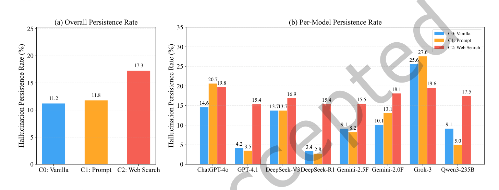
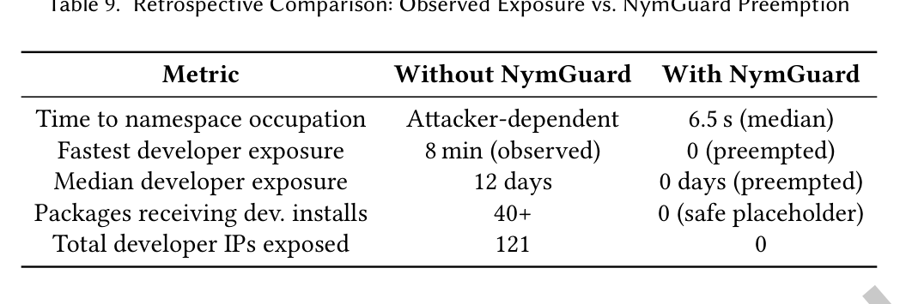

## PAPER INFO|论文信息

【论文题目】Package Hallucinations as Phantoms in Open-source Software Supply Chains: An Empirical Security Analysis
【论文链接】https://doi.org/10.1145/3830237
【代码链接】https://github.com/xiaoye798/Package-Hallucination-Research

本文由**北京理工大学与中关村实验室、哈尔滨工业大学**联合完成，已被软件工程顶刊 **ACM TOSEM** 录用。研究把"大模型幻觉包"从一个被反复讨论的理论风险，第一次做成了真实世界的端到端实证。

## OVERVIEW|导读

大模型写代码时会推荐并不存在的软件包，这叫"包幻觉"。以往研究只停在测量幻觉发生率，留下一个关键问题没答：**这到底是真实威胁，还是纸上谈兵？** 本文给出了实证答案。作者从 8 个主流大模型里提取 107 个幻觉包名，把它们作为占位包真实上传到 npm，观察半年。结果触目惊心：**35.2% 的安装来自真人开发者**（而非自动化脚本），多数交互集中在注册后两周内；25.2% 的幻觉包名与真实包的编辑距离不超过 1，直接构成抢注风险；最反直觉的是，被寄予厚望的联网搜索工具不但没能缓解幻觉，反而把持续率从 11.2% 抬高到 17.3%。而在 npm 上，整条攻击链只需约 **496 美元**。作者还开源了自动防御智能体 NymGuard 抢先占坑这些幻觉包名。

## BACKGROUND|问题与挑战

现代开发高度依赖 npm、PyPI 这类仓库，而它们的信任基础脆弱得出奇：**包名就是身份**。typosquatting（抢注错拼名）和依赖混淆已经在利用这一点，包幻觉则开辟了同样危险的新入口。攻击链条很直接：攻击者让大模型大量生成代码、收集其中反复出现的幻觉包名、抢先在仓库注册这些名字，之后大模型就成了一个"权威且有说服力"的投递渠道，把无辜的开发者引向恶意包。

以往的防御思路都有硬伤。**事后比对**（拿模型推荐的包名和官方有效包列表比对）根本无效，因为攻击者一旦抢注，恶意包就出现在"有效列表"里了。**事前预防**里，监督微调需要海量标注和持续重训，成本极高；RAG 依赖外部知识库的时效性和覆盖度。归根到底，闭源黑盒模型的输出不可控，只靠上游治理，供应链在很长一段时间里都是敞开的。

## METHOD|方法

作者把威胁拆解成一条三阶段杀伤链来系统验证：**幻觉与暴露**（大模型在代码任务中编造出看似合理实则不存在的包）、**恶意抢注**（攻击者注册这些名字）、**投递与传播**（真实用户按推荐安装，恶意载荷随之下发）。围绕这条链设计了 6 个研究问题，覆盖可行性、时延、超级传播者、抢注风险、工具增强效果、攻击成本。

实证方法上做得相当扎实也相当克制：选 JavaScript/npm 生态（npm 服务 1700 万开发者，是最大攻击面），从 10893 个真实开发者查询喂给 8 个 SOTA 模型，提炼出 107 个经四步验证确认在 npm 不存在的幻觉包。**伦理上全程用无害占位包**：包里只有一个 postinstall 脚本回传匿名遥测（用来统计谁装了），不含任何恶意功能，采用"一包一账号"策略模拟真实攻击者的分散手法，实验结束会向 npm 提交报告。

## RESULTS|实验结果

**RQ1 真实性：这不是纸上谈兵。** 343 个交互 IP 经两名 5 年经验专家独立分类（Cohen's κ=0.88，高度一致），**35.2% 的交互由真人开发者驱动**。哪怕只有一次手动安装，也可能通过依赖清单渗透进 CI/CD 和生产环境。理论风险就此坐实为可观测的高影响攻击面。

**RQ2 时延：两周高危窗 + 长尾。** 107 个包平均存活近两周，超 70% 的交互发生在前两周（第一周就占 40.22%）。更值得注意的是 npm 的清理呈"批量式"而非实时：33 个包在整齐的 12 天存活期后被同批清除。这种可预测的响应节奏，反而给了攻击者一个稳定的可利用窗口。

**RQ4 抢注风险：幻觉不是乱码，是"逼真的近似"。** 107 个幻觉名与真实包的平均归一化编辑距离仅 0.207，**25.2% 的绝对编辑距离不超过 1**（如 pydantic→pedantic、vite-plugin-remove→vite-plugin-remove）。大模型编出来的名字不是随机字符串，而是精心的"差一点点"，天然构成 typosquatting 威胁。

**RQ5 最反直觉的发现：联网搜索让幻觉更顽固。** 按常识，给模型接上实时网页搜索应该能核实包是否存在、从而减少幻觉。实测却相反：幻觉持续率从原始的 11.2% 升到提示增强的 11.8%，再到联网搜索的 **17.3%**（后者统计显著）。

作者挖出了机制，称为"**上下文污染**"：搜索引擎返回的网页里引用了其他生态（Python、R、Java）的真实包，模型读到后就把这些跨生态的包名"移植"到 npm 推荐里。一个典型例子是 undetected-chromedriver（Python 知名库）：原始条件下 8 个模型里只有 1 个会幻觉出它，接入联网搜索后全部 7 个模型都以 7/10 以上的概率持续幻觉，搜索标注里一致引用了那个 Python 仓库的 GitHub issue。**工具增强没有发明新幻觉，而是让同一批幻觉在更多场景里稳定复现。**

**RQ6 成本：496 美元的攻击。** 侦察阶段（查询大模型挖幻觉名）是唯一需要投入的环节，10893 个查询跑 8 个模型约 496 美元；注册和分发几乎零成本（npm 免费注册，大模型免费当推荐渠道，边际成本为零）。相比传统供应链攻击动辄数万到数百万美元的门槛，这是一个低到危险的价格。

**防御：NymGuard 抢先占坑。** 作者开源了自动防御智能体 NymGuard：实时检测幻觉包名、抢先注册无害占位包、维护公开预警清单。回溯验证显示，观测到的最快真人安装发生在注册后 8 分钟，而 NymGuard 的中位抢占延迟只有 6.534 秒，比最激进的攻击场景快约 73 倍，比典型的 12 天暴露窗快 15 万倍。

## TAKEAWAYS|启发与点评

**对研究者**：这篇论文的价值在于把"包幻觉"从测量层面推进到了端到端实证层面，用真实上传加半年观测回答了"到底有没有人真会中招"。它最出人意料的贡献是 RQ5 的"上下文污染"：给模型加联网搜索这个业界默认的缓解手段，反而放大了风险。这提醒所有做 RAG 与工具增强的研究者，检索引入的外部上下文本身可能是新的攻击面，跨生态的信息串扰值得单独研究。方法论上，"一包一账号 + 匿名遥测 + 事后报告"的伦理设计也为这类高风险实证研究提供了可参照的范本。

**对从业者**：三个直接的行动点。其一，**不要盲信大模型推荐的包名**，尤其是那些看起来"差一点点"像知名库的名字，安装前到官方仓库核实一次；四分之一的幻觉名就是靠这种以假乱真骗过开发者的。其二，如果你的团队在用带联网搜索的编程助手，要意识到它对包名的可靠性可能不升反降，跨语言迁移的包名（Python 库名出现在 JS 推荐里）是重点怀疑对象。其三，NymGuard 已开源，抢注防御这个思路（对高风险幻觉名主动占坑）值得关注和复用。

**一点观察**：把这篇和我们此前解读的几篇串起来看，供应链投毒的"入口"正在被大模型系统性地拓宽。恶意包检测里我们担心攻击者主动上传，恶意 Skill 里我们担心第三方技能投毒，而这篇揭示了一条更隐蔽的路径：**大模型自己会凭空"发明"出攻击者只需抢注就能利用的名字**。当 AI 成为开发者信任的推荐者，它的每一次幻觉都可能被武器化。这也让"言行核实"（模型说的包到底存不存在、装进来的代码到底干什么）成为 AI 时代供应链防御绕不开的基本功。
