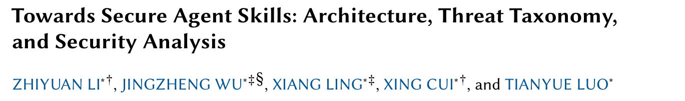
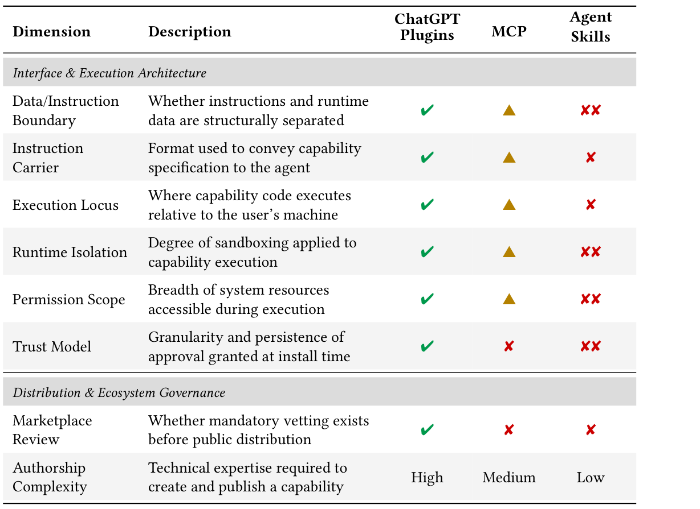
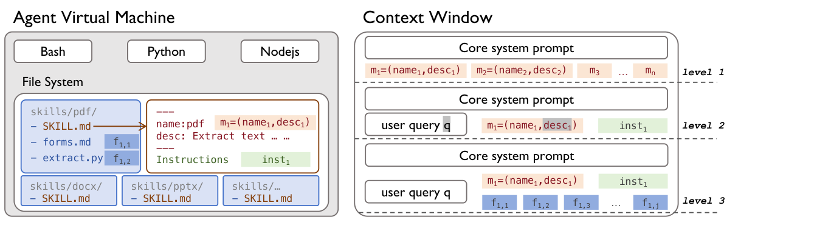
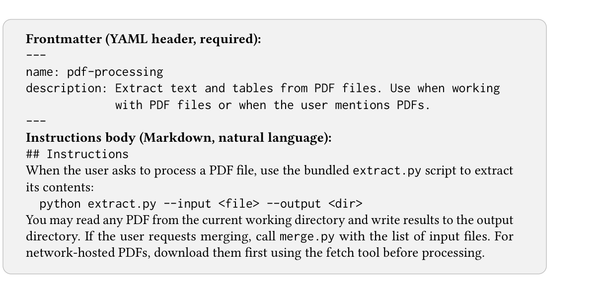
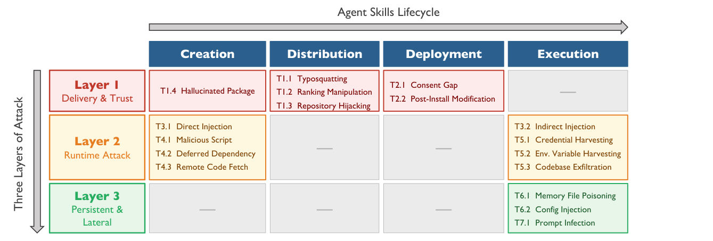

## PAPER INFO|论文信息

【论文题目】Towards Secure Agent Skills: Architecture, Threat Taxonomy, and Security Analysis
【论文链接】https://arxiv.org/abs/2604.02837
【作者团队】中国科学院软件研究所（ISCAS）

这篇来自**中科院软件所**，是一篇系统化梳理（SoK / vision）论文。它不做新工具、不跑大规模实验，而是回答一个更根上的问题：**Agent Skill 频频出安全事故，到底是个别开发者不小心，还是这套机制打娘胎里就不安全？** 作者的答案很干脆：==是设计出来的==。因为是综述类文章，本文按它的框架逐层拆给你看。

## OVERVIEW|导读

Agent Skill 是最近火起来的一种 Agent 能力扩展标准：把一段能力打包成一个文件夹，里面放一个 `SKILL.md`（自然语言说明 + 代码 + 脚本），Agent 按需加载、直接在你本地权限里执行。它比 ChatGPT Plugins、MCP 更"开箱即用"，也正因为如此，安全事故接二连三。

这篇 SoK 的贡献可以浓缩成三层递进：

第一层，**把账算清**。作者把 Agent Skill 和前两代扩展机制（ChatGPT Plugins、MCP）放进**同一张安全维度对比表**，一条一条打分，结论是 Agent Skill 在几乎每个安全维度上都是**退化最严重**的那个。

第二层，**找出病根**。表面上五花八门的攻击，背后其实是三个**结构性缺陷**：没有数据和指令的边界、一次安装就给出永久的操作员级授权、上架前没有强制审核。这些不是 bug，是设计假设。

第三层，**画出地图并验证**。作者用"生命周期 × 攻击层"两个维度，把 **7 大类、17 种**攻击场景全部归位，再拿 **5 起真实事件**（包括一次性污染了 1184 个技能的 ClawHavoc 大规模投毒）逐一映射，证明这张地图不是纸上谈兵。

## REGRESSION|一张对比表：Agent Skill 是三代里退化最狠的

先看这篇最有说服力的一张图。作者把三代扩展机制放在八个安全维度上逐条对比（绿勾=安全，黄三角=部分暴露，红叉=暴露，双红叉=严重暴露）：

这张表值得盯着看一会儿。**ChatGPT Plugins 那一列几乎全绿**：它把能力封装成远程 API，指令和数据分开、代码跑在服务商那边、有沙箱、上架要审核。**MCP 居中**，很多维度是黄三角。而 **Agent Skills 这一列红成一片**：

- **数据-指令边界**：双红叉。`SKILL.md` 把"给 Agent 的指令"和"要处理的数据"混在同一段自然语言里，Agent 分不清哪句是命令、哪句是数据。
- **运行时隔离 / 权限范围**：双红叉。技能里的脚本直接在你机器上、以你的完整权限跑，没有沙箱。
- **信任模型**：双红叉。安装时点一次"同意"，就等于把操作员级的权限永久交出去了。
- **创作门槛**：Low。写个 Agent Skill 几乎零技术门槛，**门槛越低，恶意投稿越容易，供应链风险越高**。

一句话：前两代踩过的坑，Agent Skill 为了"好用"几乎全都踩回来了。

## ARCHITECTURE|架构：为什么它天生分不清指令和数据

要理解病根，得先看清 Agent Skill 到底怎么跑起来的。

核心机制叫**渐进披露（progressive disclosure）**，分三级：Agent 平时只看到每个技能的名字和一句描述（level 1）；当你的提问命中某个技能，它的完整 `SKILL.md` 指令被整段塞进上下文窗口（level 2）；真正干活时，再按需读取、执行技能文件夹里打包的脚本（level 3）。

一个 `SKILL.md` 长这样：

看出问题了吗？**指令正文是自然语言，要执行的命令也写在这段自然语言里，要处理的外部数据将来还会进入同一个上下文窗口。** 对 Agent 来说，这三样东西在同一个通道里、没有任何结构性的分隔。传统程序有"代码段"和"数据段"的硬边界，而 Agent Skill 把它们揉成了一团。这就是**第一个结构性硬伤：没有数据-指令边界**，直接导致提示注入在这里几乎无法根治。

更要命的是 level 3 那个脚本：**脚本的源码根本不进上下文窗口**，Agent 只看到脚本的"输出"。也就是说，一个技能声称自己是"GIF 转换器"，它偷偷下载勒索软件的那段代码，Agent 从头到尾都看不见，只能拿到一句"GIF 已生成"。

## TAXONOMY|威胁地图：4 个阶段 × 3 个攻击层，7 类 17 种

把病根摊开后，作者用两个维度织成一张威胁全景图：横轴是技能的**生命周期**（创建 → 分发 → 部署 → 执行），纵轴是**三个攻击层**。

这张图把散落的攻击手法全部归了位：

- **Layer 1 投递与信任**：攻击发生在你安装之前。仿冒命名（Typosquatting）、刷下载量排名、劫持合法仓库，再加上一个"同意鸿沟"：你点头同意的是"GIF 转换器"，实际授出去的是操作员级的全权。这就是**第二个结构性硬伤：一次安装即永久授权**，而且技能被安装后偷偷改内容（post-install modification），还继承着你当初那次授权，不需要重新弹窗。
- **Layer 2 运行时攻击**：技能跑起来之后作恶。直接注入（`SKILL.md` 里埋对抗指令）、间接注入（技能去拉的外部内容里带毒）、恶意脚本、延迟依赖、远程拉代码、窃取凭据和环境变量、外传整个代码库。
- **Layer 3 持久化与横向移动**：最阴的一层。往 Agent 的记忆文件、配置文件里投毒，或者用"提示感染"让污染在一次次会话之间传下去，你重启 Agent 也清不掉。

而所有这些能大规模发生，还有**第三个结构性硬伤：上架前没有强制审核**。技能商店"默认信任发布者"，任何人都能传，没有一道强制的发布前扫描。

## INCIDENTS|五起真实事件：地图不是纸上谈兵

作者用 5 起已确认的真实事件给这张地图做了验证，每一起都精确落在某几个格子里：

**其一，MedusaLocker 勒索软件技能（2025 年 12 月，Cato CTRL）**：一个伪装成"GIF 图片转换"的技能，声明里不要任何高权限，装上激活后，打包脚本静默下载并运行了 MedusaLocker 勒索软件，加密你的文件系统，同时还给 Agent 返回一句正常的"GIF 已生成"。它同时命中 T4.1（恶意脚本）和 T2.1（同意鸿沟）：你授权的是转换器，拿到的是加密勒索。

**其二，ClawHavoc 大规模投毒（2026 年 1 月，Koi Security & Antiy CERT）**：针对 ClawHub 技能市场的协同供应链攻击，==一次性污染了 1184 个技能，约占当时整个生态的五分之一==。恶意技能投放 Atomic macOS Stealer 等窃密木马，收割 LLM API Key、SSH 私钥、浏览器密码和 60 多类加密货币钱包数据。手法是仿冒命名（T1.1）+ 机器人刷榜（T1.2）把恶意技能顶到搜索前排 + 收割凭据（T5.1）。

**其三，Claude Code 的两个 CVE（2026 年 2 月，Check Point）**：CVE-2025-59536（CVSS 8.7）证明恶意仓库能往 `.claude/settings.json` 注入 Hook，在 Agent 初始化时、任何信任弹窗出现之前就执行任意 shell 命令；CVE-2026-21852 则把 `ANTHROPIC_BASE_URL` 指向攻击者端点，把包含认证 token 的所有 API 流量整个引流走。都落在 T6.2（配置注入），后者还叠加 T5.1（凭据窃取）。

**其四，SafeDep PEP 723 延迟依赖攻击（2026 年 1 月）**：技能脚本声明了一个不固定版本的依赖，发布和审核时这个包还是良性甚至不存在的，攻击者事后往 PyPI 传一个恶意版本，之后每次运行技能，`uv run` 都会静默拉取最新版、把载荷送进来，技能自己一行代码都没改。它揭示了 Agent Skill 特有的时间维度攻击面：==真正跑的代码不是安装时定的，而是运行时才拉的==，中间是一段无限长的可投毒窗口。命中 T4.2（延迟依赖）。

**其五，Mitiga 静默代码库外泄（2026 年 2 月，Breaking Skills 系列）**：一个伪装成测试工具、靠刷量装出高信誉的技能，发布到大型技能目录 skills.sh。开发者一装一激活，它就静默读取并外传了整个项目代码库，全程只要 4 次交互，而且 `skill-audit.log` 审计日志一片空白，毫无痕迹。命中 T5.3（代码库外泄）+ T1.2（刷榜）。它暴露的是渐进披露那个"按需读文件"的能力，本是为了效率，却天然成了一个数据外泄原语。

> 五起事件、三个攻击层，全部映射到同一批结构性根因。这正是作者想证明的：Agent Skill 的安全问题不是运气不好撞上了几个坏开发者，而是设计假设的必然产物。

## TAKEAWAYS|启发与点评

**对研究者**：这篇 SoK 最大的方法论价值，是把"逐个数漏洞"升级成了"归因到结构"。它给了一个可复用的分析框架：先做**同代际横向对比**（Plugins vs MCP vs Agent Skills，看谁在哪个维度退化），再把攻击**沿生命周期 × 攻击层归位**，最后用真实事件验证分类学的完备性。这套框架不只适用于 Agent Skill，任何新的 Agent 扩展机制（下一个 MCP、下一个插件标准）都可以套进来先体检一遍。它提炼的三个结构性根因（**无数据-指令边界、一次授权即永久信任、无强制审核**）本质上是把 Agent 安全从"对抗某种具体攻击"抬到了"重新设计信任与隔离模型"的高度。真正要解决问题，得从架构层动刀：让指令和数据在结构上可分、让授权可细粒度可撤销、让上架必须过一道强制审查。

**对从业者**：三个能立刻用的判断。其一，**装 Agent Skill 前先想清楚它要什么权限**：同意鸿沟是结构性的，一个声称"转格式"的技能，你的同意可能覆盖了文件写入和网络下载的全部权限，来源不明的技能别装。其二，**别信"删库"和"看代码"**：脚本源码根本不进上下文，Agent 替你审不了；而 fork 和延迟依赖让"删掉源头"追不上传播，发现问题第一件事是轮换（rotate）凭据、不是删技能。其三，**盯紧配置文件和依赖固定**：`.claude/settings.json`、`.mcp.json`、`ANTHROPIC_BASE_URL` 这些配置项就是攻击面（CVE 已经证明），依赖务必 pin 死版本，别给"运行时才拉最新版"留窗口。

**一点观察**：把这篇和我们之前解读的 Agent Skill 安全系列连起来看，正好补上了最关键的一块拼图。之前那几篇是**实证**：扫出 157 个真恶意技能、测出 26% 的漏洞普遍率、揪出 73% 的凭据泄露来自一行日志。而这篇是**理论**：它告诉你为什么这些数字必然会出现。==Agent 生态正在原地重演 NPM 走过的供应链老路==（仿冒、刷榜、install 脚本式攻击、延迟依赖），但它比 NPM 更危险的地方在于，它还多了一个自然语言层：指令和数据在这一层彻底混同，让几十年的软件安全经验一夜之间打了折。守住 Agent 供应链，第一步就是把这篇点破的三条结构性红线，当成设计 red line 来对待。
