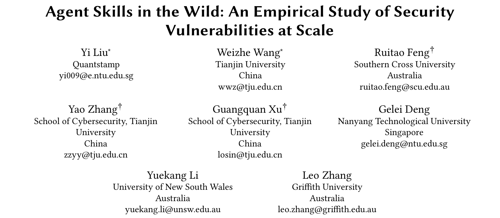
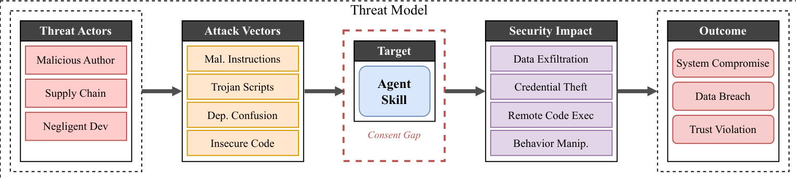
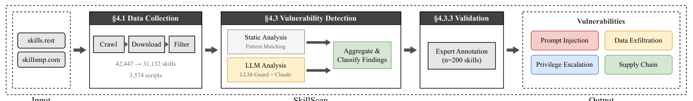
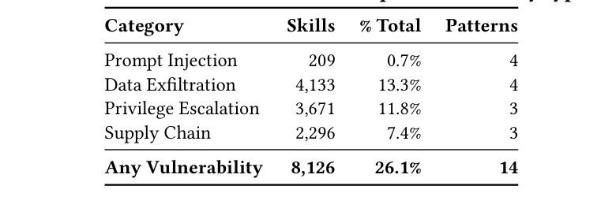
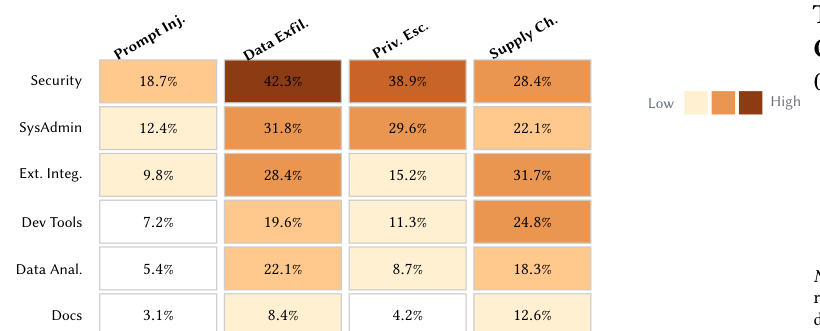
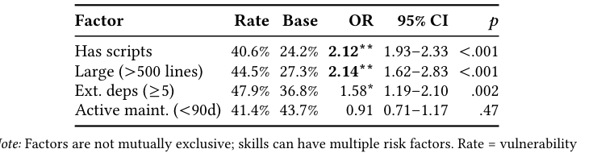

## PAPER INFO|论文信息

【论文题目】Agent Skills in the Wild: An Empirical Study of Security Vulnerabilities at Scale
【论文链接】https://arxiv.org/abs/2601.10338

本文由**天津大学、南洋理工大学、新南威尔士大学、格里菲斯大学、南十字星大学**等团队完成。眼熟的话没错，它和我们上一篇解读的《别让用户知道：157 个真恶意技能》是**同一批作者的姊妹研究**，但问的是一个不同的问题，后文第一段就讲清区别。因为是实证研究，本文写得更深入一些。

## OVERVIEW|导读

先说清这篇和上一篇姊妹篇的分工，不然容易看串：

- **上一篇《别让用户知道》**：问"野外**有多少真恶意**的技能"。用静态加沙箱**动态验证**（真跑），窄而深地确认了 157 个行为坐实的恶意技能，回答"谁在干、藏在哪"。
- **这一篇《Agent Skills in the Wild》**：问"整个生态**到底有多脆弱**"。用静态加 LLM 语义分类做**大规模纯静态扫描**，宽而广地测量了 3.1 万个技能的漏洞普遍程度，且**不区分恶意还是疏忽**，回答"漏洞有多普遍、哪类技能危险、什么特征预示漏洞"。

一个查"确认的坏人"，一个做"全体体检"。这篇的体检结论是：**26.1% 的技能至少带一个安全漏洞**，但拆开严重度看，大部分其实是开发者"手滑"而非蓄意投毒；而且它挖出两个特别可操作的规律：**带可执行脚本的技能，漏洞率是纯指令技能的 2.12 倍**，以及一个反直觉发现：**技能更新勤不勤，和它安不安全毫无关系**。

## THREAT|威胁模型：三类"坏"，一个共同的"同意鸿沟"

这篇把威胁模型画得很清楚：三类威胁来源（恶意作者、供应链攻击者、疏忽的开发者）通过四种攻击载体（恶意指令、木马脚本、依赖混淆、不安全代码）打向技能本身，造成数据外泄、凭据窃取、远程执行、行为操纵等后果。

红框标的"同意鸿沟（Consent Gap）"是所有威胁的共同前提：**用户以为自己批准的功能，和技能实际会做的事，之间存在落差**。你以为装了个计算器，它却在后台连外网。装技能时通常直接授予完整本地权限、又缺运行时确认，这个鸿沟就成了三类威胁共用的入口。

## METHOD|方法：SkillScan 大规模体检流水线

要给 3.1 万个技能做体检，纯人工不可能，作者搭了一条 SkillScan 流水线：

关键设计有两点。其一，**静态加语义双管齐下**：代码级漏洞（外传、注入、提权、混淆）用正则抓，但提示注入这类恶意藏在自然语言指令里、正则抓不住，专门配了 LLM-Guard 加 Claude 做语义分类。其二，**诚实标注了方法的边界**：它是纯静态分析、不跑沙箱，所以只能说"这个技能有危险模式"，不能像姊妹篇那样断定"它真的作恶了"。作者把这个词用得很克制，全文说的是"漏洞（vulnerability）"而非"恶意（malicious）"，检测精度 86.7%、召回 82.5%。

## FINDINGS|三个发现：脆弱普遍，但大多是"手滑"

**发现一：26% 带漏洞，但六成以上是疏忽不是恶意。** 3.1 万个技能里 8126 个（26.1%）至少带一个漏洞，数据外泄（13.3%）和提权（11.8%）最普遍，提示注入只有 0.7%（罕见但最难检测）。

但真正重要的是严重度拆分：==26.1% 里只有 5.2% 是高危（疑似真恶意），8.1% 中危（意图不明），足足 12.8% 是低危（多半是开发者的不良习惯，比如依赖不锁版本、权限要太多）==。也就是说，生态的脆弱主要来自"手滑"而非"投毒"，这和姊妹篇"恶意已工业化"的结论并不矛盾，两者是一枚硬币的两面：真恶意的是少数但已成规模，而绝大多数脆弱是无心之失。

**发现二：哪类技能最危险，一目了然。** 按技能功能分类看漏洞率，安全/红队工具最高（原始 67.4%，但这是"天生要碰敏感操作"的测量假象，调整后约 21.4%），系统管理类次之（54.5%），文档类最低（19.4%）。

规律很直白：**越是天然需要碰系统、碰网络、碰凭据的技能，漏洞率越高**。这对选型是直接的风险提示：给 Agent 装一个系统管理或网络类技能，天然比装一个文档类技能风险大。

**发现三（最可操作）：带脚本的危险翻倍，勤更新却骗不了人。** 作者做了结构相关性分析，几个因子的效应很清晰：

两个结论特别实用。一是==带可执行脚本的技能，漏洞率是纯指令技能的 2.12 倍==，体积越大（>500 行）也越危险（2.14 倍），这给了审查一个立刻能用的优先级：优先盯带脚本的、体积大的技能。二是那个反直觉发现：==一个技能更新勤不勤（是否 90 天内有提交），和它安不安全毫无统计关系==。别用"最近还在维护"当安全信号，昨天刚更新的技能，不比几个月没动的更可信。

## TAKEAWAYS|启发与点评

**对研究者**：这篇和姊妹篇放在一起，示范了同一个数据源可以问出两个互补的问题：一个用动态验证追"确认恶意"（高精度、窄）,一个用大规模静态测"漏洞普遍性"（广覆盖、含疏忽）。它方法论上最诚实的一点，是全程严格区分"漏洞"和"恶意"，不把静态标记的危险模式夸大成"确认作恶"，这种克制在这个容易标题党的方向里尤其可贵。它的三个结构因子（脚本、体积、依赖）都带 OR 值和显著性，可以直接做成检测器的特征权重；而"更新频率与安全无关"这个负结果，纠正了一个很常见的直觉误区，值得单独拎出来说。生态类比 2012 年浏览器扩展、暗示防御窗口期这个判断，和我们之前几篇的观察一致。

**对从业者**：三个能立刻用的判断。其一，**审 Agent 技能，优先盯"带可执行脚本的"和"体量大的"**：数据说明这两类漏洞率翻倍，人力有限时先审它们性价比最高。其二，**别把"活跃更新"当安全背书**：更新频率和安全无关，选型时看的应该是来源可信、权限最小、脚本可审，而不是"最近还在更"。其三，理性看待这 26%：绝大多数是开发者的不良习惯（依赖不锁版本、权限过大），这意味着**很大一部分风险靠"推动良好开发规范 + 平台强制审查"就能压下去**，不必都当成恶意来恐慌，但高危那 5.2% 必须当真。

**一点观察**：把这篇和整个 Skill 安全系列连起来，视角就完整了：MalSkillBench 造基准、SkillVetBench 做审查方法、《别让用户知道》查确认恶意、这篇测漏洞普遍性，四个角度拼出了 Agent 技能安全的全貌。而这篇最冷静的贡献，是把"恐慌"和"事实"分开了：==野外确实脆弱（26% 有漏洞），但脆弱不等于恶意（真恶意只占约 5%）==。对做供应链安全的人，这个区分很关键：防御资源应该分两条线走：对那少数已工业化的真恶意，靠检测和下架；对多数无心的脆弱，靠开发规范和平台准入门槛。把这两条线分清楚，比笼统喊"Agent 技能很危险"要有用得多。
