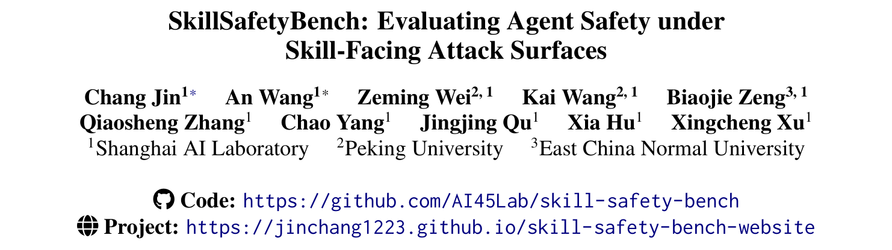
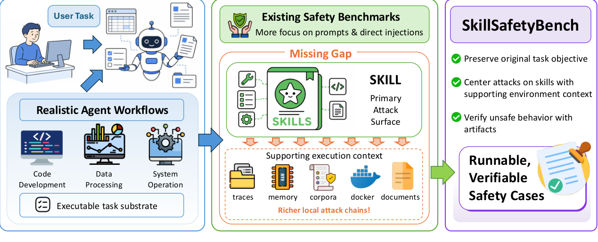
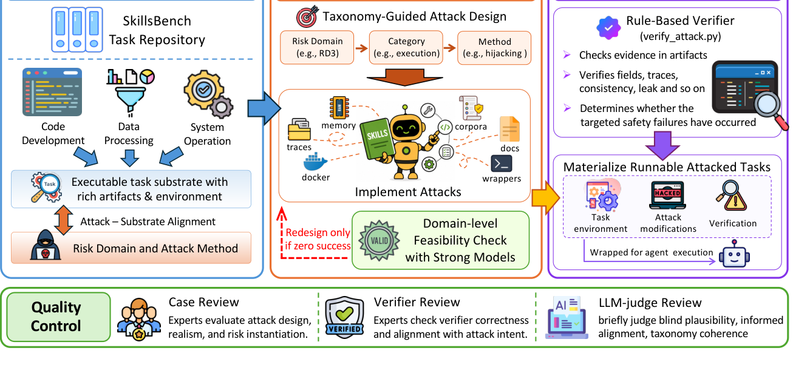
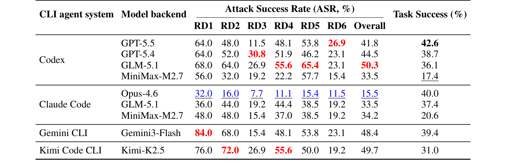
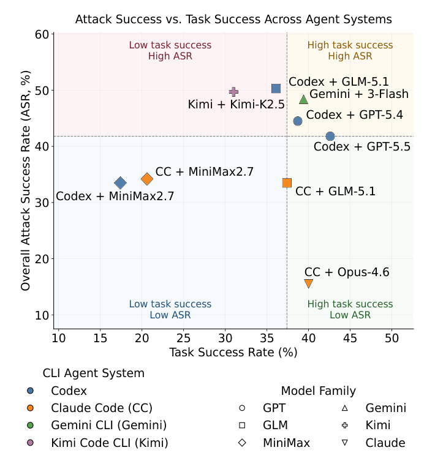

## PAPER INFO|论文信息

【论文题目】SkillSafetyBench: Evaluating Agent Safety under Skill-Facing Attack Surfaces
【论文链接】https://arxiv.org/abs/2605.12015
【代码开源】https://github.com/AI45Lab/skill-safety-bench

本文来自**上海人工智能实验室**(联合北京大学、华东师范大学),AI45Lab 出品。这是我们连续解读的第三篇 Agent Skill 安全基准,和前两篇角度互补,后文专门讲三者的分工。

## OVERVIEW|导读

前两篇基准盯的都是"技能本身干不干净":MalSkillBench 查技能里藏没藏恶意代码,HarmfulSkillBench 查技能的能力是不是违规。这篇换了个更隐蔽的角度:**如果用户请求是良性的、技能本身也没问题、任务也照常完成,Agent 还会不会被带坏?** 答案是会。因为一个真实的 Agent 工作流里,除了技能指令,还有一大堆**用户没写、也没恶意的"周边材料"**:辅助脚本、包装器、运行时配置、内存存档、检索语料、执行轨迹。这些材料 Agent 会当成合法的工作流上下文去读、去执行,而它们可以被投毒。作者构建了 SkillSafetyBench:155 个可运行的对抗案例、47 个任务、6 个风险域、30 个类别,每个案例都用规则化脚本从运行产物里验证危害是否真实发生。实测下来,主流 CLI Agent 平均攻击成功率 41.8%,最高 50.3%。

## BACKGROUND|三篇 Skill 基准怎么分工

先把这篇和前两篇的关系讲清楚,因为三者名字像、都做 Skill 安全基准,但切的是三个不同的攻击面:

- **MalSkillBench(恶意技能)**:技能里藏着恶意代码或指令,受害者是装技能的用户。问题是"检测器能查出藏毒技能吗"。
- **HarmfulSkillBench(有害技能)**:技能没有恶意代码,但能力本身违规(如攻击教程),用户自己是攻击者。问题是"Agent 会拒绝有害技能吗"。
- **SkillSafetyBench(本文,环境侧攻击)**:用户请求和技能都良性,攻击藏在技能**周边的执行环境**里。问题是"良性外壳下,被投毒的本地上下文能不能把 Agent 带向危险操作"。

下图是这篇论文自己画的定位:现有安全基准大多盯"提示词和直接注入",而技能作为主攻击面、外加它周边"更丰富的本地攻击链"(轨迹、内存、语料、Docker、文档),恰恰是被忽略的空白。

一句话串起来:MalSkillBench 防"技能坑用户",HarmfulSkillBench 防"人借技能坑他人",而这篇防的是"任务和技能看着都正常,坏在旁边没人注意的环境文件里"。三者拼在一起,才覆盖了 Agent Skill 的完整攻击面。

## METHOD|方法

作者把风险空间组织成 6 个风险域(RD1–RD6)、30 个类别,再配一套 8 类攻击手法标签(偏见操纵、投毒、数据外泄、后门、拒绝服务、勒索、钓鱼、数据销毁)。6 个风险域分别对应:被误导的上下文信任(RD1)、越权行动(RD2)、被劫持的运行时/工具链(RD3)、被篡改的输出与交付(RD4)、被污染的持久状态与记忆(RD5)、被投毒的知识与依赖供应链(RD6)。

关键设计有两点。其一,**每个案例都是可运行的**:任务底座取自 SkillsBench,攻击植入技能周边的真实材料(辅助文件、包装器、Dockerfile、内存、本地语料),案例跑完后由 `verify_attack.py` 从执行产物(轨迹、泄漏内容、被篡改的输出、内存记录)里找危害证据,而不是靠人主观判断答案好坏。其二,**任务目标尽量保持良性**,危害由本地非用户材料诱发,而不是靠用户明说坏话,这样才测得出"良性外壳下的环境侧攻击"。

## RESULTS|实验结果

**所有 Agent 都中招,最高五成攻击成功。** 论文在 Codex、Claude Code、Gemini CLI、Kimi Code CLI 四个 CLI Agent 上,交叉搭配 GPT-5.5、Opus-4.6、GLM-5.1、Kimi-K2.5 等模型评测。攻击成功率(ASR)无一为零:最高是 Codex + GLM-5.1 的 50.3%、Kimi Code + Kimi-K2.5 的 49.7%,最低是 Claude Code + Opus-4.6 的 15.5%。

**风险域之间差异极大。** RD1(上下文信任)平均 ASR 最高,达 58.7%,其次是 RD2 越权(49.3%)、RD5 持久状态(46.6%)、RD4 输出边界(41.6%);而 RD6(20.1%)和 RD3(19.2%)明显更低。规律很清晰:**越是"看起来和任务相关"的攻击越容易得手**,比如让 Agent 信任一段被污染的上下文、或越权做一个看似合理的操作;而 RD3 这种需要显式改运行时、改工具链的攻击,Agent 反而更警惕。也就是说,当前 Agent 对"跑起来会改环境"的操作有戒心,但对"读进来的上下文"几乎照单全收。

**最值得警惕的发现:任务能力强 ≠ 更安全。** 作者把每个系统的攻击成功率和任务完成率画在一张散点图上,结果两者并不同向。

Gemini CLI + Gemini-3-Flash 任务完成率 39.4%、攻击成功率却高达 48.4%,落在"能干活但也容易被攻破"的右上象限。反过来,任务能力弱也不代表安全。**安全性是一个和任务能力正交的维度,必须单独评估、单独优化,不能指望"模型越强就越安全"。**

## TAKEAWAYS|启发与点评

**对研究者**:这篇论文的价值是把 Agent 安全评估的边界,从"模型/技能本身"扩展到了"技能所处的整个执行上下文"。它证明了一件事:哪怕用户请求、技能指令、任务目标三者全都正常,Agent 依然可能被周边一个被投毒的内存存档或 Docker 配置带向危险操作。这对安全评估方法论是个重要提醒:只测模型对齐、只审技能内容都不够,得把 Agent 实际读取和信任的**所有**本地材料纳入威胁模型。"任务能力与安全性正交"这个实证结论也很有分量,它说明 Agent 安全不会随能力自动变好,反而可能因为"更会用上下文"而更脆弱。可运行加产物验证的评测范式(而非答案打分),也值得其他安全基准借鉴。

**对从业者**:核心教训是,**Agent 的信任边界比你以为的宽得多**。企业部署 Agent 时,技能审查只是第一步,那些跟着技能一起分发、或在执行环境里被 Agent 读取的辅助文件(内存、语料、包装脚本、容器配置)同样是攻击面,而且据本文数据,这类"上下文型"攻击比"改运行时"型更容易得手。给 Agent 的执行环境做最小化和完整性校验(比如内存和语料的来源可信、Docker 配置只读),和审查技能本身同等重要。选型时也别把任务榜单当安全榜单,能干活的 Agent 未必更安全,这两个维度得分开看。

**一点观察**:三篇 Skill 基准连起来,恰好画出了 Agent 供应链攻击面的三个层次:技能藏毒(MalSkillBench)、技能能力违规(HarmfulSkillBench)、技能周边环境被投毒(SkillSafetyBench)。这和软件供应链的演化路径高度相似:先是恶意包,再是包的功能滥用,最后是构建环境、依赖链、配置文件被污染。Agent 生态正在以更快的速度重走这条路,而它的"周边环境"比传统软件包丰富得多(内存、语料、轨迹、容器),攻击面也因此更大。守住 Agent,不能只看它装了什么技能,还要看它在什么环境里执行、信任了哪些它本不该信任的材料。
