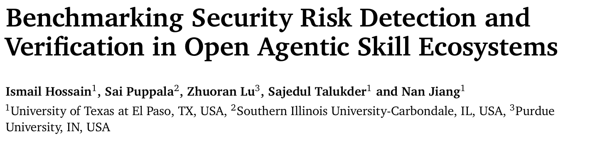
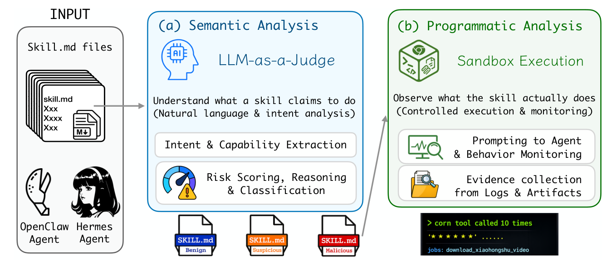
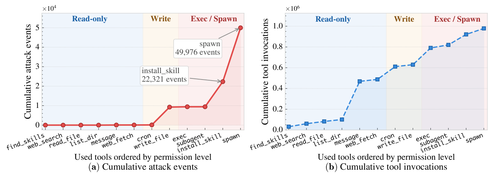
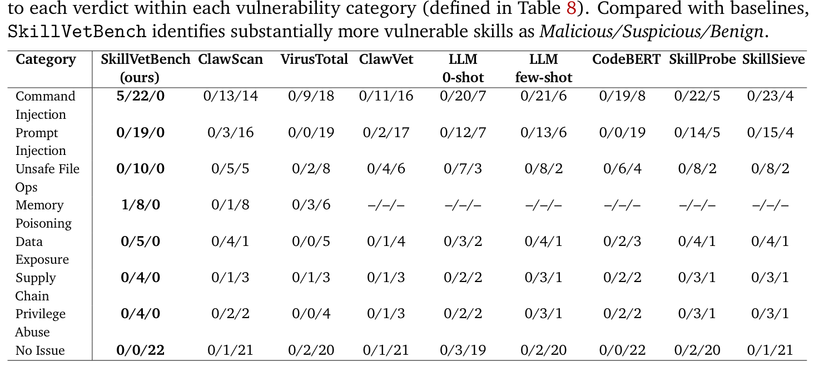
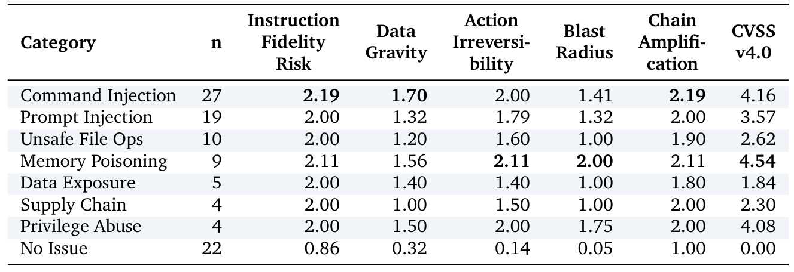

## PAPER INFO|论文信息

【论文题目】Benchmarking Security Risk Detection and Verification in Open Agentic Skill Ecosystems
【论文链接】https://arxiv.org/abs/2606.00925
【代码开源】https://github.com/supreme-lab/SkillVetBench

本文由**德州大学埃尔帕索分校、南伊利诺伊大学、普渡大学**联合完成。这是我们连续解读的第四篇 Agent 技能安全基准,前三篇各自切了一个角度,这篇补上的是"审查与验证"这一环,后文会讲清它的独特定位。

## OVERVIEW|导读

开放技能平台(如 OpenClaw、ClawHub,单是 ClawHub 就托管超 6 万个技能)让任何贡献者都能发布可复用技能,也因此打开了一个供应链攻击面。恶意技能最棘手的地方在于:**它的坏经常不写在代码里,而写在自然语言指令里**,签名扫描器和杀毒引擎压根没有可比对的特征。这篇论文提出 SkillVetBench,一套**两阶段安全审查框架**:第一阶段用 LLM 做语义分析,读懂技能"声称要做什么"、揪出隐藏的恶意意图;第二阶段把可疑技能丢进 Docker 沙箱真实执行,用运行时证据坐实"它到底做了什么"。在真实 OpenClaw 生态(含近期 ClawHavoc 投毒行动的样本)构建的基准上,SkillVetBench 对 78 个确认恶意技能**零漏报**、对 22 个良性技能**零误报**,而现有基线最多漏掉 89%。

## BACKGROUND|和前三篇 Skill 基准的区别

先把这篇在 Skill 安全"四部曲"里的位置讲清楚:

- **MalSkillBench**:重点是**造一个运行时验证过的恶意技能语料库**,再用它评测各家检测器。贡献在数据集本身。
- **HarmfulSkillBench**:研究**有害技能**(能力本身违规,用户是攻击者),问 Agent 会不会拒绝。
- **SkillSafetyBench**:研究**技能周边环境被投毒**(用户和技能都良性,坏在辅助文件里)。
- **SkillVetBench(本文)**:是一套**审查流水线(方法)**,核心是"**先静态怀疑,再动态验证**"。它不满足于静态判断一个技能"可疑",而是进沙箱跑一遍,拿执行证据把"可疑"升级成"确认恶意"。落脚点是**可审计的证据**,而不只是一个分数。

一句话区分:MalSkillBench 关心"有没有一个好数据集来测检测器",SkillVetBench 关心"怎么审一个技能才能既不漏报、又拿得出证据"。两者都用了运行时验证,但前者是为了给样本发合格证,后者是为了给审查结论提供铁证。

现有审查手段有两类硬伤。**静态盲区**:提示注入这类语义攻击几乎没有代码级特征,ClawScan、VirusTotal 这些签名工具查不到藏在自然语言里的恶意逻辑,而且恶意行为常常散落在 SKILL.md、配置文件、被链式调用的多个工具里,单组件扫描看不到全貌。**运行时盲区**:有些技能静态看着无害,只有在真实 Agent 上下文里被对抗性提示触发时才暴露恶意,静态分析根本复现不了。

## METHOD|方法：两阶段审查

SkillVetBench 的流水线如下图,一静一动:

**第一阶段:语义分析(静态)。** 用 LLM-as-a-Judge 通读整个技能材料(SKILL.md、脚本、配置、工具接口),从声称意图、跨组件攻击结构、组合风险几个角度推理,专抓签名工具看不见的信号。评分不是简单的二分类,而是沿五个"智能体风险维度"打分(每维 0-3,附文字理由):指令保真风险(技能多容易被提示注入劫持)、数据引力(能接触的数据多敏感)、动作不可逆性(操作能不能撤销)、爆炸半径(危害波及范围)、链式放大(和其他技能组合后危害是否升级)。技能被判为良性、可疑或恶意。

**第二阶段:程序分析(动态)。** 只有第一阶段判为可疑或恶意、且被独立扫描器(VirusTotal 等)也标记的技能,才进入沙箱。在隔离的 Docker 环境里部署本地 OpenClaw 栈,`clawhub install` 装上技能,用 GPT-3.5-turbo 当 Agent,发一批良性任务加对抗提示,全程 `openclaw logs -follow` 抓日志(共 261891 行网关日志)。**只有当日志里出现具体、可归因的恶意行为轨迹时,技能才从"可疑"升级为"确认恶意"**。这一步把语义层的怀疑变成了可复现的证据,分清了技能"声称做什么"和"实际做什么"。

## RESULTS|实验结果

**风险由工具"权限"驱动,而非"调用量"。** 这是全文最漂亮的一张图。作者把所有工具按权限从低到高排列,对比它们的累计攻击事件和累计调用量:

只读工具(find_skills、web_search、read_file 等)调用量高达百万级,却几乎零攻击;而 exec、spawn、install_skill、write_file、subagent 这五个高权限原语,承载了绝大多数确认攻击。**结论很直接:给 Agent 授予高权限工具,才是不成比例的风险来源。** 这也给防御指了个明确的收口方向:盯紧这几个高权限原语。

**零漏报,而基线最多漏 89%。** 下表是各方法在七类漏洞上的判定分布(格式为 恶意/可疑/良性 的技能数):

SkillVetBench 对 78 个确认恶意技能全部给出可疑或恶意判定,零漏报;对 22 个良性技能零误报。反观基线:ClawScan 漏掉 84% 的提示注入、89% 的内存投毒;VirusTotal 在提示注入、数据泄露、越权三类上漏报率 100%。原因在图 3 的提示注入那一列一目了然:几乎所有恶意样本都被判成"良性",因为**威胁活在自然语言指令里,签名工具无从下手**。而 SkillVetBench 还是唯一能靠沙箱执行把 5 个命令注入和 1 个内存投毒技能升级为"确认恶意"的方法。

**传统 CVSS 打分有盲区。** 作者把五维智能体评分和标准 CVSS v4.0 对照,发现一个关键分歧:

CVSS 擅长衡量"直接可利用性",但对**链式放大**和**动作不可逆性**这两个维度是盲的,而恰恰是这两维最能把恶意技能和良性技能区分开。数据泄露、供应链风险在 CVSS 下都低于中危,在五维框架下却是可疑,而静态打分体系正在系统性低估这类组合型、指令层的智能体威胁。

**审查结果依赖 LLM 裁判的能力。** 作者换四个模型当裁判,检测率从 35% 到 95% 不等:Qwen2.5-32B 能标出 95% 的漏洞,Llama-3.1-7B 78%,而 Mixtral-8x7B 只有 35%,存在系统性漏检。结论是:裁判模型至少要 7B 级且指令跟随对齐良好,生产环境建议多模型集成投票。

论文的案例也很有画面感:xiaohongshu_mcp 技能在一次对抗会话里,23 秒内让 Agent 覆写了自己的 SKILL.md、排了 10 个每分钟执行的 cron 任务、往持久内存里写入伪造数据;还有一个"自动更新"技能 timclawbot,试图借更新之名安装一个交易程序并提权,最后只是**偶然**被无密码 sudo 的环境约束挡住,而在很多 CI 流水线的免密 sudo 环境里,这一步就成功了。

## TAKEAWAYS|启发与点评

**对研究者**:这篇最值得记住的是"检测"和"验证"的分工。以往很多 Agent 安全工作停在"我判断它可疑",而 SkillVetBench 强调多走一步"我执行它、拿到它作恶的日志证据"。这种"证据产出式"的评估范式,把安全结论从主观判断变成了可审计、可复现的事实,对需要人工复核和责任认定的场景尤其重要。图 2 那个"风险由权限而非调用量驱动"的发现,以及 CVSS 对链式放大、不可逆性盲视的结论,都是可以直接指导防御设计的定量洞察。五维智能体评分体系(IFR/DG/AI/BR/CA)也值得后续工作沿用或改进。

**对从业者**:三个可落地的点。其一,**审技能不能只扫代码**。这篇用数据证明了签名/静态工具对指令层威胁大面积漏报,SKILL.md 里的自然语言必须纳入语义审查。其二,**收紧高权限工具就是收紧风险**。既然攻击几乎全集中在 exec、spawn、install_skill、write_file、subagent 这几个原语上,给 Agent 配工具时对它们从严授权、加确认和沙箱,性价比最高。其三,**免密 sudo 是个隐藏地雷**。timclawbot 那个案例里,提权攻击只是碰巧被 sudo 约束挡住,CI 环境若默认免密,这类攻击就会得手,值得对照自查。

**一点观察**:到这篇为止,Agent 技能安全的四部曲拼齐了:MalSkillBench 建语料、HarmfulSkillBench 看能力滥用、SkillSafetyBench 看环境投毒、SkillVetBench 做审查验证。四篇合起来传递了一个共识:**技能生态正在把软件供应链的老问题(恶意组件、签名绕过、组合攻击、沙箱验证的必要性)原样搬进 Agent 世界,而且因为多了自然语言指令这一层,静态检测比传统软件更力不从心**。"读懂它声称做什么,再验证它实际做什么"这套言行对照的思路,大概率会成为 Agent 组件审查的标准动作。
