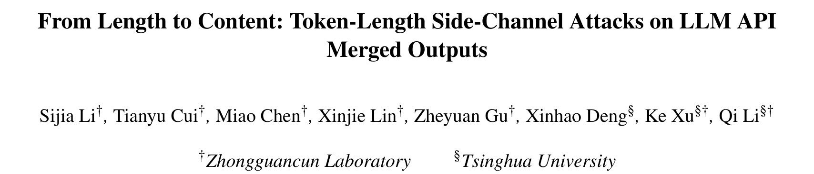
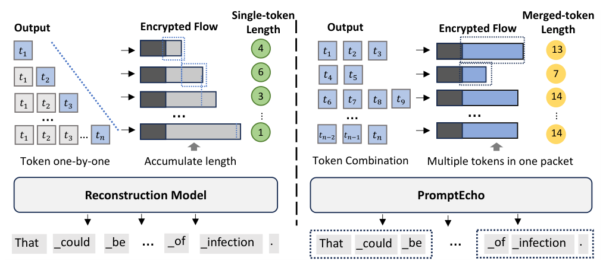
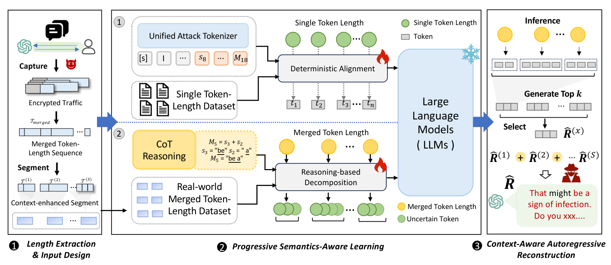
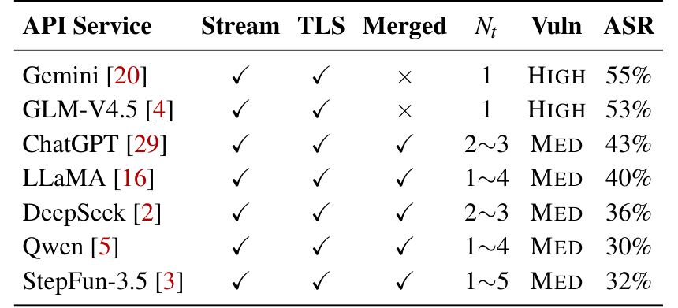

## PAPER INFO|论文信息

【论文题目】From Length to Content: Token-Length Side-Channel Attacks on LLM API Merged Outputs
【论文链接】https://www.usenix.org/conference/usenixsecurity26/presentation/li-sijia
【作者团队】中关村实验室、清华大学

这是一篇发表在 **USENIX Security 2026** 的攻击方法论文（Artifact Evaluated），来自清华与中关村实验室。它盯住一个几乎所有人都以为已经安全的地方，你和大模型的加密对话，然后证明它其实还在漏。因为是方法类论文，本文重点讲清这个攻击的巧思和为什么有效。

## OVERVIEW|导读

你用 API 调 ChatGPT、DeepSeek，流量都走 TLS 加密，中间人看不到你聊了什么。但有一个东西加密盖不住，**每个数据包有多大**。早期的大模型 API 是"逐 token 流式返回"，一个 token 一个包，于是每个包的大小就等于那个 token 的字符长度，攻击者把这串长度序列拿去还原，就能重建你看到的文本。这是已知的响应长度侧信道。

厂商的应对是**合并 token 发送**：把好几个 token 打包进同一个网络包，这样单个 token 的边界就被抹掉了，传统的逐 token 攻击自然失效。看起来漏堵上了。但这篇论文发现，==合并 token 并没有堵住泄露，只是把它模糊了==：包的大小现在等于这一组 token 的**总字符数**，这个"合并长度"依然携带着结构信息。他们据此造出攻击 PromptEcho，在真实的 GPT-4o、DeepSeek-V3 流量上，**42.5% 的会话能被猜中话题，25.5% 的回复能重建到语义高度相似**。

## BLINDSPOT|痛点：从一串数字里，反推出你说过的话

先看这张图，左边是老办法、右边是新攻击，一对比就懂难在哪：

难点在于这是一个**双重歧义**的还原问题。攻击者看到的是一串纯数字，比如"13、7、14"，但他既不知道每个数字里到底藏了几个 token（一个 13 可以是 4+9、也可以是 6+7、还可以是 5+4+4），也不知道每一段 token 具体是什么词。也就是说，==你要从一串只剩字符个数的数字里，把一整句话原样反推出来，而连"哪几个字凑成一个数字"这个边界都是未知的==。单看信息论，这几乎是不可能的，一个长度序列能对应的句子有天文数字种。

## INSIGHT|核心洞察：加密抹掉了字符，抹不掉语言的结构

> PromptEcho 的核心洞察是：合并 token 的包长度虽然把内容抹成了一串数字，但语言本身有极强的约束。一个长度序列到底对应哪句话，看似有无数种可能，可一旦叠加上语法、标点和上下文连贯性，绝大多数组合瞬间就被排除了。于是攻击被重构成一个"受限序列恢复"问题：用大模型的语言学先验去补全那串数字最可能对应的文本，再用思维链把每个合并长度拆回它可能的 token 组合（比如长度 5 拆成 "be" + "a"）。加密抹掉了字符，却抹不掉语言的结构。

这个视角很关键：它不去硬解那个天文数字的组合空间，而是让一个大模型带着"人话应该长什么样"的先验，在合法的语言里挑出最可能的那句。数字提供硬约束（总长度必须对上），语言先验提供软约束（得是通顺的话），两者一夹，答案就收敛了。

## METHOD|方法：PromptEcho 三步，把不可能变成可能

三步里每一步都有讲究。**第一步，切段降歧义**：直接还原一整条长序列，歧义会累积到失控，所以先用标点、长度突变这些线索把序列切成结构连贯的小段，把歧义局部化。**第二步，也是最核心的一步，是"渐进式"学习**：作者没有一上来就啃最难的合并数据，而是先在"单 token"数据上训练，因为那里长度和 token 一一对应、没有歧义，模型能干净地学到"某个字符长度最可能是哪些词"的先验；然后再迁移到有歧义的合并数据上，用思维链显式地把一个合并长度拆解成几段 token 长度（M5 = s3 + s2 → "be" + "a"），复用前一步学到的先验来挑语义上说得通的组合。**第三步，带着上文重建**：逐段生成时把前一段的长度信息也作为上下文，让整句读起来连贯。

这里还藏着一个很妙的设计细节：模型怎么"理解"长度这个数字？作者没有直接把数字喂进去，而是为每种长度造了一个**专门的符号 token**，而且它的向量是随机初始化的、不和数字本身的数值绑定。原因很实在，如果直接用数字，大模型会把"长度 10"和"数字 10 这个概念"混淆，反而被自己对数字的语义带偏。把长度变成一个纯粹的符号，模型才能干净地学"这个符号约束了字符数"这件事。

## RESULTS|实验：谁在泄、泄多少、泄的是什么

先看哪些服务在漏：

这张表说明两件事。其一，**还在逐 token 发送的服务（Gemini、GLM）风险最高，一半以上的会话能被还原**。其二，也是更重要的，合并 token 确实降低了风险，但远没有消除，ChatGPT 43%、DeepSeek 36%，攻击对合并服务依然有效。

更值得琢磨的是**泄露的深浅取决于内容类型**。作者按提问类型拆开看：日常问答类的 ASR 最高（41.2%），因为这类回答用词常规、句式规整、语义集中，最贴合模型的语言学先验；而代码生成（11.5%）、数学推理（10.9%）最难还原，因为它们受严格的语法或逻辑约束，还原时一个 token 错了，整段就语法崩了、逻辑不成立。换句话说，**你越是用大白话聊家常、聊隐私，越容易被还原；越是结构化的硬核内容，反而越安全**。

最后，即便还原不完美，隐私也照样泄。作者给的真实案例很说明问题：有的能逐字还原出"这里有一些 PTSD（创伤后应激障碍）互助资源"，直接暴露求助者的心理健康状况；有的把措辞改写了，但"免疫疗法""癌细胞"这些关键实体准确还原，治疗话题一览无余；还有一例把"温哥华"错还原成了"澳大利亚"，实体是错的，可"原住民社区与政治活动"这个敏感话题依然被推断了出来。这引出一个关键认知：==对攻击者来说，逐字还原并不是必需的，只要还原出话题和意图，隐私就已经泄了==。

## TAKEAWAYS|启发与点评

**对研究者**：这篇最漂亮的地方，是它把一个看似信息论上不可能的问题（从纯长度数字还原文本），靠"大模型语言学先验 + 思维链分解"变成了可行。它给出的范式很有迁移价值：当观测信号本身高度歧义、但底层数据有强结构（自然语言、代码、协议报文）时，与其硬解组合空间，不如让一个懂这门"语言"的模型带着先验去收敛答案。其中"先在无歧义的简单数据上学先验、再迁移到有歧义的真实数据"的渐进式训练，以及"把数字变成符号 token 以免污染语义"的细节，都是可复用的招法。而它更深一层的警示是：**在大模型时代，元数据（哪怕只是包长度）配上一个够强的语言模型，就能被放大成内容级的泄露**，加密保护的是字节，但保护不了结构。

**对从业者**：两个能立刻用的判断。其一，**别以为 TLS 加密就等于对话内容安全**：只要你的服务是流式返回，包长度这个元数据就在漏，尤其对医疗、心理、法律这类高敏感场景，要重视传输层的侧信道。其二，防御是有成本的权衡：论文分析了填充（padding）等手段，粗暴地把每个包填到最大长度会带来约 3.2 倍的带宽开销，而动态填充能压到 1.4 倍但仍留残余泄露。值得一提的是，这类研究正在推动真实防御落地，论文提到 OpenAI 已经在其 Responses API 里上线了默认开启的混淆参数（include_obfuscation）来动态对抗这种侧信道，这是一次教科书式的"负责任披露推动修复"。

**一点观察**：把这篇放进我们持续关注的供应链与 LLM 安全脉络里看，它戳中的是一个越来越普遍的盲区，我们习惯把"加密"当成安全的终点，可在大模型这里，==真正泄密的常常不是被加密的内容，而是没被保护的元数据==。软件供应链安全里我们反复强调"看不见的地方才是风险"，而这篇给出的正是一个看不见的信道：你以为聊天记录锁在加密里，其实一串包长度加上一个大模型，就把你聊过的话大致复述了出来。当模型越来越强，能从残缺信号里脑补出的东西也越来越多，"哪些元数据需要被当成敏感数据来保护"，会是这条战线上一个绕不开的新问题。
