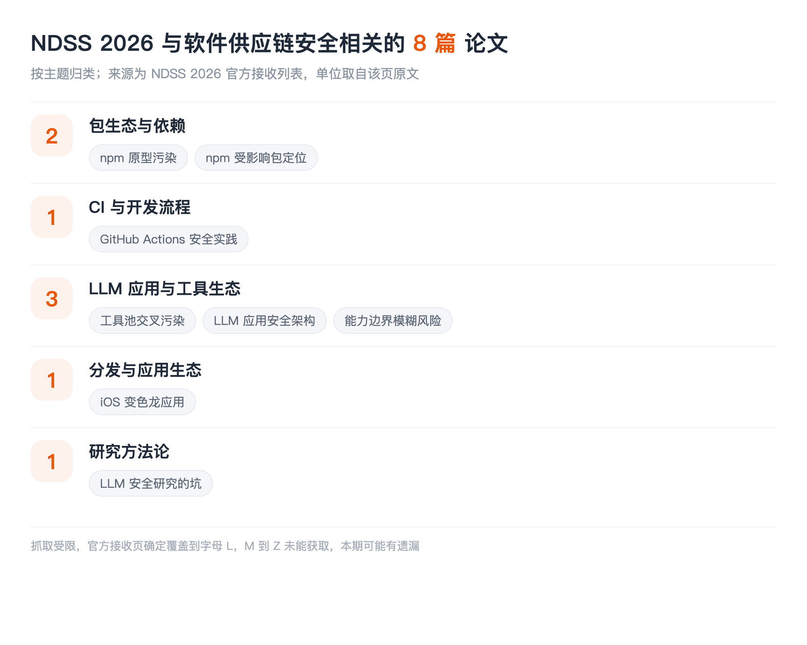

## LIST INFO|本期说明

【会议】NDSS 2026，网络与分布式系统安全研讨会，2026 年 2 月 23 至 27 日，美国圣迭戈
【来源】NDSS 2026 官方接收论文列表，全会共接收 265 篇
【口径】只收与**软件供应链安全**直接相关的：包与依赖、CI 与开发流程、组件与工具生态、分发。固件漏洞挖掘、反编译、模糊测试这些不收

先说这一期最大的局限：**抓取工具对 NDSS 那个长列表有长度上限，内容到字母 L 就被截断了**，反复试过也绕不过去。==所以这一期确定覆盖 A 到 L，M 之后的部分没能获取，很可能有遗漏==。这个坑和 ASE 那期一样，索性都写在明面上。另外多数论文全文没读，介绍限制在标题能支撑的范围内，单位只在官方页给出时标注。

## PKG|包生态与依赖

### Bullseye: Detecting Prototype Pollution in NPM Packages with Proof of Concept Exploits
康考迪亚大学
检测 **npm 包里的原型污染**，而且要给出可执行的 PoC。原型污染是 JavaScript 生态特有的一类问题：污染一个共享的原型对象，影响面会顺着依赖树扩散到整个应用。带 PoC 这一点很关键，它把"疑似有问题"变成了"确实能打"，这正是大量供应链告警最缺的一步。

### From Noise to Signal: Precisely Identify Affected Packages of Known Vulnerabilities in npm Ecosystem
奇安信技术研究院、清华大学
精确定位 **npm 生态里某个已知漏洞到底影响哪些包**。标题里的"从噪声到信号"点明了痛点：漏洞情报给的影响范围往往过宽或过窄，下游拿到的是一堆真假混杂的告警。这和 ASE 那期"漏洞利用的跨版本适用性"是同一个问题的两端，一个从利用侧问、一个从依赖侧问。

## CI|CI 与开发流程

### Action Required: A Mixed-Methods Study of Security Practices in GitHub Actions
混合方法研究 **GitHub Actions 的安全实践**。CI 是供应链上权限最高、审计最少的一段：它拿着发布凭据、能改产物、还经常直接引用第三方 action。而第三方 action 本身就是可复用组件，引用一个 action 和引用一个依赖包在风险结构上没有区别，却几乎没人给它做来源审计。

## AGENTS|LLM 应用与工具生态

### Les Dissonances: Cross-Tool Harvesting and Polluting in Pool-of-Tools Empowered LLM Agents
伊利诺伊大学厄巴纳香槟分校
智能体挂着一池子工具时的**跨工具窃取与污染**。这篇的位置很有意思：单个工具可能都是良性的，风险出在它们被放进同一个池子共享上下文之后，一个工具能读到、甚至能污染另一个工具的数据。==这是典型的组合风险，审计单个组件永远发现不了==。本账号解读过 ColluSkill 那篇共谋技能链，讲的是同一类结构。

### ACE: A Security Architecture for LLM-Integrated App Systems
东北大学
给 **LLM 集成的应用系统**设计安全架构。当应用把模型、插件、外部数据源接在一起，边界该划在哪、谁对谁授权，目前基本靠各家自己拍脑袋。这类工作是在补地基。

### Beyond Jailbreak: Unveiling Risks in LLM Applications Arising from Blurred Capability Boundaries
讲 LLM 应用里**能力边界模糊**带来的风险，标题明确把自己和越狱区分开。这个切入点值得注意：越狱讲的是让模型说不该说的话，而能力边界模糊讲的是应用把不该给的能力给了出去，后者在有工具调用的场景里后果严重得多。

## DIST|分发与应用生态

### CHAMELEOSCAN: Demystifying and Detecting iOS Chameleon Apps via LLM-Powered UI Exploration
用大模型驱动的 UI 探索来检测 **iOS 变色龙应用**。这类应用上架时是一副面孔，过审之后再变成另一副，本质上是攻击者在应用商店这个分发环节上做的时间差。和恶意包在仓库里先发良性版本、后续版本再投毒是完全同构的手法。

## METHOD|研究方法论

### Chasing Shadows: Pitfalls in LLM Security Research
CISPA 亥姆霍兹信息安全中心、马普安全与隐私研究所、卡尔斯鲁厄理工、鲁尔大学
系统梳理 LLM 安全研究里的**方法论陷阱**。**本账号已解读过**，72 篇顶会论文篇篇踩坑、只有 15.7% 被作者自己察觉。放进这一期是因为供应链方向正在大量引入大模型做检测和分析，这些坑同样适用。

## TAKEAWAYS|一点观察

**npm 这条老线还在被硬啃，而且啃的是硬骨头。** 两篇 npm 论文都不是"我们又做了个检测器"，一篇要给原型污染出可执行 PoC，一篇要把漏洞影响范围从噪声收敛成信号。这两件事的共同点是**都在提高结论的可执行性**：不是告诉你"可能有问题"，而是告诉你"确实能打"或者"确实影响你这个版本"。包生态研究做到今天，产出精确结论比产出更多告警更有价值。

**工具池污染是这一期最新的一类。** 智能体挂一池子工具已经是标准做法，而这篇说明风险可以从工具之间的组合里长出来，单个工具全是良性的也没用。==这对现有的组件审计范式是个直接挑战：我们所有的扫描、签名、来源验证都是逐个制品做的，没有一样能表达"这两个组件放一起会出事"==。

**CI 是被严重低估的一段。** GitHub Actions 那篇提醒了一件事：CI 流水线握着发布权限，还大量引用第三方 action，它在结构上就是一条依赖链，但几乎没有人像审计 npm 依赖那样审计自己的 action 引用。这是目前性价比最高、却最少被认真做的一块。

**最后说一句这一期的缺陷。** 只覆盖到字母 L 是硬伤，M 之后的部分我没拿到。如果你手上有完整名单、发现遗漏了重要的，欢迎在留言区补，我会在后续更新里补进去。做盘点最怕的不是漏，是漏了还装作全了。
