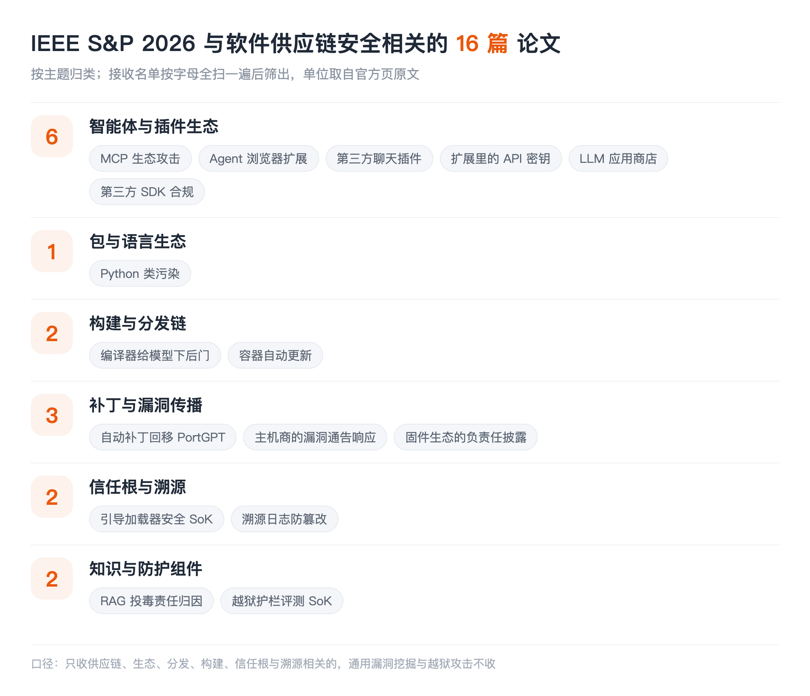

## LIST INFO|本期说明

【会议】IEEE S&P 2026，第 47 届 IEEE 安全与隐私研讨会，2026 年 5 月，美国旧金山
【来源】S&P 2026 官方接收论文列表，含多个投稿周期
【口径】只收与**软件供应链安全**直接相关的：包与组件生态、分发与构建链、补丁传播、信任根。通用漏洞挖掘、模糊测试、越狱攻击这些即便是安全顶会的主流也不收

和 ASE 那期一样，先说清楚边界：**多数论文全文还没读**，下面的介绍严格限制在标题和作者团队能支撑的范围内，不替作者把结论说满；本账号已经读过全文的会特别标出来。单位取自官方接收页的原文。

这一期把接收名单按字母整个扫了一遍，最值得先说的不是某一篇，而是**名单的形状**。ASE 那边包生态、依赖、SBOM 是主力，而在 S&P 这边，==传统包生态几乎空场，供应链相关的论文集中砸在了 MCP、浏览器扩展、聊天插件、LLM 应用商店这些新的组件生态上==。同一年、同一个大主题，两个会议的重心完全不同。

## AGENTS|智能体与插件生态

### Parasites in the Toolchain: A Large-Scale Analysis of Attacks on the MCP Ecosystem
Shuli Zhao, Qinsheng Hou, Zihan Zhan, Yanhao Wang, Yuchong Xie, Yu Guo, Libo Chen, Shenghong Li, Zhi Xue | Shanghai Jiao Tong University, CHAITIN TECHNOLOGY, Hong Kong University of Science and Technology
对 **MCP 生态**攻击面的大规模分析。MCP 现在是智能体接工具的事实标准，一个 MCP server 就是一个第三方组件，装进来就获得了工具调用权限。标题里的"寄生虫"点得很准：这条工具链上的组件既能被投毒，也能反过来吃掉调用方。这大概是这批里最正面命中供应链定义的一篇。

### Site Isolation is Dead: How Site Isolation is Broken in Agentic Browsers and Extensions
Suyoung Lee, Seongho Keum, Changoo Lee, Dongwon Shin, Sanghyun Hong, Byoungyoung Lee, Sooel Son | KAIST, Oregon State University, Seoul National University
站点隔离是浏览器安全的基石假设，而这篇说它在**智能体浏览器和扩展**里被打破了。原因不难想象：智能体天然要跨站点读取和操作，扩展又长期拥有跨站权限，两者叠在一起，浏览器几十年建起来的边界就被从内部绕过了。

### When AI Meets the Web: Prompt Injection Risks in Third-Party AI Chatbot Plugins
Yigitcan Kaya, Anton Landerer, Stijn Pletinckx, Michelle Zimmermann, Christopher Kruegel, Giovanni Vigna | University of California, Santa Barbara
**第三方聊天机器人插件**里的提示注入风险。插件是典型的供应链结构：用户信任的是聊天机器人，实际执行的是第三方代码，而注入内容可以从插件拉取的网页里进来。信任传递了，但审计没有跟着传递。

### KeyChaser: Unveiling API Keys in Browser Extensions
Shijin Chen, Willy Susilo, Yudi Zhang, Fuchun Guo | University of Wollongong
挖**浏览器扩展里硬编码的 API 密钥**。扩展是打包分发的制品，密钥一旦随包发出去就等于公开，而且撤销和轮换的成本极高。这和本账号解读过的智能体技能凭据泄露是同一类问题，只是载体从 Skill 换成了扩展。

### LLMThief: Evaluating Configuration Leaking Risks in Commercial LLM App Stores
Pinji Chen, Jinlong Jiang, Jianjun Chen, Feiran Qin, Minghao Zhang, Jiahe Zhang, Haixin Duan, Kaiwen Shen, Hui Jiang | Tsinghua University, Wuhan University, Clouditera, Baidu
商业 **LLM 应用商店**里的配置泄露风险。应用商店是分发环节，上架的每个应用都带着自己的系统提示词和配置，这些东西既是开发者的资产，也是攻击者摸清应用行为的入口。本账号解读过 LLM App Store 的安全实测，这篇是配置泄露这一面的延伸。

### Navigating Developers' Quagmire: LLM-Enabled Privacy Compliance Analysis for SDK Integrations
Zhaojie Hu, Xueqiang Wang | University of Central Florida
用大模型分析**第三方 SDK 集成的隐私合规**。SDK 是移动端最典型的供应链组件：应用开发者集成它、承担它的合规责任，却基本看不到它到底收了什么数据。把合规分析自动化，等于给这条链补上一个开发者能自己跑的检查点。

## PKG|包与语言生态

### The First Large-Scale Systematic Study of Python Class Pollution Vulnerability
Zhengyu Liu, Jiacheng Zhong, Jianjia Yu, Muxi Lyu, Zifeng Kang, Yinzhi Cao | Johns Hopkins University
第一次大规模系统研究 **Python 类污染漏洞**。它和 JavaScript 的原型污染是同构的：污染一个被共享的类属性，影响会顺着依赖树扩散到整个应用。NDSS 那期有一篇做 npm 原型污染，两篇对着读能看清这类"语言机制级"漏洞在不同生态的表现。

## BUILD|构建与分发链

### Your Compiler is Backdooring Your Model: Understanding and Exploiting Compilation Inconsistency Vulnerabilities in Deep Learning Compilers
Simin Chen, Jinjun Peng, Yixin He, Junfeng Yang, Baishakhi Ray | Columbia University, University of Southern California
**深度学习编译器**的编译不一致性可以被用来给模型下后门。这个位置很要命：模型权重没被动，训练数据没被动，问题出在把模型编译成可执行形态的那一步。传统供应链防护盯的是源码和依赖，编译器这一环长期被当成可信基础设施，**而这篇说明编译器本身就能成为投毒点**。

### Death Is Not the End: A Longitudinal Study on the Impact of Automatic Updates on Container Vulnerability Lifespans
Simge Tekin, Octavian Suciu, Sungsu Kwag, Yonghwi Kwon, Tudor Dumitras | University of Maryland, College Park, Google
纵向研究**自动更新对容器镜像漏洞存活期**的影响。容器镜像是今天最主要的分发单元之一，标题里"死亡不是终点"指的应该是漏洞并不会因为上游发布修复就消失，它在镜像里的实际存活取决于更新有没有真的滚下去。这和 ASE 那批的"修复传不到底"是同一个母题，只是换到了镜像层。

## PATCH|补丁与漏洞传播

### PORTGPT: Towards Automated Backporting Using Large Language Models
Zhaoyang Li, Zheng Yu, Jingyi Song, Meng Xu, Yuxuan Luo, Dongliang Mu | Huazhong University of Science and Technology, Northwestern University, University of Waterloo, Canonical Ltd.
用大模型做**自动补丁回移**。这篇值得单独说一句：本账号解读过 ASE 2026 那篇回移基准，==它评测的五个工具里就有 PortGPT，而且在复现集上是表现最好的两个之一（80.5%）==。一个会议提出工具、另一个会议建基准把它拉去考，两篇放在一起看，比单读任何一篇都清楚。

### Behind the Curtain: How Shared Hosting Providers Respond to Vulnerability Notifications
Giada Stivala, Rafael Mrowczynski, Maria Hellenthal, Giancarlo Pellegrino | CISPA Helmholtz Center for Information Security
测**共享主机服务商收到漏洞通告后到底怎么响应**。漏洞通告是修复传播链上极关键又极少被量化的一环：研究者发了通告，中间商收不收、转不转、修不修，决定了这个洞最终会不会落地修复。

### Responsible Disclosure is a Two-Way Street: Empirically Measuring the Responsible Disclosure Contract in the Firmware Ecosystem
Hui Jun Tay, Souradip Nath, Arvind S Raj, Abhay Bhat, Ishan Bansal, Audrey Dutcher, Moritz Schloegel, Adam Doupé, Tiffany Bao, Yan Shoshitaishvili, Ruoyu Wang | Arizona State University
实证测量**固件生态里的负责任披露**。标题说披露是"双向的"，意思很直白：研究者遵守了披露约定，厂商未必履行自己那一半。固件生态的下游极长且更新极慢，这条链上的约定是否被兑现，直接决定了漏洞的实际寿命。

## TRUST|信任根与溯源

### SoK: All You Ever Wanted to Know About Bootloader Security But Were Afraid to Ask
Connor Glosner, Aravind Machiry | Purdue University
**引导加载器安全**的系统化梳理。引导链是整台设备信任的起点，上面所有的签名校验、度量启动、可信执行都建立在它之上。这一层被攻破，上面所有的供应链防护都是空的。

### Sealing the Window: Efficient Tamper Protection for Provenance Logs
Sagar Mishra, R Sekar | Stony Brook University
给**溯源日志**做高效的防篡改保护。溯源日志是事后追责的唯一依据，而攻击者拿到权限后第一件事往往就是改日志。日志本身不可信，上面建的所有溯源结论都不成立，这一层和引导加载器一样属于"必须先守住"的地基。

## GUARD|知识与防护组件

### Who Taught the Lie? Responsibility Attribution for Poisoned Knowledge in Retrieval-Augmented Generation
Baolei Zhang, Haoran Xin, Yuxi Chen, Zhuqing Liu, Biao Yi, Tong Li, Lihai Nie, Zheli Liu, Minghong Fang | Nankai University, Guilin Institute of Information Technology, University of North Texas, University of Louisville
RAG 知识库被投毒之后，**追责到底该落到哪一条知识上**。这篇的切入角度和大多数投毒研究不同：不是检测有没有被投毒，而是投毒发生后定位是哪条来源导致了错误输出。检索库就是模型的外部依赖，出了事要能溯源到具体那条，这和包生态里定位是哪个依赖引入了漏洞是同一件事。

### SoK: Evaluating Jailbreak Guardrails for Large Language Models
Xunguang Wang, Zhenlan Ji, Wenxuan Wang, Zongjie Li, Daoyuan Wu, Shuai Wang | The Hong Kong University of Science and Technology, Renmin University of China, Lingnan University
45 项越狱护栏工作按六个维度归类，再把其中 13 个拉到同一张考卷上做安全、效率、可用性三目标评测。**本账号已解读过**，结论是面对自适应多轮攻击，绝大多数护栏的成功率仍在九成以上。放进这一期是因为护栏本身也已经变成一类可下载、可组合的组件：选一个护栏和选一个依赖包在操作上没有区别，但它对哪类攻击失效这件事并不随组件附带。

## TAKEAWAYS|一点观察

**传统包生态在 S&P 这边几乎空场。** npm、PyPI、Maven 这些词在整份名单里基本找不到，而在 ASE 那边它们是主力。这不代表问题解决了，更可能是分工：软工会议把包生态当作工程治理问题继续深耕，安全会议则整体转向了**新出现、边界还没定型的组件生态**。想跟踪供应链安全的全貌，只盯一个会议会严重失真。

**新的组件生态一次性冒出来六篇。** MCP server、浏览器扩展、聊天插件、LLM 应用商店、第三方 SDK，这几类东西的共同点是：都在最近两三年成为可分发、可安装、可组合的第三方组件，==而它们全都没有包生态那套已经磨了十几年的治理设施：没有统一的注册表审核、没有成熟的签名与来源验证、没有依赖关系的可见性==。攻击者迁移的速度，比治理设施建设的速度快得多。

**信任根在往更下层沉。** 引导加载器、深度学习编译器，这两篇分别落在设备启动链和模型构建链的最底部。当上层的防护逐渐补齐，攻击自然往下找那些"默认可信、无人审计"的环节，而这些环节的共同特点是一旦失守，上面的所有校验都会变成走过场。

**跨会议看同一个问题，信息量会翻倍。** PortGPT 在 S&P 提出、在 ASE 被基准评测，这种对照能直接回答"这个方法到底有多强"，而单读任何一篇都只能听到作者自己的说法。这也是做这种跨会议盘点的价值所在。
