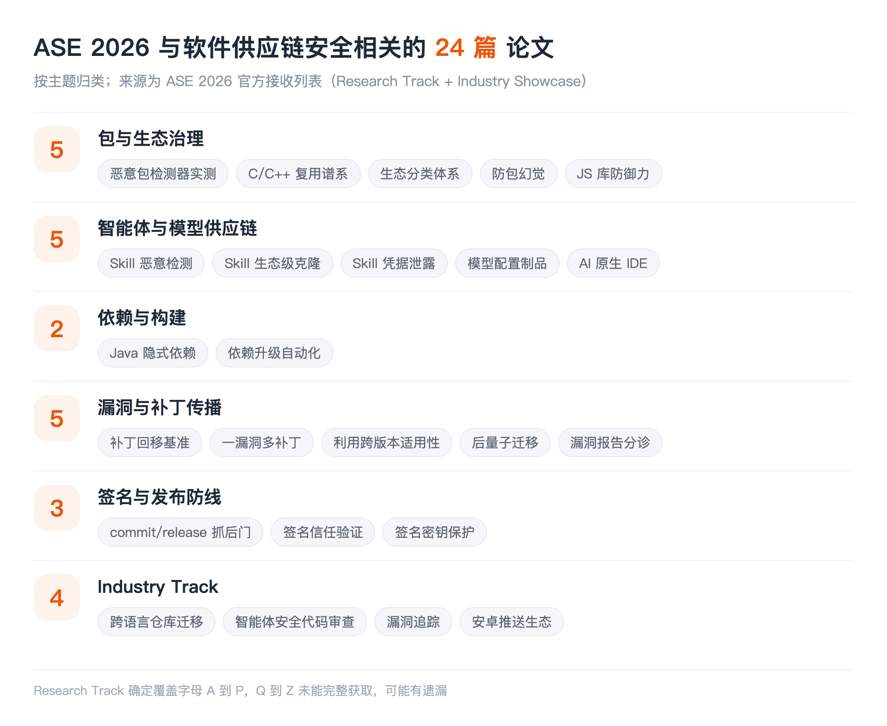

## LIST INFO|本期说明

【会议】ASE 2026，第 41 届 IEEE/ACM 自动化软件工程国际会议，2026 年 10 月 12 日至 16 日，德国慕尼黑
【来源】ASE 2026 官方接收论文列表（Research Track 与 Industry Showcase）
【口径】只收与**软件供应链安全**直接相关的，通用漏洞检测、模糊测试、程序修复这些即便沾安全也不收

先把两件事说在前面，免得误导。

其一，**这份名单是逐篇过出来的，但不敢说全**。ASE 2026 的 Research Track 接收了 200 多篇，我是把接收列表按字母顺序整个过了一遍再自己判断相关性，不是丢几个关键词让工具筛。但抓取受限，字母 Q 到 Z 那一段没能完整拿到，==所以这一期确定覆盖 A 到 P，后半段可能有遗漏==，欢迎在留言区补。

其二，**多数论文全文还没公开**，ASE 要到十月才开会。所以下面每篇的介绍分两种：本账号已经读过全文的，写的是实际内容；其余的，介绍严格限制在标题能支撑的范围内，不替作者把结论说满。作者单位只在核实到的时候标注。

## PACKAGES|包与生态治理

### How Effective Are NPM Malicious Package Detectors? A Large-Scale Empirical Study
Wenbo Guo, Zhongwen Chen, Zhengzi Xu, Chengwei Liu, Ming Kang, Shiwen Song, Chengyue Liu, Yijia Xu, Weisong Sun, Yang Liu | Nanyang Technological University, Sichuan University, Imperial Global Singapore, Nankai University, Singapore Management University
NPM 恶意包检测工具这几年出了一堆，但各自在不同数据集、不同口径上自评，横向没法比。这篇把它们拉到统一数据集和统一设置下做大规模实测。**本账号已解读过**，结论对做检测的人挺不客气。

### GANADI: Uncovering C/C++ OSS Reuse Genealogies via Pivotal Function-Based Clustering to Enhance Supply Chain Security
Dongyeon Kim, Seunghoon Woo, Heejo Lee | Korea University
C/C++ 世界没有统一的包管理器，代码复用大量靠复制粘贴和 vendoring，所以"这段代码到底源自哪个上游项目"是个真问题，也是漏洞传播分析的前提。这篇用关键函数聚类去还原开源代码的**复用谱系**。

### ATLAS: Agentic Taxonomy of LArge-Scale Software Ecosystems
Junyi Lu, Mengyao Lyu, Wu Jiahui, Lei Yu, Chengwei Liu, Fengjun Zhang, Li Yang, Chun Zuo, Yang Liu | Nankai University, Nanyang Technological University
用智能体给大规模软件生态自动建**分类体系**。生态治理的第一步是知道生态里有什么、怎么分类，这类基础设施性质的工作往往被低估，但下游的风险度量、依赖分析都依赖它。

### Guided Decoding as a Defense against Package Hallucination in LLM-Generated Code
Alberick Euraste Djire, Iyiola E. Olatunji, Melissa Tessa, Earl T. Barr, Jacques Klein, Tegawendé F. Bissyandé

### Defensive Capability Analysis for JavaScript Libraries
Wenyuan Xu, Anders Møller

## AGENTS|智能体与模型供应链

这是这批里最新的一支，围绕 Agent Skill 生态和模型制品展开。

### MalSkills: Detecting Malicious Skills in the Agentic Supply Chain via Neuro-symbolic Reasoning
Shenao Wang, Junjie He, Yanjie Zhao, Yayi Wang, Kan Yu, Haoyu Wang | Huazhong University of Science and Technology, Ant Group
用神经符号推理检测恶意技能：先从异构制品里抽出安全敏感操作，再做符号推理判定。**本账号已解读过**，不过要注意，==它的预印本标题和 ASE 正式版完全不同==（预印本叫《"Elementary, My Dear Watson."…》），同一批作者、同一个系统。这正是查论文最容易踩的坑：只匹配标题会把同一篇当成两篇。

### Latent Reuse in Agent Skills: Multi-modal Clone Detection at Ecosystem Scale
Jiaying Zhu, Lyuye Zhang, Wenbo Guo, Yang Liu | Nanyang Technological University
在整个技能生态尺度上做**多模态克隆检测**。技能不是纯代码，是提示词、脚本、配置和资源的混合体，传统代码克隆检测的那套在这里不够用。找出"哪些技能其实是同一份东西的变体"，对追踪恶意技能的扩散和评估生态真实多样性都是前置能力。

### How Your Credentials Are Leaked by LLM Agent Skills: An Empirical Study
Zhihao Chen, Ying Zhang, Yi Liu, Gelei Deng, Yuekang Li, Yanjun Zhang, Jianting Ning, Leo Zhang, Lei Ma, Zhiqiang Li | Griffith University, Wake Forest University, Nanyang Technological University, University of New South Wales, Zhejiang Sci-Tech University, The University of Tokyo
第一个针对智能体技能**凭据泄露**的大规模实证研究。技能运行在特权环境里、日常要处理敏感凭据，这条路径此前基本没人系统查过。**本账号已解读过**。

### Execution-as-Configuration: Security Smells in Model Configuration Artifacts
Mohammed Latif Siddiq, Prince Noah Johnson, Joanna C. S. Santos

### "Impossible to Hide Secret ...": Uncovering Security and Privacy Issues in LLM-Native IDEs
Mostafijur Rahman Akhond, Md Afif Al Mamun, Gias Uddin, Song Wang

## DEPS|依赖与构建

### Implicit, Yet Impactful: Understanding Hidden Dependencies in Java Projects
Lyuye Zhang, Chengwei Liu, Fangyuan Zhang, Yiran Zhang, Yuan Zhou, Yang Liu | Nanyang Technological University, Nankai University
讲 Java 项目里的**隐式依赖**：没有写在依赖声明里、但实际被用到的那些。这类依赖是依赖分析和 SBOM 的系统性盲区，声明文件里看不见，可它出问题一样会炸。

### DepUpgrade: Automating Dependency Upgrade through State-Path Exploration
Yifan An, Xiangxi Ma, Wentong Tian, Xuanqi Wang, Qingao Dong, Xiang Gao, Hailong Sun | Beihang University
用状态路径探索来自动化**依赖升级**。升级依赖是所有供应链安全建议的最后一公里，也是最容易卡住的一环：修复存在、但升不上去。这个方向和补丁回移是同一个问题的两种形态。

## PATCH|漏洞与补丁的传播

### Benchmarking Automated Security Patch Backporting: How Far Are We?
Jincheng Yang, Yulong Fu, Chengwei Liu, Lyuye Zhang, Fangyuan Zhang, Bingyang Ren, Yang Liu, Hui Li | Xidian University, Nankai University, Nanyang Technological University
1234 例真实回移案例的统一基准，把五个自动回移工具拉到同一张考卷上。**本账号已解读过**，核心结论是对齐评测后成功率集体跳水，结构复杂的补丁只剩 24%。

### One Is Not Enough: The Untold Story of Multiple Security Patches for One Vulnerability
Fangyuan Zhang, Lyuye Zhang, Lingling Fan, Chengwei Liu, Yinan Li, Liang Huang, Yang Liu, Zheli Liu, Sen Chen | Nankai University, Nanyang Technological University
一个漏洞**不止一个补丁**。这件事对下游影响很直接：如果你的扫描器认定"打了某个补丁就算修复"，而上游实际上分了多次提交才补完，那你的合规状态就是假的。这类"看起来已修复"的情形，比未修复更危险。

### Assessing the Cross-Version Applicability of Java Library Vulnerability Exploits
Zirui Chen, Qi Zhan, Jiayuan Zhou, Xing Hu, Xin Xia, Xiaohu Yang

### Post-quantum Cryptography in the Wild: Assessing the Readiness of Open-Source Ecosystems
Tongxin Yuan, Zhanpeng Liu, Jiashuo Liang, Zhuosheng Zhang, Gongshen Liu, Yang Yu, Guancheng Li | Shanghai Jiao Tong University
评估开源生态迁移到**后量子密码**的就绪度。这是一次超大规模的强制依赖升级预演，牵涉到密码库、协议实现和它们所有的下游，跟前面几篇讲的是同一类问题：**修复能不能真的传到底**。

### Learning to Triage Vulnerability Reports from Program Analysis: An Empirical Study in Node.js
Ronghao Ni, Aidan Z.H. Yang, Min-Chien Hsu, Nuno Sabino, Limin Jia, Ruben Martins, Darion Cassel, Kevin Cheang

## TRUST|签名与发布防线

### Not In My Git Yard: Catching Backdoors at Commit and Release Time
Dimitri Kokkonis, Michaël Marcozzi, Stefano Zacchiroli | Université Paris-Saclay, CEA List
在**提交和发布这两个时间点**上抓后门。这个选点很务实：包一旦发布出去，检测就变成了跟分发速度赛跑；而 commit 和 release 是攻击者必须经过的两道闸门，卡在这里成本最低。

### Context-Aware Trust Verification for Identity-Based Software Signing
Chinenye Okafor, James C. Davis, Santiago Torres-Arias

### A Longitudinal Study of Android Apps Signing Key Protection
Mark Meng, Qing Zhang, Weirao Lu, Chunyang Chen

## INDUSTRY|Industry Track

Industry Showcase 这条轨道更贴近真实生产环境的约束，下面几篇值得单独看。

### DepWareTrans: Dependency-Aware Incremental Repository Migration across Co-executable Languages
Sivajeet Chand, Alexander Pretschner, Steve Haupt, Derui Zhu, Sushant Kumar Pandey

### AgenticSCR: An Autonomous Agentic Secure Code Review for Immature Vulnerabilities Detection
Wachiraphan (Ping) Charoenwet, Kla Tantithamthavorn, Patanamon Thongtanunam, Hong Yi Lin, Minwoo Jeong, Ming Wu

### Vulnerability Tracking using Normalized Scope+Offset
Julian Thome, Hua Yan, Lucas Charles, Craig Smith, Jason Leasure

### An Empirical Study of Security Risks in the Android Push Notification Ecosystem
Shilong Hu, Zikan Dong, Chao Wang, Tianming Liu, Haoyu Wang

## TAKEAWAYS|一点观察

**智能体与模型供应链已经单独成一支了。** Agent Skill 相关的论文进入 ASE 主轨，分工很清楚：一篇做恶意检测，一篇做生态级克隆识别，一篇做凭据泄露实证；再加上模型配置制品和 AI 原生 IDE 两篇，攻击面已经从"技能本身"扩到了"承载技能的整个开发与运行环境"。这个结构和十年前包生态刚起步时几乎一模一样，先有人发现恶意样本，再有人做规模化测量，然后才是检测工具和治理机制。==技能生态正在用比包生态快得多的速度，重走同一条路==。

**"修复传不到底"是这批论文最集中的母题。** 补丁回移、一个漏洞多个补丁、依赖升级自动化、漏洞利用的跨版本适用性、后量子迁移就绪度，五篇讲的其实是同一件事的不同切面：漏洞的修复往往是存在的，真正的风险在于它到不了所有下游。这个判断比"某某组件有漏洞"更有行动价值，因为它指向的是流程和工具，而不是某一个具体的洞。

**信任根这条线今年明显变粗了。** 签名的信任验证、签名密钥保护、提交与发布时的后门拦截，三篇都落在同一个位置：**分发环节**。过去我们默认签名体系是可信的、只讨论签名之上的东西，现在开始有人系统地问签名本身牢不牢。

**方法论上有个共同转向：从"检测单个制品"转向"理解整个生态的结构"。** 复用谱系、生态分类体系、隐式依赖、克隆关系，这几篇都不是在判断某个包是好是坏，而是在还原"谁来自谁、谁包含谁"。这种结构性知识才是风险传播分析的底座，也是目前最缺的基础设施。
