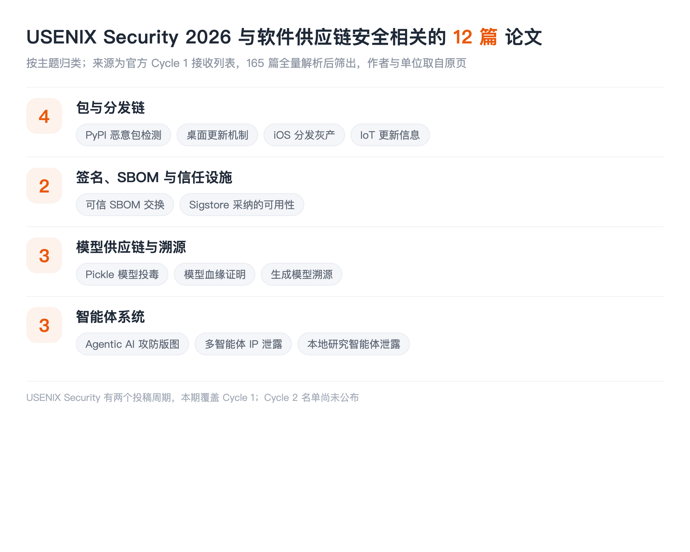

## LIST INFO|本期说明

【会议】USENIX Security 2026，第 35 届 USENIX 安全研讨会，2026 年 8 月 12 至 14 日，美国巴尔的摩
【来源】USENIX Security 2026 官方 Cycle 1 接收列表，共 165 篇，全量解析后逐篇判断
【口径】只收与**软件供应链安全**直接相关的：包与分发、签名与 SBOM、模型制品与溯源、智能体系统。固件模糊测试、密码学协议、隐私计算这些不收

先说数据。这一期是四期盘点里**数据质量最好的一期**：官方页面完整拿到了 165 篇的标题和作者单位，**没有截断、没有靠关键词猜，是把整份名单解析出来逐篇判断的**。作者和单位全部取自官方页原文。唯一的缺口是 USENIX Security 有两个投稿周期，**本期只覆盖 Cycle 1，Cycle 2 的名单还没公布**。顺带一提，本账号此前解读过的几篇 USENIX Sec 26 论文（恶意 Agent Skill 实测、token 长度侧信道、OpenHarmony 设计级漏洞 SoK）都不在 Cycle 1 里，应该在 Cycle 2，等公布了再补一期。

## DIST|包与分发链

### Cutting the Gordian Knot: Detecting Malicious PyPI Packages via a Knowledge-Mining Framework
Wenbo Guo, Chengwei Liu, Ming Kang, Yiran Zhang, Jiahui Wu, Zhengzi Xu, Vinay Sachidananda, Yang Liu | Nanyang Technological University, Nankai University, Sichuan University, Imperial Global Singapore
从现有检测器的**误报和漏报里挖行为知识**，再拿这些知识去检测恶意 PyPI 包。**本账号已解读过**，思路是把别人踩过的坑变成自己的特征，这在检测器普遍误报率 15% 到 30% 的现状下是个很实在的切入点。

### When Updates Backfire: A Black-Box Security Analysis of Desktop Software Update Mechanisms
Jie Wan, Pengcheng Xia, Haoyu Wang | Huazhong University of Science and Technology
黑盒分析**桌面软件的更新机制**。更新通道是供应链上最诱人的一环：它有最高权限、自动执行、用户不会审查。而桌面端不像移动端有统一商店兜底，每家自己实现更新逻辑，实现质量参差不齐。标题说"更新反而害了你"，指的就是这条本该修复问题的通道自己变成了入口。

### Cracks in the Walled Garden: Dissecting the Gray-Market of Unauthorized iOS App Distribution via Ad Hoc Sideloading
Yijing Liu, Yiming Zhang, Baojun Liu, Haixin Duan | Tsinghua University, BNRist
拆解 **iOS 非授权分发的灰色市场**。苹果的围墙花园被认为是最严的分发管控，这篇讲的是绕过它的那条侧载产业链。**绕过官方分发渠道的灰产，本质上就是给整个生态开了一条不受审核的供应链**，这和企业证书滥用、第三方应用商店是同一类问题。

### Missing, Present and Conflicting: A Large Scale Analysis of IoT Update Information in the EU Market
Swaathi Vetrivel, Michel van Eeten, Carlos H. Gañán | Delft University of Technology
大规模分析欧盟市场上 **IoT 设备的更新信息**。标题三个词点明了发现：更新信息要么缺失、要么存在、要么互相矛盾。这是合规视角的供应链问题，欧盟新规要求厂商披露支持期限，而这篇量化了披露质量到底如何。买设备的人无法判断它还能收几年补丁，这本身就是风险。

## TRUST|签名、SBOM 与信任设施

### Trustworthy and Confidential SBOM Exchange
Eman Abu Ishgair, Chinenye Okafor, Marcela S. Melara, Santiago Torres-Arias | Purdue University, Intel Corporation
做**可信且保密的 SBOM 交换**。SBOM 推了这些年，卡点已经从"怎么生成"转移到"怎么交换"：供应商愿意给你成分清单，但不愿意让全世界都看到自己的技术栈；采购方需要验证清单可信，又不能只听供应商一面之词。这篇要同时解决可信和保密这对矛盾。

### Why Johnny Adopts Identity-Based Software Signing: A Usability Case Study of Sigstore
Kelechi G. Kalu, Sofia Okorafor, Tanmay Singla, Sophie Chen, Santiago Torres-Arias, James C. Davis | Purdue University, Carnegie Mellon University
研究开发者**为什么会采纳 Sigstore** 这种基于身份的软件签名。Sigstore 把签名从"管理长期密钥"变成了"用现有身份换短期证书"，技术上解决了密钥管理这个最大的采纳障碍。但技术可行不等于会被用，这篇走的是可用性研究路线，问的是真实开发者的采纳动机和阻力。==签名基础设施的瓶颈早就不在密码学，而在人愿不愿意用==。

## MODELS|模型供应链与溯源

### The Art of Hide and Seek: Making Pickle-Based Model Supply Chain Poisoning Stealthy Again
Tong Liu, Guozhu Meng, Peng Zhou, Zizhuang Deng, Shuaiyin Yao, Kai Chen | Institute of Information Engineering, Chinese Academy of Sciences, Shanghai University, Shandong University
让基于 **pickle 的模型供应链投毒重新变得隐蔽**。pickle 反序列化能执行任意代码是老问题，模型托管平台后来都加了扫描器。标题里"重新"两个字是关键：**这篇是在已有防御的前提下重新把攻击做隐蔽**，属于攻防对抗进入下一轮的信号。CCS 那期有一篇查预训练模型 Hub 的整体风险，两篇正好是同一个生态的攻防两侧。

### Attesting Model Lineage by Consisted Knowledge Evolution with Fine-Tuning Trajectory
Zhuoyi Shang, Jiasen Li, Pengzhen Chen, Yanwei Liu, Xiaoyan Gu, Weiping Wang | Institute of Information Engineering, Chinese Academy of Sciences
用微调轨迹来证明**模型血缘**。给定两个模型，判断其中一个是不是从另一个微调来的。这件事对供应链的意义很直接：模型被下游改过之后，要能追回它的来源，才谈得上追责和许可证合规。这和包生态里做代码溯源、二进制溯源是同一件事，只是对象换成了权重。

### Identifying Provenance of Generative Text-to-Image Models
Anna Yoo Jeong Ha, Wenxin Ding, Stanley Wu, Shawn Shan, Haitao Zheng, Ben Y. Zhao | University of Chicago
识别**生成式文生图模型的来源**。给一张图，判断它出自哪个模型。这是溯源的另一个方向：不从制品查来源，而是从产物反推制品。在模型被大量微调、蒸馏、二次分发的今天，这类能力是判断责任归属的前提。

## AGENTS|智能体系统

### SoK: Attack and Defense Landscape of Agentic AI Systems
Juhee Kim, Wenbo Guo, Dawn Song | UC Berkeley, Seoul National University, UC Santa Barbara
Agentic AI 攻防版图的系统化梳理。**本账号已解读过**，不过又是一个标题对不上的例子：**它的预印本叫《The Attack and Defense Landscape of Agentic AI: A Comprehensive Survey》，和 USENIX 正式版标题差得挺远**，同一批核心作者。这已经是这几期盘点里第三次遇到 camera-ready 换标题了，查重只匹配标题一定会出事。

### MASLeak: Investigating and Exposing Intellectual Property Leakage Vulnerabilities in Multi-Agent Systems
Liwen Wang, Wenxuan Wang, Shuai Wang, Zongjie Li, Zhenlan Ji, Zongyi Lyu, Daoyuan Wu, Shing-Chi Cheung | The Hong Kong University of Science and Technology, Renmin University of China, Lingnan University
多智能体系统里的**知识产权泄露**。多智能体协作时，各个智能体的提示词、工具定义、内部策略要在系统里流转，而这些恰恰是开发者最核心的资产。一个智能体被攻破，泄露的可能是整条流水线的设计。

### Network-Level Prompt and Trait Leakage in Local Research Agents
Hyejun Jeong, Mohammadreza Teymoorianfard, Abhinav Kumar, Amir Houmansadr, Eugene Bagdasarian | University of Massachusetts Amherst
本地研究型智能体在**网络层泄露提示词和用户特征**。哪怕智能体跑在本地，它检索网页、调用 API 的流量模式仍然会把用户在问什么泄露出去。本账号解读过从 token 长度侧信道重建对话那篇，这篇是同一类思路在智能体场景的延伸：加密保住了内容，保不住行为。

## TAKEAWAYS|一点观察

**四大安全会里，只有 USENIX 还在认真做传统信任基础设施。** SBOM 交换、Sigstore 的采纳可用性、桌面更新机制、iOS 分发灰产、IoT 更新信息披露，这五篇是标准的供应链基础工程，==而这类论文在 S&P、CCS、NDSS 的今年名单里几乎找不到==。做这个方向的人需要知道该往哪投。

**Purdue 那个组在两个会议上同时推进签名这条线。** USENIX 这边是 SBOM 交换和 Sigstore 采纳可用性，ASE 那期还有一篇《Context-Aware Trust Verification for Identity-Based Software Signing》，作者里 Chinenye Okafor、James C. Davis、Santiago Torres-Arias 都是同一批人。三篇连起来看是一条完整的路线：先研究开发者为什么愿意签，再研究签名之上怎么做信任判定，再研究签出来的成分清单怎么安全地交换。**这种成体系的推进，比零散的单点论文更值得跟。**

**pickle 投毒"重新"变隐蔽，是一个值得警惕的信号。** 模型托管平台加了扫描器之后，这类攻击一度被认为收敛了，而这篇把它重新做隐蔽。安全史上这个模式反复出现：防御上线、攻击沉寂、然后以更隐蔽的形态回来。==扫描器的存在会筛选出更强的攻击，而不是消灭攻击==，这一条对所有依赖扫描的治理方案都适用。

**溯源今年集中爆发。** 模型血缘、生成图像来源、编译器溯源（CCS）、溯源日志防篡改（S&P），四个会议不约而同地在做"这个东西到底从哪来"。这背后是同一个变化：当制品可以被大量二次加工和再分发，来源就从一个元数据问题变成了责任归属问题。**包生态用了十几年才把来源验证做成基础设施，模型这条链现在才刚开始。**
