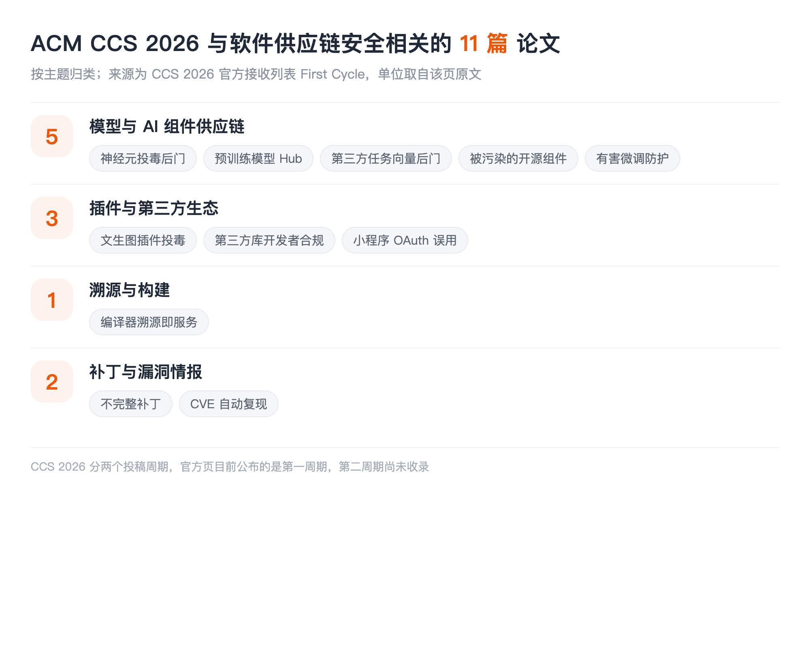

## LIST INFO|本期说明

【会议】ACM CCS 2026，第 33 届 ACM 计算机与通信安全会议，2026 年 11 月 15 日至 19 日，荷兰海牙
【来源】CCS 2026 官方接收论文列表（First Cycle）
【口径】只收与**软件供应链安全**直接相关的：组件与生态、分发与构建、溯源、补丁传播。通用漏洞挖掘和模糊测试不收，哪怕 CCS 这类论文占了大头

两点说明。其一，**CCS 分两个投稿周期，官方页目前公布的是第一周期**，第二周期的论文还没上去，所以这一期后续可能要补。其二，多数论文全文还没读，介绍严格限制在标题和作者团队能支撑的范围内。单位取自官方接收页原文。

这一期的重心非常统一，统一到几乎不用我总结：==CCS 这批供应链论文里，被投毒、被污染、被后门的对象基本都不是软件包，而是模型侧的制品：预训练模型、任务向量、开源组件、插件、微调过程==。ASE 那期的主角是包和依赖，S&P 那期是 MCP 和浏览器扩展，到了 CCS 就成了模型本身。

## MODELS|模型与 AI 组件供应链

### Implementation Bugs as Attacks: Adversarial Neuron Fuzzing and Supply-Chain Backdoors
山东大学、奥本大学、中国科学院信息工程研究所
把**实现层面的 bug 当成攻击手段**，用对抗性神经元模糊测试来构造供应链后门。这个思路和常见的数据投毒、权重篡改都不一样：它不改训练数据也不改模型语义，而是利用实现里的缺陷做文章，因此常规的模型完整性校验很可能看不见。

### Your Space is My Zone: Demystifying the Security Risks of AI-Powered Applications on Pre-Trained Model Hubs
清华大学、奇安信技术研究院
系统梳理**预训练模型 Hub 上 AI 应用的安全风险**。模型 Hub 现在就是模型时代的包仓库：任何人可以上传、任何人可以拉取、大量应用直接挂在上面运行。本账号解读过影子 API 那篇，里面的 Hugging Face 恶意数据集攻击链就是这个生态的一个切面，而这篇是对整个生态的系统排查。

### BadTV: Unveiling Backdoor Threats in Third-Party Task Vectors
阳明交通大学、加州大学伯克利分校、RIKEN AIP、CISPA、东京科学大学
**第三方任务向量**里的后门威胁。任务向量是模型能力的可组合单元，你可以下载别人训好的一个向量、加到自己的模型上直接获得某种能力。它的分发和组合方式几乎就是包管理器的翻版，==而这篇要说的是：这种可组合性同样把后门变成了可分发的商品==。

### Don't Trust the AI Ecosystem: Analyzing Privacy Leakage in Compromised Open-Source Components
延世大学、日本情报通信研究机构 NICT、兵库县立大学
分析 AI 生态里**被污染的开源组件**造成的隐私泄露。标题的口吻很直接，指向的是同一件事：AI 应用堆在一层层开源组件之上，其中任何一层被污染，泄露的都是最上层用户的数据。

### Token Buncher: Shielding LLMs from Harmful Reinforcement Learning Fine-Tuning
南洋理工大学、新加坡科技研究局、西北大学
防护**有害的强化学习微调**。微调是模型供应链上一个特别的环节：模型交付出去之后，下游还能继续改它。别人拿走你的模型做有害微调，从供应链视角看就是制品在下游被改坏了，而原厂既看不见也管不着。

## PLUGINS|插件与第三方生态

### Customization under Fire: Plugin Poisoning in Text-to-Image Ecosystem
浙江大学、南洋理工大学、广州大学、天津大学
**文生图生态里的插件投毒**。LoRA、ControlNet 这类插件已经形成了一个巨大的共享生态，用户从社区下载别人训好的插件直接叠加使用，几乎没有任何来源校验。这个生态的分发模式和 npm 极其相似，成熟度却差着十几年。

### Assessing Privacy Compliance Awareness and Practices Among Mobile Third-party Library Developers
印第安纳大学、罗格斯大学、伊利诺伊大学厄巴纳香槟分校
调查**移动第三方库开发者**的隐私合规意识和实践。这篇的视角很少见：它不查库有没有问题，而是查写库的人怎么想。供应链治理最终要落到上游开发者的行为上，而我们对这群人的认知长期是空白的。

### Mini-Programs, Mega-Problems: Unveiling OAuth-based Authentication Misuses in Mini-Programs via Dynamic Analysis
西蒙菲莎大学、山东大学、奇安信技术研究院、上海交通大学、清华大学
用动态分析挖**小程序里的 OAuth 认证误用**。小程序是一个封闭平台上的第三方应用生态，宿主应用、小程序开发者、后端服务三方之间的信任关系很容易搭错，而用户看到的只是宿主的品牌。

## PROV|溯源与构建

### Compiler Provenance as a Service: Decoupled Identification for Composite Provenance and Operational Resilience
普渡大学
把**编译器溯源做成服务**，还要能处理复合溯源。给定一个二进制，判断它是用什么编译器、什么优化选项构建的，这是逆向和取证的基础能力，也是供应链上判断"这个制品到底从哪来"的一手证据。当源码不可得时，溯源就是唯一能查的东西。

## PATCH|补丁与漏洞情报

### From Fix to Flaw: Understanding and Revealing Incomplete Patches for Link Following Vulnerabilities
复旦大学
研究**不完整补丁**。补丁打了但没补干净，漏洞还在，而扫描器和合规流程都已经把它标成已修复，这是最危险的一类状态。ASE 那期有一篇"一个漏洞多个补丁"，讲的是同一件事的另一面，两篇可以对着读。

### CVE-Genie: An LLM-Based Multi-Agent Framework for Reproducing CVEs
波士顿大学、加州大学圣塔芭芭拉分校、亚利桑那州立大学、新南威尔士大学
用多智能体框架**自动复现 CVE**。这件事的价值在漏洞情报的下游：一条 CVE 说影响某个版本区间，但到底能不能在你的环境里复现，决定了它对你是不是真风险。能自动复现，等于给漏洞情报补上了一个可验证的环节。

## TAKEAWAYS|一点观察

**被投毒的制品变了。** 这一期最清楚的信号是攻击对象的迁移：模型权重、任务向量、文生图插件、开源组件、微调过程，五篇都在讲同一类事，只是位置不同。==软件供应链安全研究了十几年的那套问题，正在模型这条链上被完整地重放一遍==，而且每一环都比包生态年轻得多、治理设施也少得多。

**三个会议三种重心，只看一个会严重失真。** ASE 的主角是包、依赖和 SBOM，S&P 是 MCP、浏览器扩展和插件生态，CCS 是模型制品。它们讲的是同一个大问题在不同层的表现：软工会议关注工程治理，安全会议关注攻击面，而 CCS 这边最贴近"模型即制品"这个新形态。把三份名单叠在一起，才是这个方向今年的真实全貌。

**任务向量这类东西值得单独盯。** 它是可下载、可组合、可叠加的模型能力单元，分发方式和包管理器几乎一致，但它既不是代码也不是数据，现有的扫描器、SBOM 规范、来源验证机制没有一样能直接套上去。**一个新的可分发单元出现时，最危险的窗口期就是它已经在被广泛使用、而治理设施还完全没有的这段时间。**

**补丁这条线在两个会议同时出现。** CCS 的不完整补丁和 ASE 的一个漏洞多补丁，指向的是同一个盲区：我们的合规状态是按"补丁有没有打"算的，而不是按"洞有没有真的堵上"算的。这两者之间的差距，目前没有任何工具能自动告诉你。
